Learn about what agents are and how they work. 

## About A2A

Agent-to-agent, or [A2A](https://github.com/a2aproject/A2A), is an open protocol... that enables communication and interoperability between opaque agentic applications. Developed by Google, A2A defines a common language that enables agents to show their capabilities and help them negotiate how they interact with the user, such as via text, forms, or bidirectional audio or video, irrespective of the framework or vendor they are built on.

With A2A, agents can:

* Discover each other's capabilities.
* Negotiate interaction modalities (text, forms, media).
* Securely collaborate on long running tasks.
* Operate without exposing their internal state, memory, or tools.

## What are agents? 

An artificial intelligence (AI) agent is an application that can interact with users in natural language. Agents use LLM to generate responses to user queries and decide whether to call external tools to execute actions on behalf of the user.

LLMs are limited by static training data. This limitation can make seemingly simple questions difficult to answer. For example, consider the following question:

> What's the weather today?

The LLM has to know several pieces of real-time information that it was not trained on:

* The user's location
* The current date
* The weather forecast for that date and location

With agents and tools, you can extend the capabilities of the LLM with your own external APIs, apps, and data. First, you create _tools_ that extend the capabilities of the LLM with a function, such as `get_weather`. These functions can include _parameters_, or inputs, that are needed to execute the function. For example, the `get_weather` function needs the date and location to get the current weather forecast. The _name_ and _description_ of the tool function and parameters help the LLM decide when to call the tool.

Next, when forwarding user requests to the LLM, you can include the set of tools that the LLM can leverage to answer the user. Based on the user's question, the LLM can respond directly or suggest a tool to call to help answer the question. To get the required parameters for the tool call, the LLM might ask the end user or call other functions like `get_location` or `get_date`, which in turn might pull that information based on system settings on the end user's device.

### Agent sequence diagram {#diagram}

Consider the following sequence diagram that shows how agents and tools work.

```mermaid
sequenceDiagram
    autonumber
    User->>+Agent: "What's the weather in Columbus?"
    Agent->>+LLM: Forward user request along with tool list
    LLM-->>-Agent: Suggest tool call (get_weather)
    Agent-->>+App: Send tool suggestion
    App->>-App: Execute tool (get_weather)
    App->>+Agent: Send tool result
    Agent->>+LLM: Forward tool result
    LLM-->>+Agent: Generate final response
    Agent-->>-User: "The weather in Columbus is 15°C and cloudy."
```

1. The User asks about the weather today. The request includes a list of tools that the LLM can use to answer the question.

2. The agent sends the request with the tool list to the LLM.

3. Based on the conversation, the LLM suggests to call the get_weather tool and includes the required parameters to use that tool. The LLM might get these parameters by using the chat history, asking the end user to provide them, or by suggesting other tools to call before calling the get_weather function.

4. The agent invokes the get_weather tool by sending a request to the App. The request includes the required parameters to execute the tool.

5. The App executes the get_weather tool with the required parameters to get the current weather in the location, such as Columbus, OH.

6. The App returns the tool result to the agent.

7. The agent returns the tool result to the LLM.

8. The LLM uses the real-time tool result from the App in a natural language response and returns this response to the agent.

9. The agent then forwards the natural language response to the User.
