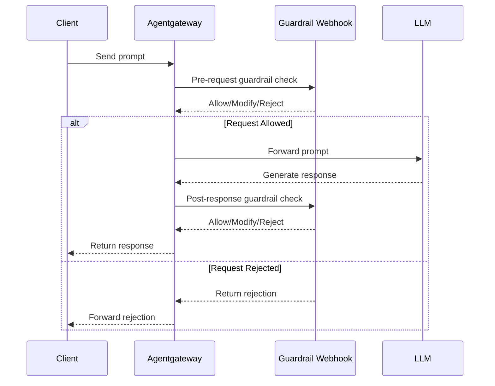

Use the Guardrail Webhook API to set up your own custom guardrail controls for .

## About guardrails {#about}

Guardrails are control mechanisms that help ensure safe, consistent, and compliant interactions with large language models (LLMs) by validating both input and output content.

### Benefits of guardrails {#about-benefits}

Because LLMs generate text based on probability calculations and training data that is outside your control and business context, their responses can vary widely. LLMs might hallucinate, generate harmful or unhelpful content, leak sensitive data, or otherwise return unexpected responses that are not aligned with your organization's standards. 

Guardrails mitigate such risks by letting you take action on:

* Input, or the content before sending requests to the LLM.
* Output, or the content before delivering responses to the user.

For example, a guardrail might:

* Scan input and mask sensitive data patterns before they reach the LLM, such as employee IDs or other personally identifiable information (PII).
* Verify that LLM responses follow a required JSON structure before returning them to users.

By applying guardrails to both input and output, you can:

* Reject or mask harmful or unhelpful content.
* Enforce desired formats, content boundaries, and safety rules.
* Comply with regulatory requirements, industry standards, internal policies, style guides, and more.

### Support for guardrails {#about-guardrail-support}

 includes built-in [prompt guards](../../prompt-guards/) to reject, mask, or pass prompt data through a moderation endpoint.

However, you might want to bring your own guardrails for situations such as:

* Small language models (SMLs) that do not have a moderation endpoint but that you want to use to sanitize input or output.
* Advanced guards and moderation rules that are not part of  or the LLM provider's moderation endpoint.
* Full control over safety and compliance logic.
* Centralized enforcement across multiple models and providers.
* The ability to update your policies without redeploying the gateway proxy or models.
* Extra logging and auditing capabilities that are built into your own guardrail implementation.

To support such advanced scenarios,  includes a Guardrail Webhook API that you can use to bring your own guardrails. This way, your webhook server can integrate with  to process requests synchronously before they reach the LLM and responses before they return to the user. This architecture allows for flexible integration with your existing security and compliance tools.

### Example diagram {#example-diagram}

The following diagram shows a simple sequence of how the Guardrail Webhook API lets your webhook server integrate with  to process LLM requests and responses.



1. The client sends a request to the LLM.
2.  receives the request and passes it to the webhook server for a pre-request guardrail check.
3. If the request is allowed,  forwards the request to the LLM. The LLM generates a response that the webhook server can modify before  returns the response to the client.
4. If the request is rejected by the Guardrail Webhook,  forwards the rejection to the client.

### Considerations for using guardrails {#about-considerations}

When implementing a guardrail webhook server, consider the following performance, implementation, and operational factors.

* **Performance impact**: Each guardrail check adds latency to the request-response cycle. Plan accordingly, such as deploying the webhook server close to the gateway proxy to minimize latency and implementing resiliency best practices such as timeouts and horizontal scaling.
* **Implementation challenges**: Your webhook server must handle requests synchronously and respond quickly to avoid user experience degradation. The requests might be streaming or non-streaming.
* **Operational responsibilities**: You are responsible for developing, integrating, and operating your own guardrail webhook server.

### Optimize guardrail webhook performance {#optimize-performance}

To optimize guardrail webhook performance, you can update the  for  with the following settings.

* `GUARDRAIL_WEBHOOK_MAX_CONNECTIONS`: The maximum number of concurrent connections that the gateway can open to the webhook server. A value of `0` means no limit. The default value is `100`. Higher values allow for greater concurrency, which is good for high-throughput systems, such as when many user requests trigger requests to the webhook server. Lower values help reduce resource usage and the risk of overwhelming the webhook server.
* `GUARDRAIL_WEBHOOK_KEEPALIVE_SECONDS`: The number of seconds to keep an idle connection alive. The default value is `300`. Higher values help avoid delays to setup and teardown connections when requests are intermittent. Lower values help free up unused connections faster, which can help if the webhook server does not handle idle connections well.

Example configuration file:

```yaml
kubectl apply -f- <<EOF
apiVersion: 
kind: 
metadata:
  name: gloo-gateway-override
  namespace: 
spec:
  kube:
    aiExtension:
      enabled: true
      env:
      - name: GUARDRAIL_WEBHOOK_MAX_CONNECTIONS
        value: "50"
      - name: GUARDRAIL_WEBHOOK_KEEPALIVE_SECONDS
        value: "60"
EOF
```

### More information

* [Example scenario](#example-scenario) of a simple Python webhook server that integrates with the Guardrail Webhook API.
* [Guardrail Webhook API reference docs](../redocly.html).

## Example scenario

To learn how to implement your own guardrail webhook server, you can use the following sample Python webhook server. For the source code, see the [GitHub repository](https://github.com/solo-io/gloo-gateway-use-cases/tree/main/ai-guardrail-webhook-server).

The webhook server is configured to take the following actions:

* If the content has the word `block`, the request is rejected with a 403 Forbidden response.
* If the response has the word `mask`, the gateway transforms the word `mask` to asterisks (`****`) in the body with a 200 response.


{}


### Before you begin



### Step 1: Deploy the webhook server to your cluster

1. Deploy the webhook server. The example includes a Deployment based on the `gcr.io/solo-public/docs/ai-guardrail-webhook:latest` image and Service of type LoadBalancer that listens for incoming requests on port 8000. If the image does not work for your environment, you can build your own from the sample code in the [GitHub repository](https://github.com/solo-io/gloo-gateway-use-cases/tree/main/ai-guardrail-webhook-server).

   ```yaml
   kubectl apply -f - <<EOF
   apiVersion: apps/v1
   kind: Deployment
   metadata:
     name: ai-guardrail-webhook
     namespace: 
     labels:
       app: ai-guardrail
   spec:
     replicas: 2
     selector:
       matchLabels:
         app: ai-guardrail-webhook
     template:
       metadata:
         labels:
           app: ai-guardrail-webhook
       spec:
         containers:
         - name: webhook
           image: gcr.io/solo-public/docs/ai-guardrail-webhook:latest
           ports:
           - containerPort: 8000
           resources:
             requests:
               memory: "128Mi"
               cpu: "100m"
             limits:
               memory: "256Mi"
               cpu: "200m"
   ---
   apiVersion: v1
   kind: Service
   metadata:
     name: ai-guardrail-webhook
     namespace: 
     labels:
       app: ai-guardrail
   spec:
     selector:
       app: ai-guardrail-webhook
     ports:
     - port: 8000
       targetPort: 8000
     type: LoadBalancer
   EOF
   ```

2. Verify that the webhook server is running.

   ```sh
   kubectl get deploy,svc -n  -l app=ai-guardrail
   ```

   Example output:

   ```
   NAME                                   READY   UP-TO-DATE   AVAILABLE   AGE
   deployment.apps/ai-guardrail-webhook   2/2     2            2           88s

   NAME                           TYPE           CLUSTER-IP       EXTERNAL-IP                                 PORT(S)          AGE
   service/ai-guardrail-webhook   LoadBalancer   172.xx.xxx.xx    <external-ip>.us-east-2.elb.amazonaws.com   8000:30752/TCP   88s
   ```

3. Save the address of the webhook server in an environment variable. 
   
   
   {}

   ```sh
   export WEBHOOK_SERVER_ADDRESS=$(kubectl get svc -n  ai-guardrail-webhook -o jsonpath="{.status.loadBalancer.ingress[0]['hostname','ip']}")
   echo $WEBHOOK_SERVER_ADDRESS  
   ```
   {}
   {}
   If the webhook service is deployed in the same cluster as the gateway proxy, you can also use the Kubernetes DNS name of the service, such as `ai-guardrail-webhook..svc.cluster.local`.
   ```sh
   export WEBHOOK_SERVER_ADDRESS=ai-guardrail-webhook..svc.cluster.local
   echo $WEBHOOK_SERVER_ADDRESS  
   ```
   {}
   

### Step 2: Configure the gateway proxy to use the webhook server {#ai-gateway}

Configure a  to use the webhook server for prompt guarding.

```yaml
kubectl apply -f - <<EOF
apiVersion: 
kind: 
metadata:
  name: openai-prompt-guard
  namespace: 
spec:
  targetRefs:
  - group: gateway.networking.k8s.io
    kind: HTTPRoute
    name: openai
  ai:
    promptGuard:
      request:
        webhook:
          host:
            host: $WEBHOOK_SERVER_ADDRESS
            port: 8000
      response:
        webhook:
          host:
            host: $WEBHOOK_SERVER_ADDRESS
            port: 8000
EOF
```

{} For more prompt guard options such as custom responses, see the  API docs for AI.

| Setting | Description |
|---------|-------------|
| `targetRefs` | The HTTPRoute that you want to apply the guardrail to. This example uses the `openai` HTTPRoute that you created before you began. |
| `ai.promptGuard` | The AI prompt guarding configuration that you want to set up. In this example, you configure the webhook server for both request and response guardrails. |
| `webhook.host` and `.port` | The host address and port number of the webhook server. For this example, you use the LoadBalancer service address as the webhook server address. If the webhook service is deployed in the same cluster as the gateway proxy, you can also use the Kubernetes DNS name of the service, such as `ai-guardrail-webhook..svc.cluster.local`. The example webhook server is configured to use port 8000. |


### Step 3: Test the webhook server {#test-webhook-server}

1. Send a request through  to the OpenAI provider. In the body, include the word `block` to trigger the 403 Forbidden response.

   
   {}   
   ```sh
   curl -vi "$INGRESS_GW_ADDRESS:8080/openai" -H content-type:application/json  -d '{
      "model": "gpt-3.5-turbo",
      "messages": [
        {
          "role": "system",
          "content": "You are a skilled developer who is good at explaining basic programming concepts to beginners."
        },
        {
          "role": "user",
          "content": "Write a method to block inappropriate content."
        }
      ]
    }'
   ```
   {}
   {}
   ```sh
   curl -vi "localhost:8080/openai" -H content-type:application/json  -d '{
      "model": "gpt-3.5-turbo",
      "messages": [
        {
          "role": "system",
          "content": "You are a skilled developer who is good at explaining basic programming concepts to beginners."
        },
        {
          "role": "user",
          "content": "Write a method to block inappropriate content."
        }
      ]
    }'
   ```
   {}
   

   Example response:

   ```
   HTTP/1.1 403 Forbidden
   ...
   request blocked
   ```

2. Send another request. This time, include the word `mask` in the body to trigger the 200 response with the content masked.

   
   {}
   ```sh
   curl -vi "$INGRESS_GW_ADDRESS:8080/openai" -H content-type:application/json  -d '{
      "model": "gpt-3.5-turbo",
      "messages": [
        {
          "role": "system",
          "content": "You are a skilled developer who is good at explaining basic programming concepts to beginners."
        },
        {
          "role": "user",
          "content": "Explain masking to me briefly, and show me an example of masking the names of the people in this directory: Alice, Sr. Developer. Bob, Jr. Developer. Charlie, Manager."
        }
      ]
    }'
   ```
   {}
   {}
   ```sh
   curl -vi "localhost:8080/openai" -H content-type:application/json  -d '{
      "model": "gpt-3.5-turbo",
      "messages": [
        {
          "role": "system",
          "content": "You are a skilled developer who is good at explaining basic programming concepts to beginners."
        },
        {
          "role": "user",
          "content": "Explain masking to me briefly, and show me an example of masking the names of the people in this directory: Alice, Sr. Developer. Bob, Jr. Developer. Charlie, Manager."
        }
      ]
    }'
   ```
   {}
   

   Example response: Note that the response turns the word `mask` into asterisks (`****`).

   ```
   HTTP/1.1 200 OK
   ```

   ```json
   {
     "id": "chatcmpl-BMFO97jLVP4YOjf6CZEOL5sHSqhbn",
     "object": "chat.completion",
     "created": 1744642069,
     "model": "gpt-3.5-turbo-0125",
     "choices": [
       {
         "index": 0,
         "message": {
           "role": "assistant",
           "content": "Sure! In programming, we use the term \"****\" to refer to a process of hiding sensitive information such as names, passwords, or other personal data. This is done to protect privacy and prevent unauthorized access to the information. \n\nIn this context, if you want to hide the names of the people in the directory, you can replace them with placeholders like this:\n\n- ****, Sr. Developer\n- ****, Jr. Developer\n- ****, Manager\n\nThis way, you are concealing the actual names while still providing their job titles or roles in the directory.",
           "refusal": null,
           "annotations": []
         },
         "logprobs": null,
         "finish_reason": "stop"
       }
     ],
     "usage": {
       "prompt_tokens": 55,
       "completion_tokens": 116,
       "total_tokens": 171,
       "prompt_tokens_details": {
         "cached_tokens": 0,
         "audio_tokens": 0
       },
       "completion_tokens_details": {
         "reasoning_tokens": 0,
         "audio_tokens": 0,
         "accepted_prediction_tokens": 0,
         "rejected_prediction_tokens": 0
       }
     },
     "service_tier": "default",
     "system_fingerprint": null
   }
   ```


### Cleanup



1. Delete the webhook server deployment and service.

   ```sh
   kubectl delete deploy,svc -n  -l app=ai-guardrail
   ```

2. Delete the .

   ```sh
   kubectl delete  -n  openai-opt
   ```

