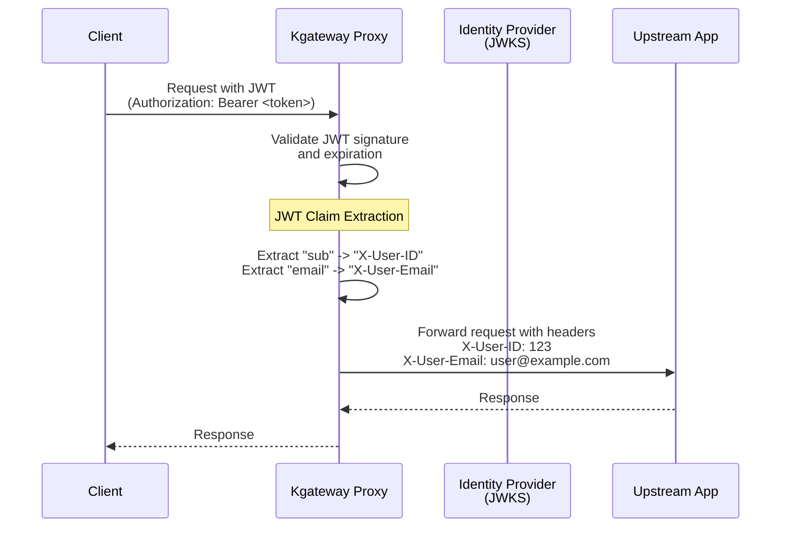

After a request is successfully authenticated via JWT, you can extract specific claims from the token payload and inject them as custom HTTP request headers. These headers are then forwarded to the upstream application, allowing your backend services to access user information (such as user IDs, roles, or email addresses) without having to re-parse or validate the JWT themselves.

## JWT claim extraction in kgateway

The kgateway proxy supports JWT claim extraction through the `claimsToHeaders` field in a `JWTProvider` configuration. You specify the name of the claim you want to extract and the name of the header you want to map it to.

If a claim is present in the validated JWT, the gateway adds the corresponding header to the request. If the claim is missing, the header is not added.

The following diagram illustrates the flow:



## Before you begin



## Extract claims to headers

To extract claims, you configure the `claimsToHeaders` list within your JWT provider configuration.

1. Create a `GatewayExtension` that defines your JWT provider. In this example, we use a provider that validates JWTs against a remote JWKS endpoint and extracts the `sub` and `email` claims.

   ```yaml
   kubectl apply -f- <<EOF
   apiVersion: 
   kind: GatewayExtension
   metadata:
     name: jwt-provider
     namespace: 
   spec:
     jwt:
       providers:
         - name: my-idp
           issuer: https://auth.example.com/
           audiences:
             - my-app-audience
           remoteJwks:
             url: https://auth.example.com/.well-known/jwks.json
           claimsToHeaders:
             - name: "sub"
               header: "X-User-ID"
             - name: "email"
               header: "X-User-Email"
   EOF
   ```

2. Create a  resource that applies the JWT authentication to your gateway.

   ```yaml
   kubectl apply -f- <<EOF
   apiVersion: 
   kind: 
   metadata:
     name: jwt-auth-policy
     namespace: 
   spec:
     targetRefs:
       - group: gateway.networking.k8s.io
         kind: Gateway
         name: http
     jwt:
       extensionRef:
         name: jwt-provider
         namespace: 
   EOF
   ```

3. Send a request to your application with a valid JWT. Verify that the backend receives the injected headers. If you are using the `httpbin` app, you can check the `/headers` endpoint output.

   ```sh
   curl -X GET "http://localhost:8080/headers" \
     -H "host: www.example.com" \
     -H "Authorization: Bearer <your-valid-jwt>"
   ```

   **Example output**:
   In the `headers` section of the response, you should see your custom headers:
   ```json
   {
     "headers": {
       ...
       "X-User-ID": "user-12345",
       "X-User-Email": "alice@example.com",
       ...
     }
   }
   ```

## Cleanup



```sh
kubectl delete  jwt-auth-policy -n 
kubectl delete gatewayextension jwt-provider -n 
```

## Advanced usage

### Extracting nested claims

If your JWT has nested claims (e.g., inside a `profile` object), you can use dot notation to reach them.

```yaml
claimsToHeaders:
  - name: "profile.given_name"
    header: "X-First-Name"
```

### Overwriting vs. Appending

By default, if the client sends a header with the same name as one of your extracted claims (e.g., a malicious client sending their own `X-User-ID` header), kgateway will **overwrite** the client's header with the verified value from the JWT. This ensures that your backend can trust the value in these headers.
