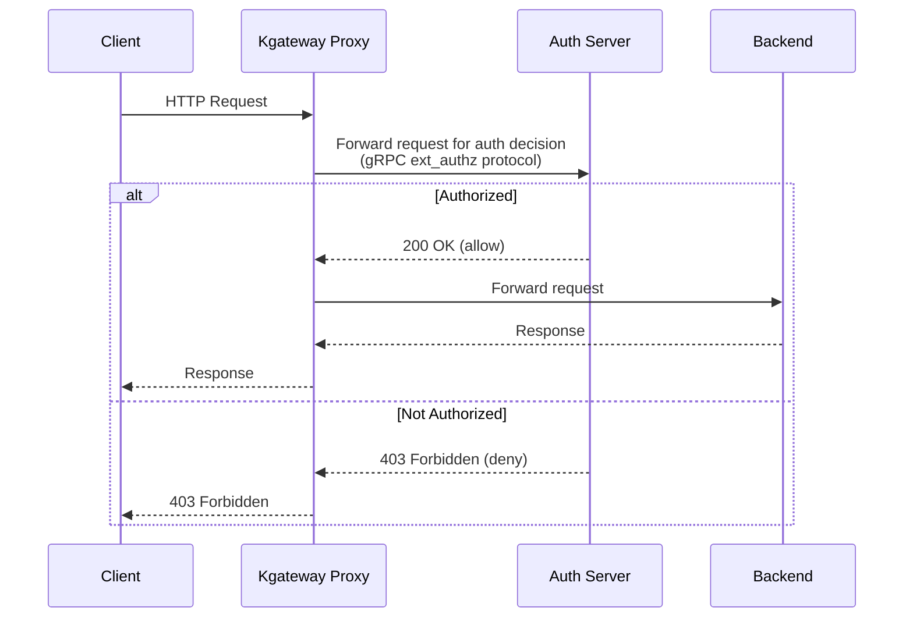

Passthrough authentication lets you delegate all authorization decisions to your own external auth server. The kgateway proxy forwards each incoming request to your auth server, which decides whether to allow or deny it. This approach is useful when you have custom authentication logic, an existing auth service you want to reuse, or compliance requirements that demand a centralized auth server.

## About passthrough auth

The kgateway proxy integrates with external auth servers that implement the [Envoy external authorization gRPC protocol](https://www.envoyproxy.io/docs/envoy/latest/intro/arch_overview/security/ext_authz_filter). You configure the connection to your auth server in a GatewayExtension resource, and then reference that extension in a  resource.



1. The client sends a request to the kgateway proxy.
2. The proxy forwards the request to your auth server using the Envoy gRPC external auth protocol.
3. If the auth server allows the request, the proxy forwards it to the backend.
4. If the auth server denies the request, the proxy returns the configured error status (default: 403 Forbidden) to the client.

## Before you begin



## Deploy your auth server

Deploy an auth server that implements the [Envoy external auth gRPC protocol](https://github.com/envoyproxy/envoy/blob/main/api/envoy/service/auth/v3/external_auth.proto). The following example uses the [Istio external authorization service](https://github.com/istio/istio/tree/master/samples/extauthz) for quick testing. This service allows requests that include the `x-ext-authz: allow` header and denies all others.

1. Deploy the auth server.

   ```yaml
   kubectl apply -f - <<EOF
   apiVersion: apps/v1
   kind: Deployment
   metadata:
     name: ext-authz
     namespace: 
     labels:
       app: ext-authz
   spec:
     replicas: 1
     selector:
       matchLabels:
         app: ext-authz
     template:
       metadata:
         labels:
           app: ext-authz
           app.kubernetes.io/name: ext-authz
       spec:
         containers:
         - name: ext-authz
           image: gcr.io/istio-testing/ext-authz:1.25-dev
           ports:
           - containerPort: 9000
   EOF
   ```

2. Create a Service so that the proxy can reach the auth server.

   ```yaml
   kubectl apply -f - <<EOF
   apiVersion: v1
   kind: Service
   metadata:
     name: ext-authz
     namespace: 
     labels:
       app: ext-authz
   spec:
     ports:
     - port: 4444
       targetPort: 9000
       protocol: TCP
       appProtocol: kubernetes.io/h2c
     selector:
       app: ext-authz
   EOF
   ```

3. Verify that the auth server pod is running.

   ```sh
   kubectl get pods -n  -l app=ext-authz
   ```

## Set up passthrough auth

1. Create a GatewayExtension resource that points the proxy to your auth server. The GatewayExtension must be in the same namespace as the Service that backs the auth server, or you must set up a [Kubernetes ReferenceGrant](https://gateway-api.sigs.k8s.io/api-types/referencegrant/).

   ```yaml
   kubectl apply -f - <<EOF
   apiVersion: gateway.kgateway.dev/v1alpha1
   kind: GatewayExtension
   metadata:
     name: passthrough-auth
     namespace: 
     labels:
       app: ext-authz
   spec:
     type: ExtAuth
     extAuth:
       grpcService:
         backendRef:
           name: ext-authz
           port: 4444
   EOF
   ```

2. Create a  that applies passthrough auth at the Gateway level. For other common configuration examples, see [Other configuration examples](#other-configuration-examples).

   ```yaml
   kubectl apply -f - <<EOF
   apiVersion: 
   kind: 
   metadata:
     name: passthrough-auth
     namespace: 
     labels:
       app: ext-authz
   spec:
     targetRefs:
     - group: gateway.networking.k8s.io
       kind: Gateway
       name: http
     extAuth:
       extensionRef:
         name: passthrough-auth
   EOF
   ```

3. Send a request without the required header. Verify that the auth server denies the request with a 403 response.

   
   {}
   ```sh
   curl -i http://$INGRESS_GW_ADDRESS:8080/headers -H "host: www.example.com:8080"
   ```
   {}
   {}
   ```sh
   curl -i localhost:8080/headers -H "host: www.example.com"
   ```
   {}
   

   Example output:

   ```txt
   HTTP/1.1 403 Forbidden
   x-ext-authz-check-result: denied
   ...
   denied by ext_authz for not found header `x-ext-authz: allow` in the request
   ```

4. Send a request with the `x-ext-authz: allow` header. The Istio auth server is configured to allow requests with this header. Verify that the request succeeds.

   
   {}
   ```sh
   curl -i http://$INGRESS_GW_ADDRESS:8080/headers -H "host: www.example.com:8080" -H "x-ext-authz: allow"
   ```
   {}
   {}
   ```sh
   curl -i localhost:8080/headers -H "host: www.example.com" -H "x-ext-authz: allow"
   ```
   {}
   

   Example output:

   ```txt
   HTTP/1.1 200 OK
   ...
   ```

## Cleanup



```sh
kubectl delete  -A -l app=ext-authz
kubectl delete gatewayextension,deployment,service -n  -l app=ext-authz
```

## Other configuration examples

Review other common configuration examples.

### Disable passthrough auth for a specific route

Apply a passthrough auth policy at the Gateway level, then disable it for a specific HTTPRoute — for example, to exempt health-check endpoints.

```yaml
kubectl apply -f - <<EOF
apiVersion: 
kind: 
metadata:
  name: passthrough-auth-disable
  namespace: httpbin
  labels:
    app: ext-authz
spec:
  targetRefs:
  - group: gateway.networking.k8s.io
    kind: HTTPRoute
    name: httpbin
  extAuth:
    disable: {}
EOF
```

### Send the request body to the auth server

By default, only request headers are forwarded to the auth server. Use `withRequestBody` to also buffer and send the request body. Note that buffering has performance implications for streaming requests.

```yaml
kubectl apply -f - <<EOF
apiVersion: 
kind: 
metadata:
  name: passthrough-auth
  namespace: 
spec:
  targetRefs:
  - group: gateway.networking.k8s.io
    kind: Gateway
    name: http
  extAuth:
    extensionRef:
      name: passthrough-auth
    withRequestBody:
      maxRequestBytes: 8192
EOF
```

### Pass additional context to the auth server

Use `contextExtensions` to send additional key-value metadata to the auth server alongside the request. This setup is useful for passing policy identifiers or tenant information.

```yaml
kubectl apply -f - <<EOF
apiVersion: 
kind: 
metadata:
  name: passthrough-auth
  namespace: 
spec:
  targetRefs:
  - group: gateway.networking.k8s.io
    kind: Gateway
    name: http
  extAuth:
    extensionRef:
      name: passthrough-auth
    contextExtensions:
      policy-id: "my-auth-policy"
      tenant: "team-a"
EOF
```

### Fail open

By default, if the auth server is unavailable, requests are denied. Set `failOpen: true` on the GatewayExtension to allow requests through when the auth server cannot be reached. Use this option with caution.

```yaml
kubectl apply -f - <<EOF
apiVersion: gateway.kgateway.dev/v1alpha1
kind: GatewayExtension
metadata:
  name: passthrough-auth
  namespace: 
spec:
  type: ExtAuth
  extAuth:
    failOpen: true
    grpcService:
      backendRef:
        name: ext-authz
        port: 4444
EOF
```

### Custom error status code

By default, the proxy returns a `403 Forbidden` when the auth server denies a request. Use `statusOnError` on the GatewayExtension to return a different HTTP status code, such as `401 Unauthorized`.

```yaml
kubectl apply -f - <<EOF
apiVersion: gateway.kgateway.dev/v1alpha1
kind: GatewayExtension
metadata:
  name: passthrough-auth
  namespace: 
spec:
  type: ExtAuth
  extAuth:
    statusOnError: 401
    grpcService:
      backendRef:
        name: ext-authz
        port: 4444
EOF
```

### Custom request timeout

Set a timeout for how long the proxy waits for the auth server to respond.

```yaml
kubectl apply -f - <<EOF
apiVersion: gateway.kgateway.dev/v1alpha1
kind: GatewayExtension
metadata:
  name: passthrough-auth
  namespace: 
spec:
  type: ExtAuth
  extAuth:
    grpcService:
      backendRef:
        name: ext-authz
        port: 4444
      requestTimeout: 5s
EOF
```
