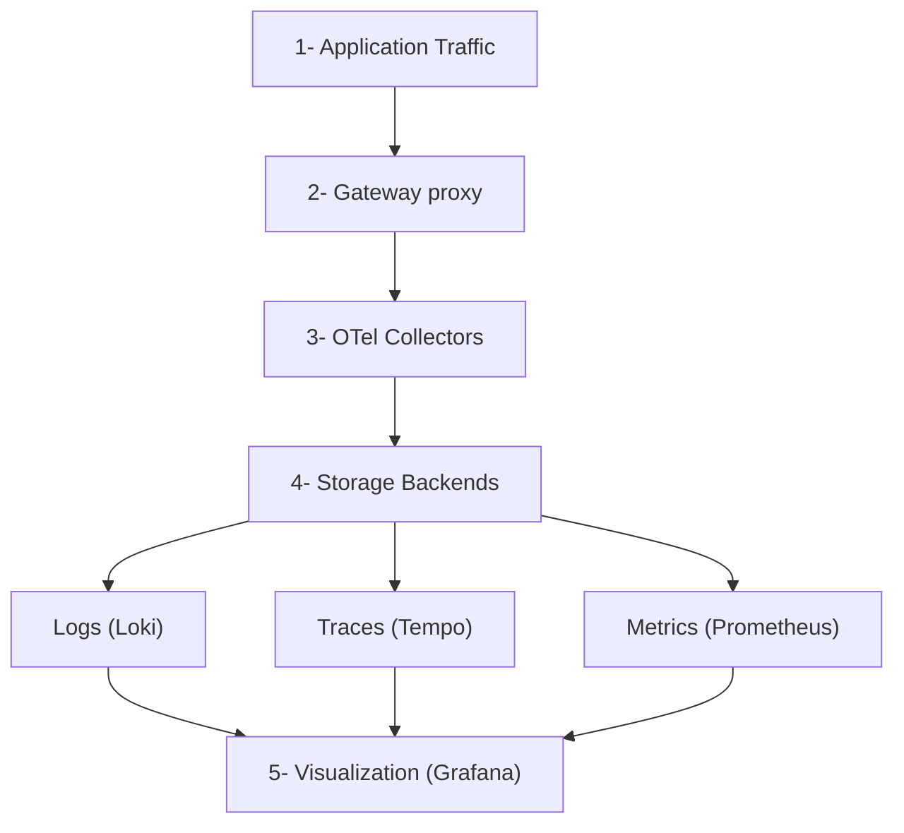

Deploy an open source observability stack based on OpenTelemetry (OTel) that includes the following components:

- **Logs**: Centralized log collection and storage with Grafana [Loki](https://github.com/grafana/loki).
- **Traces**: Distributed tracing with Grafana [Tempo](https://github.com/grafana/tempo).
- **Metrics**: Time-series metrics collection with [Prometheus](https://github.com/prometheus/prometheus).
- **Collection**: Unified telemetry collection with [OpenTelemetry Collector](https://github.com/open-telemetry/opentelemetry-collector).
- **Visualization**: Comprehensive dashboards with [Grafana](https://github.com/grafana/grafana).

## About

Observability tools are essential to gain insight into the health and performance of your gateway proxies. [OpenTelemetry](https://opentelemetry.io/) (OTel) is a flexible, open source framework that provides a set of APIs, libraries, and instrumentation to help capture and export observability data. However, you can follow a similar process as this guide to use the tools that you prefer.

### Observability data types {#data-types}

Observability is built on three core pillars as described in the following table. By combining these three data types, you get a complete picture of your system's health and performance.

| Pillar | Description |
| -- | -- |
| Logs | Discrete events that happen at a specific time with detailed context. |
| Metrics | Numerical measurements aggregated over time intervals. |
| Traces | Records of requests as they flow through distributed systems. |

### Architecture

Review the following diagram to understand the architecture of the observability stack.

The gateway proxy acts as the primary telemetry generator, while the OTel Collectors serve as the central routing hub for all observability data.

Architecture data flow:
1. **Application Traffic**: Applications send requests to the gateway proxy.
2. **Gateway Processing**: The gateway proxy processes requests and generates telemetry data in the form of logs, traces, and metrics.
3. **Telemetry Collection**: The OTel Collectors receive telemetry data from the gateway proxy.
4. **Data Storage**: The OTel Collectors route data to the appropriate storage backends:
   - **Logs** go to Loki for log aggregation and storage.
   - **Traces** go to Tempo for distributed tracing storage.
   - **Metrics** go to Prometheus for time-series metrics storage.
5. **Visualization**: Grafana queries the storage backends as data sources to create unified dashboards.

### More considerations {#more-considerations}

**Push model**: This guide sets up the OTel collectors to push metrics to the storage backends (`push` model), vs. setting up the backends such as Prometheus to scrape metrics from the collector pod (`pull` model). The `push` model is used because it shows the ease and consistency of using OTel for demonstration purposes. It also supports Native Histograms out of the box, which the `pull` model does not due to [a known OTel issue with the Prometheus exporter](https://github.com/open-telemetry/opentelemetry-collector-contrib/issues/33703).

**Debug exporter**: The example pipelines in all three OTel collectors set up the `debug` exporter. This exporter is useful for testing and validation purposes. However, for production scenarios, remove this exporter to avoid performance impacts.

**Prometheus exporter**: If you prefer the `pull` model to the `push` model, you can use `prometheusexporter`'s `promexporter` port with Prometheus to scrape metrics from the collector pod, such as configured in the example later. Also, if you use the `pull` model, make sure to configure Prometheus to handle Native Histograms and scrape the metrics directly as for this model OTel's `prometheusexporter` is not yet supported, per the [known issue](https://github.com/open-telemetry/opentelemetry-collector-contrib/issues/33703) previously mentioned.

## Before you begin

