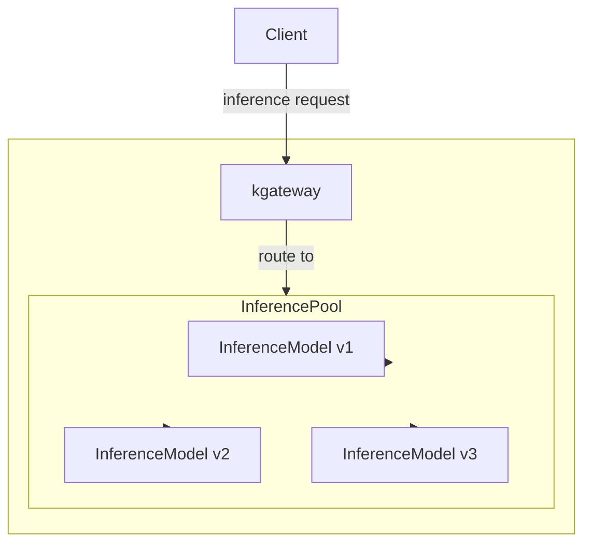

```mermaid
graph TD
    Client -->|inference request| kgateway
    kgateway -->|route to| InferencePool
    InferencePool --> InferenceModel_v1["InferenceModel v1"]
    InferencePool --> InferenceModel_v2["InferenceModel v2"]
    InferencePool --> InferenceModel_v3["InferenceModel v3"]
    subgraph  
        subgraph InferencePool
            direction TB
            InferenceModel_v1
            InferenceModel_v2
            InferenceModel_v3
        end
        kgateway
    end
```