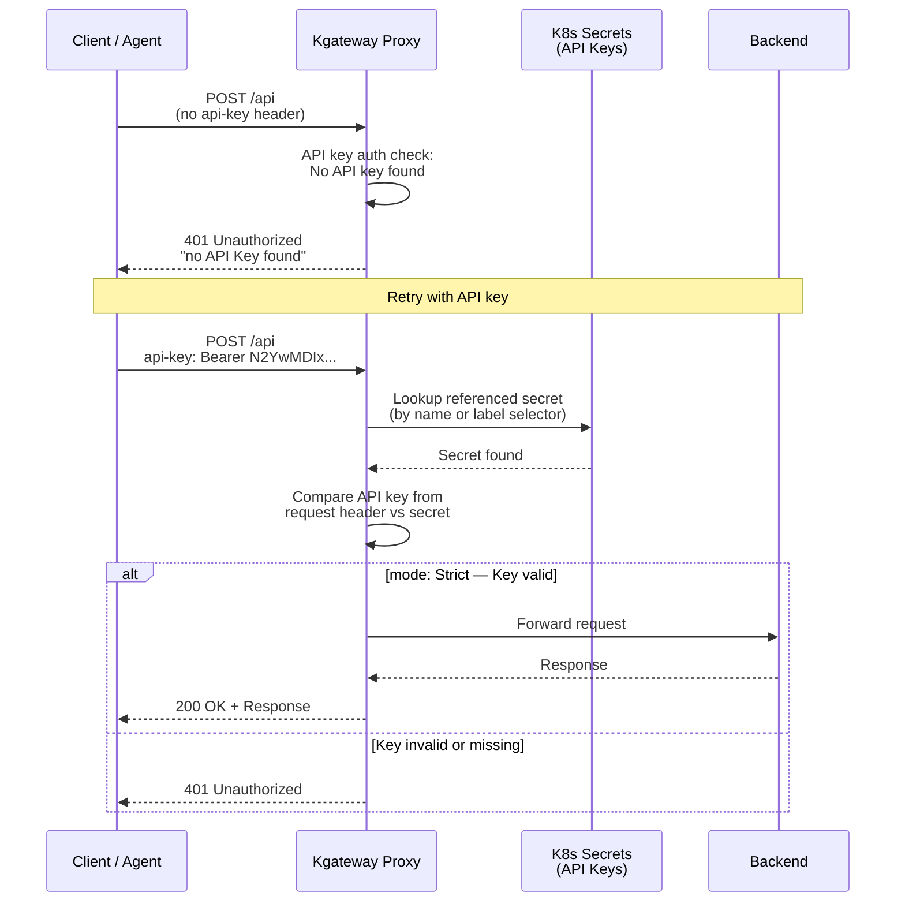

[API keys](https://en.wikipedia.org/wiki/Application_programming_interface_key) are secure, long-lived UUIDs that clients provide when they send a request to your service. You might use API keys in the following scenarios:
* You know the set of users that need access to your service. These users do not change often, or you have automation that easily generates or deletes the API key when the users do change. 
* You want direct control over how the credentials are generated and expire.

> [!WARNING]
> When you use API keys, your services are only as secure as the API keys. Storing and rotating the API key securely is up to the user.

## API key auth in kgateway

The kgateway proxy comes with built-in API key auth support via the  resource. To secure your services with API keys, first provide your kgateway proxy with your API keys in the form of Kubernetes secrets. Then in the  resource, you refer to the secrets in one of two ways.

* Specify a **label selector** that matches the label of one or more API key secrets. Labels are the more flexible, scalable approach.
* Refer to the **name and namespace** of each secret.

The proxy matches a request to a route that is secured by the external auth policy. The request must have a valid API key in the `api-key` header to be accepted. You can configure the name of the expected header. If the header is missing, or the API key is invalid, the proxy denies the request and returns a `401` response. 

The following diagram illustrates the flow: 



## Before you begin



## Set up API key auth

Store your API keys in a Kubernetes secret so that you can reference it in an  resource. 

1. From your API management tool, generate an API key. The examples in this guide use `N2YwMDIxZTEtNGUzNS1jNzgzLTRkYjAtYjE2YzRkZGVmNjcy`.

2. Create a Kubernetes secret to store your API key. Each entry in the secret's data is one API key, where the entry name identifies the client and the value is the key itself. To store keys for several clients, add one entry per client.

   ```yaml 
   kubectl apply -f - <<EOF
   apiVersion: v1
   kind: Secret
   metadata:
     name: apikey
     namespace: 
     labels:
       app: httpbin
   type: extauth.solo.io/apikey
   stringData:
     api-key: N2YwMDIxZTEtNGUzNS1jNzgzLTRkYjAtYjE2YzRkZGVmNjcy
   EOF
   ```

3. Verify that the secret is created. Note that the `data.api-key` value is base64 encoded. 
   
   ```sh
   kubectl get secret apikey -n  -o yaml
   ```

4. Create an  resource that configures API key authentication for all routes that the Gateway serves and reference the `apikey` secret that you created earlier. The following example uses the `Strict` validation mode, which requires requests to include a valid `Authorization` header to be authenticated successfully. For other common configuration examples, see [Other configuration examples](#other-configuration-examples).  
   ```yaml
   kubectl apply -f- <<EOF
   apiVersion: 
   kind: 
   metadata:
     name: apikey-auth
     namespace: 
   spec:
     targetRefs:
       - group: gateway.networking.k8s.io
         kind: Gateway
         name: http
     apiKeyAuth:
       secretRef:
         name: apikey
   EOF
   ```

5. Send a request to the httpbin app without an API key. Verify that the request fails with a 401 HTTP response code. 
   
   
   {}
   ```sh
   curl -vi "${INGRESS_GW_ADDRESS}:8080/headers" -H "host: www.example.com"                                  
   ```
   {}
   {}
   ```sh
   curl -vi "localhost:8080/headers" -H "host: www.example.com" 
   ```
   {}
   

   Example output: 
   ```
   ...
   < HTTP/1.1 401 Unauthorized
   HTTP/1.1 401 Unauthorized

   Client authentication failed   
   ...
   ```

6. Repeat the request. This time, you provide a valid API key in the `Authorization` header. Verify that the request now succeeds. 
   
   {}
   ```sh
   curl -vi "${INGRESS_GW_ADDRESS}:8080/headers" \
   -H "host: www.example.com" \
   -H "api-key: Bearer N2YwMDIxZTEtNGUzNS1jNzgzLTRkYjAtYjE2YzRkZGVmNjcy"                                 
   ```
   {}
   {}
   ```sh
   curl -vi "localhost:8080/headers" \
   -H "host: www.example.com" \
   -H "api-key: Bearer N2YwMDIxZTEtNGUzNS1jNzgzLTRkYjAtYjE2YzRkZGVmNjcy"  
   ```
   {}
   

   Example output: 
   ```console
   ...
   HTTP/1.1 200 OK
   < access-control-allow-credentials: true
   access-control-allow-credentials: true
   < access-control-allow-origin: *
   access-control-allow-origin: *
   < content-type: application/json; encoding=utf-8
   content-type: application/json; encoding=utf-8
   < content-length: 441
   content-length: 441
   < x-envoy-upstream-service-time: 13
   x-envoy-upstream-service-time: 13
   < server: envoy
   server: envoy
   
   {
    "headers": {
      "Accept": [
        "*/*"
      ],
      "Host": [
        "www.example.com"
      ],
      "User-Agent": [
        "curl/8.7.1"
      ],
      "X-Envoy-Expected-Rq-Timeout-Ms": [
        "15000"
      ],
      "X-Envoy-External-Address": [
        "127.0.0.1"
      ],
      "X-Forwarded-For": [
        "10.244.0.18"
      ],
      "X-Forwarded-Proto": [
        "http"
      ],
      "X-Request-Id": [
        "f64f1efa-1288-47d8-921f-4cb8f8deb96c"
      ]
    }
   }
   ...
   ```

## Cleanup 



```sh
kubectl delete  apikey-auth -n 
kubectl delete secret apikey -n 
```

## Other configuration examples

Review other common configuration examples.

### Label selectors

Refer to your API key secrets by using label selectors. 

```yaml
kubectl apply -f- <<EOF
apiVersion: 
kind: 
metadata:
  name: apikey-auth
  namespace: 
spec:
  targetRefs:
    - group: gateway.networking.k8s.io
      kind: Gateway
      name: http
  apiKeyAuth:
    secretSelector:
      matchLabels:
        app: httpbin
EOF
```

A selector can match several secrets, and each secret can hold several API keys, so make sure that each key value is unique across all of them. If the same key value is stored under two different entry names, the  reports a `duplicate API key value` error in its status and API key auth is not applied. If the same key value is stored under the same entry name in more than one secret, the extra copies are ignored and no error is reported.

### Secrets in another namespace

The secrets that you refer to in `secretRef`, or match with `secretSelector`, do not need to be in the same namespace as the . A cross-namespace reference requires a [ReferenceGrant](https://gateway-api.sigs.k8s.io/reference/api-types/referencegrant/) in the namespace that holds the secret. In the ReferenceGrant, the `from` section must use the `gateway.kgateway.dev` group and the `TrafficPolicy` kind. For an example, see [ReferenceGrant example]().

Note the following behavior when you use `secretSelector`:

* The selector matches labels in every namespace, not only the namespace of the .
* A matching secret in another namespace is skipped when no ReferenceGrant allows the reference.
* Skipped secrets are reported only when no secret is left. If at least one secret is allowed, such as a secret in the same namespace as the policy, the policy is applied with the remaining secrets and no error is reported. As a result, a missing ReferenceGrant can silently reduce the set of API keys that are accepted.
* The `failed to get secrets by selector: missing reference grant` error means that every matching secret was skipped.

### Custom header name

By default, kgateway reads the API key from the `api-key` header. Use `keySources` to specify a different header name.

```yaml
kubectl apply -f- <<EOF
apiVersion: 
kind: 
metadata:
  name: apikey-auth
  namespace: 
spec:
  targetRefs:
    - group: gateway.networking.k8s.io
      kind: Gateway
      name: http
  apiKeyAuth:
    secretRef:
      name: apikey
    keySources:
      - header: X-API-KEY
EOF
```

### Multiple key sources

Configure multiple key sources. The gateway proxy checks them in order. If you define different types of key sources, the precedence is determined as follows: 
* Header key sources take precedence over query parameter
* Query parameter key sources take precedence over cookie key sources

```yaml
kubectl apply -f- <<EOF
apiVersion: 
kind: 
metadata:
  name: apikey-auth
  namespace: 
spec:
  targetRefs:
    - group: gateway.networking.k8s.io
      kind: Gateway
      name: http
  apiKeyAuth:
    secretRef:
      name: apikey
    keySources:
      - header: X-API-KEY
      - query: api_key
      - cookie: auth_token
EOF
```

### Forward client ID header

Use `clientIdHeader` to forward the authenticated client identifier to the upstream service in a request header. This setup is useful for passing caller identity to backend services.

```yaml
kubectl apply -f- <<EOF
apiVersion: 
kind: 
metadata:
  name: apikey-auth
  namespace: 
spec:
  targetRefs:
    - group: gateway.networking.k8s.io
      kind: Gateway
      name: http
  apiKeyAuth:
    secretRef:
      name: apikey
    clientIdHeader: x-client-id
EOF
```

### Forward credential to upstream

By default, the API key is stripped from the request before it is forwarded to the upstream. Set `forwardCredential: true` to preserve the API key in the upstream request.

```yaml
kubectl apply -f- <<EOF
apiVersion: 
kind: 
metadata:
  name: apikey-auth
  namespace: 
spec:
  targetRefs:
    - group: gateway.networking.k8s.io
      kind: Gateway
      name: http
  apiKeyAuth:
    secretRef:
      name: apikey
    forwardCredential: true
EOF
```

### Disable API key auth

Use `disable` to override an API key auth policy that is applied at a higher level in the hierarchy, such as a gateway-level policy, for a specific route.

```yaml
kubectl apply -f- <<EOF
apiVersion: 
kind: 
metadata:
  name: apikey-auth-disable
  namespace: 
spec:
  targetRefs:
    - group: gateway.networking.k8s.io
      kind: HTTPRoute
      name: httpbin
  apiKeyAuth:
    disable: {}
EOF
```
