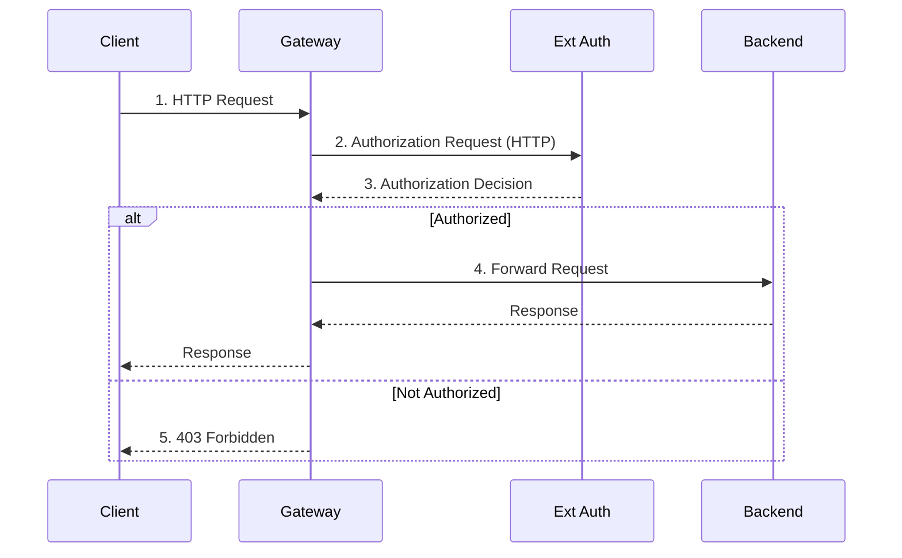

Bring your own HTTP-based external authorization service to protect requests that go through your Gateway.


This guide covers HTTP-based external authorization services. For gRPC-based services, see the [gRPC guide]().


## About external auth {#about}

 lets you integrate your own external authorization service to your Gateway, based on the [Envoy external authorization filter](https://www.envoyproxy.io/docs/envoy/latest/intro/arch_overview/security/ext_authz_filter). 

When using an HTTP authorization service,  forwards only a minimal set of request headers to the authorization service by default, including `Host`, `Method`, `Path`, `Content-Length`, and `Authorization`. Use the `headersToForward` field to forward additional headers such as cookies or custom auth headers.



1. The Client sends a request to the Gateway.
2. The Gateway forwards the request to the Ext Auth service over HTTP.
3. The Ext Auth service makes a decision as to whether the request is authorized, based on headers, parameters, or other credentials.
4. If authorized, the Gateway forwards the request to the Backend app, which then sends back a response to the Client through the Gateway.
5. If not authorized, the Gateway rejects the request and by default returns a 403 Forbidden response to the Client.

## Before you begin 



## Bring your own HTTP external authorization service {#byo-ext-auth}

Deploy your own HTTP-based external authorization service as a backend service that is accessible to your gateway proxy. Then, configure a GatewayExtension to point to the external auth server by using the `httpService` field.


Note that in the following example, resources are created in the same namespace to simplify the setup. To create resources in different namespaces, set up a [Kubernetes ReferenceGrant](https://gateway-api.sigs.k8s.io/reference/api-types/referencegrant/) from the GatewayExtension to the Services that back the external auth service.


1. Deploy your external authorization service. The following example uses the [Istio external authorization service](https://github.com/istio/istio/tree/master/samples/extauthz) for quick testing purposes. This image exposes both a gRPC server on port 9000 and an HTTP server on port 8000. The HTTP server allows requests with the `x-ext-authz: allow` header.

   ```yaml
   kubectl apply -f - <<EOF
   apiVersion: apps/v1
   kind: Deployment
   metadata:
     namespace: 
     name: ext-authz
     labels:
       app: ext-authz
   spec:
     replicas: 1
     selector:
       matchLabels:
         app: ext-authz
     template:
       metadata:
         labels:
           app: ext-authz
           app.kubernetes.io/name: ext-authz
       spec:
         containers:
         - image: gcr.io/istio-testing/ext-authz:1.25-dev
           name: ext-authz
           ports:
           - containerPort: 8000
   EOF
   ```

2. Create a Service for the Deployment that exposes the HTTP port.

   ```yaml
   kubectl apply -f - <<EOF
   apiVersion: v1
   kind: Service
   metadata:
     namespace: 
     name: ext-authz
     labels:
       app: ext-authz
   spec:
     ports:
     - port: 4444
       targetPort: 8000
       protocol: TCP
     selector:
       app: ext-authz
   EOF
   ```

3. Create a GatewayExtension resource that points to your HTTP authorization service by using the `httpService` field. Unlike gRPC, HTTP authorization services receive only a minimal set of client request headers by default, including the `Host`, `Method`, `Path`, `Content-Length`, and `Authorization` headers. Use the `headersToForward` field to specify any additional headers the auth service needs to make its decision.

   ```yaml
   kubectl apply -f - <<EOF
   apiVersion: gateway.kgateway.dev/v1alpha1
   kind: GatewayExtension
   metadata:
     namespace: 
     name: basic-ext-auth
     labels:
       app: ext-authz
   spec:
     type: ExtAuth
     extAuth:
       headersToForward:
         - x-ext-authz
       httpService:
         backendRef:
           name: ext-authz
           port: 4444
   EOF
   ```

   The `httpService` field supports additional optional configuration:

   | Field | Description |
   | -- | -- |
   | `pathPrefix` | Prefix prepended to the authorization request path. Use this field when your auth server expects requests at a specific path, such as `/check` or `/verify`. |
   | `requestTimeout` | Timeout for the authorization request. Defaults to 2 seconds. |
   | `authorizationRequest.headersToAdd` | Additional headers to add to every authorization request that is sent to the auth service. |
   | `authorizationResponse.headersToBackend` | Headers from the authorization response to forward to the upstream service when the request is allowed. |{}
   | `authorizationResponse.headersToClient` | Headers from a denial response to forward to the downstream client. Use this field to pass redirect headers, such as `Location` and `Set-Cookie`, back to the client during redirect-based authentication flows (for example, oauth2-proxy). |
   | `authorizationResponse.headersToClientOnSuccess` | Headers from a successful authorization response to forward to the downstream client. |{}
   | `headersToForward` | Client request headers to forward to the authorization service. HTTP services receive only `Host`, `Method`, `Path`, `Content-Length`, and `Authorization` by default. |

## Create external auth policy {#create-policy}

You can apply a policy at two levels: the Gateway level or the HTTPRoute level. If you apply the policy at both levels, the request must pass both policies to be authorized.

1. Send a test request to the httpbin sample app. Verify that you get back a 200 HTTP response code and that no authorization is required.

   
   {}
   ```sh
   curl -i http://$INGRESS_GW_ADDRESS:8080/headers -H "host: www.example.com:8080"
   ```
   {}
   {}
   ```sh
   curl -i localhost:8080/headers -H "host: www.example.com"
   ```
   {}
   

   Example output: 
   
   ```console
   HTTP/1.1 200 OK
   ...
   ```

2. Create a  that references the GatewayExtension resource that you created earlier to apply external authorization at the Gateway level.

   ```yaml
   kubectl apply -f - <<EOF
   apiVersion: 
   kind: 
   metadata:
     namespace: 
     name: gateway-ext-auth-policy
     labels:
       app: ext-authz
   spec:
     targetRefs:
     - group: gateway.networking.k8s.io
       kind: Gateway
       name: http
     extAuth:
       extensionRef: 
         name: basic-ext-auth
   EOF
   ```

3. Repeat the request to the httpbin sample app and verify that the request is denied with a 403 HTTP response.

   
   {}
   ```sh
   curl -i http://$INGRESS_GW_ADDRESS:8080/headers -H "host: www.example.com:8080"
   ```
   {}
   {}
   ```sh
   curl -i localhost:8080/headers -H "host: www.example.com"
   ```
   {}
   

   Example output: 

   ```console
   HTTP/1.1 403 Forbidden
   ...
   denied by ext_authz for not found header `x-ext-authz: allow` in the request
   ```

4. Send another request with the `x-ext-authz: allow` header. The Istio external authorization service is configured to allow requests with this header. Verify that you get back a 200 HTTP response code.

   
   {}
   ```sh
   curl -i http://$INGRESS_GW_ADDRESS:8080/headers -H "host: www.example.com:8080" -H "x-ext-authz: allow"
   ```  
   {}
   {}
   ```sh
   curl -i localhost:8080/headers -H "host: www.example.com" -H "x-ext-authz: allow"
   ```
   {}
   

   Example output: 

   ```console
   HTTP/1.1 200 OK
   ...
   ```

5. Create another  to disable external authorization for a particular HTTPRoute. This way, requests that do not require external authorization, such as health checks, are allowed through while the external authorization service is still in place for requests to other routes on the Gateway.
   ```yaml
   kubectl apply -f - <<EOF
   apiVersion: 
   kind: 
   metadata:
     namespace: httpbin
     name: route-ext-auth-policy
     labels:
       app: ext-authz
   spec:
     targetRefs:
     - group: gateway.networking.k8s.io
       kind: HTTPRoute
       name: httpbin
     extAuth:
       disable: {}
   EOF
   ```

6. Send a request to the httpbin app without the `x-ext-authz` header and verify that you now get back a 200 HTTP response. 

   
   {}
   ```sh
   curl -i http://$INGRESS_GW_ADDRESS:8080/headers -H "host: www.example.com:8080"
   ```
   {}
   {}
   ```sh
   curl -i localhost:8080/headers -H "host: www.example.com"
   ```
   {}
   

   Example output: 
   
   ```console
   HTTP/1.1 200 OK
   ...
   ```

## Cleanup



1. Delete the  for the Gateway and HTTPRoute.    

   ```sh
   kubectl delete  -A -l app=ext-authz
   ```

2. Delete the sample external authorization service and GatewayExtension resource.

   ```sh
   kubectl delete gatewayextension,deployment,service -n  -l app=ext-authz
   ```
