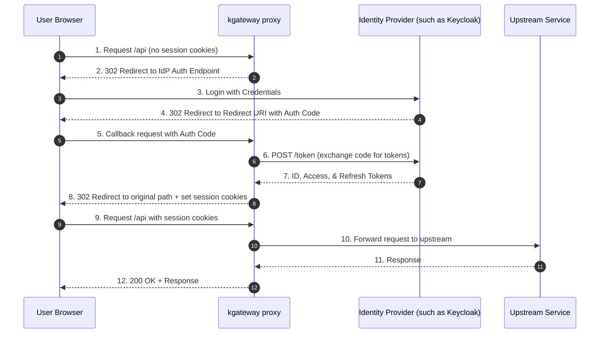

Secure your services by delegating authentication to an external Identity Provider (IdP) using OpenID Connect (OIDC) or OAuth 2.0.

## About OAuth2 and OIDC in kgateway

When you configure OAuth2/OIDC in kgateway, the gateway proxy acts as the OAuth2 client. It intercepts incoming client requests, determines if they are authenticated, and handles the handshake with the authorization server:

1. **Redirect**: If the request does not contain valid session cookies, the gateway redirects the client's browser to the IdP's authorization endpoint.
2. **Callback**: After the user successfully authenticates with the IdP, they are redirected back to the gateway's redirect URI with an authorization code.
3. **Token Exchange**: The gateway proxy intercepts the redirect callback, contacts the IdP's token endpoint to exchange the authorization code for access, ID, and refresh tokens.
4. **Cookies & Forwarding**: The gateway proxy stores the received tokens in encrypted, secure, HTTP-only session cookies in the user's browser, and then forwards the authenticated request to the upstream backend. Subsequent requests from the client use these cookies to bypass the authorization handshake.

The following sequence diagram illustrates this authorization code flow:



## Before you begin



## Set up an identity provider

For detailed instructions on setting up Keycloak as your identity provider, see the [Keycloak IdP guide]().

If you are using a different IdP (such as Auth0, Okta, or Google), you can adapt the steps from that guide to your provider's documentation.


## Set up OAuth2/OIDC authentication

To configure OIDC/OAuth2, you store the client credentials in a Kubernetes Secret, create a `GatewayExtension` specifying the provider details, and apply the policy using a `TrafficPolicy`.

### 1. Store client secret in a Secret

Create a Kubernetes Secret containing your OAuth2 client secret. The secret must contain the client secret under the `client-secret` key:

```yaml
kubectl apply -f- <<EOF
apiVersion: v1
kind: Secret
metadata:
  name: oauth2-client-secret
  namespace: 
type: Opaque
stringData:
  client-secret: my-super-secret-client-secret-key
EOF
```

Replace `my-super-secret-client-secret-key` with the OAuth/OIDC client secret from your identity provider. For example, in Keycloak, this is the secret generated for your confidential client when you create it in the Keycloak admin console.


### 2. Create a GatewayExtension for OAuth2

Create a `GatewayExtension` specifying your OIDC provider settings in the `spec.oauth2` block. The following example uses Keycloak as the Identity Provider:

```yaml
kubectl apply -f- <<EOF
apiVersion: 
kind: GatewayExtension
metadata:
  name: keycloak-oauth2
  namespace: 
spec:
  oauth2:
    backendRef:
      name: keycloak
      namespace: keycloak-system
      port: 8080
    issuerURI: https://keycloak.example.com/realms/master
    redirectURI: https://www.example.com/oauth2/redirect
    credentials:
      clientID: my-client-id
      clientSecretRef:
        name: oauth2-client-secret
    scopes:
      - openid
      - email
      - profile
EOF
```

| Setting | Description |
| ------- | ----------- |
| `backendRef` | Reference to the Kubernetes Service representing your Identity Provider (IdP). This is the internal network path the gateway uses to communicate with the IdP. |
| `issuerURI` | The public issuer URL of the OpenID provider used to discover the auth, token, and JWKS endpoints. Note that while `backendRef` points to the in-cluster location for direct networking, `issuerURI` represents the identity of the issuer as seen by the browser or external clients. |
| `redirectURI` | The callback URI registered with your IdP. The gateway intercepts this endpoint to complete the code exchange. |
| `credentials.clientID` | The client ID registered with your IdP. |
| `credentials.clientSecretRef` | Reference to the Kubernetes Secret containing the client secret. |
| `scopes` | The scopes requested in the authentication flow. Include `openid` to enable OpenID Connect. |

For more details, see the [API reference](https://kgateway.dev/docs/envoy/latest/reference/api/#oauth2jwtconfig).

### 3. Create a TrafficPolicy

Enforce the OAuth2/OIDC authentication policy on your Gateway using the `oauth2` configuration block in a `TrafficPolicy`:

```yaml
kubectl apply -f- <<EOF
apiVersion: 
kind: 
metadata:
  name: oauth2-auth-policy
  namespace: 
spec:
  targetRefs:
    - group: gateway.networking.k8s.io
      kind: Gateway
      name: http
  oauth2:
    extensionRef:
      name: keycloak-oauth2
EOF
```

| Setting | Description |
| ------- | ----------- |
| `targetRefs` | Selects the resource to apply the authentication policy to (such as a Gateway or HTTPRoute). |
| `oauth2.extensionRef` | References the `GatewayExtension` created in the previous step. |


## Verify the authentication flow

1. Open your browser and navigate to the application URL (e.g., `https://www.example.com/`).




2. Verify that you are redirected to the Keycloak login screen.




3. Authenticate with your credentials.

4. Verify that you are redirected back to your application and the request succeeds.




5. Inspect the cookies in your browser; you should see secure, HTTP-only cookies containing the session tokens.




### Test with curl

The following examples show how to test the OAuth2/OIDC flow using curl. The first request triggers a redirect to the IdP, and the second request uses the session cookie obtained after browser login.

**Send a request without authentication (browser flow):**


{}

```sh
curl -vik http://$INGRESS_GW_ADDRESS:8080/headers -H "host: www.example.com:8080"
```

{}
{}

```sh
curl -vik localhost:8080/headers -H "host: www.example.com:8080"
```

{}


**Expected output:**

```text
< HTTP/1.1 302 Found
< location: https://keycloak.example.com/realms/master/protocol/openid-connect/auth?...
```

**Send a request with session cookies (after browser login):**

After completing the browser login flow, copy the session cookie from your browser's developer tools (Application → Cookies) and replace `session-cookie=...` with the actual cookie value.


{}

```sh
curl -vik http://$INGRESS_GW_ADDRESS:8080/headers \
  -H "host: www.example.com:8080" \
  --cookie "session-cookie=..."
```

{}
{}

```sh
curl -vik localhost:8080/headers \
  -H "host: www.example.com:8080" \
  --cookie "session-cookie=..." 
```

{}


**Expected output:**

```text
< HTTP/1.1 200 OK
```

**Optional: Test JWT bearer authentication for API clients**

If you want to test with a bearer token (for API clients), you can use:


{}

```sh
curl -vik http://$INGRESS_GW_ADDRESS:8080/headers \
  -H "host: www.example.com:8080" \
  --header "Authorization: Bearer $TOKEN"
```

{}
{}

```sh
curl -vik localhost:8080/headers \
  -H "host: www.example.com:8080" \
  --header "Authorization: Bearer $TOKEN"
```

{}


**Expected output:**

```text
< HTTP/1.1 200 OK
```

## Advanced configurations

Review these optional configurations to customize the OAuth2/OIDC behavior. Each of the following examples re-applies the `GatewayExtension` that you created in [step 2](#2-create-a-gatewayextension-for-oauth2) with an additional `spec.oauth2` field. Because the resource name is unchanged, re-applying updates your existing `GatewayExtension`.

### Forward access token to backend

By default, the gateway proxy stores tokens in cookies and does not forward them to backend services. Set `forwardAccessToken: true` in your `GatewayExtension` to forward the access token upstream in the `Authorization: Bearer <token>` header:

```yaml
kubectl apply -f- <<EOF
apiVersion: 
kind: GatewayExtension
metadata:
  name: keycloak-oauth2
  namespace: 
spec:
  oauth2:
    backendRef:
      name: keycloak
      namespace: keycloak-system
      port: 8080
    issuerURI: https://keycloak.example.com/realms/master
    redirectURI: https://my-app.example.com/oauth2/redirect
    credentials:
      clientID: my-client-id
      clientSecretRef:
        name: oauth2-client-secret
    scopes:
      - openid
      - email
      - profile
    forwardAccessToken: true
EOF
```

### Customize cookie configuration

You can customize the names, domain, and `sameSite` policy of the cookies used to store session tokens:

```yaml
kubectl apply -f- <<EOF
apiVersion: 
kind: GatewayExtension
metadata:
  name: keycloak-oauth2
  namespace: 
spec:
  oauth2:
    backendRef:
      name: keycloak
      namespace: keycloak-system
      port: 8080
    issuerURI: https://keycloak.example.com/realms/master
    redirectURI: https://my-app.example.com/oauth2/redirect
    credentials:
      clientID: my-client-id
      clientSecretRef:
        name: oauth2-client-secret
    scopes:
      - openid
      - email
      - profile
    cookies:
      domain: example.com
      sameSite: Lax
      names:
        accessToken: my-custom-access-token
        idToken: my-custom-id-token
EOF
```

### Extract JWT claims to custom request headers

If your Identity Provider issues tokens in JWT format, you can configure kgateway to verify the signatures and copy specific claims (such as the user `email`, `sub`, or custom roles) directly into HTTP headers forwarded to the backend:

```yaml
kubectl apply -f- <<EOF
apiVersion: 
kind: GatewayExtension
metadata:
  name: keycloak-oauth2
  namespace: 
spec:
  oauth2:
    backendRef:
      name: keycloak
      namespace: keycloak-system
      port: 8080
    issuerURI: https://keycloak.example.com/realms/master
    redirectURI: https://my-app.example.com/oauth2/redirect
    credentials:
      clientID: my-client-id
      clientSecretRef:
        name: oauth2-client-secret
    scopes:
      - openid
      - email
      - profile
    jwt:
      jwksURI: https://keycloak.example.com/realms/master/protocol/openid-connect/certs
      idToken:
        claimsToHeaders:
          - name: sub
            header: x-user-id
          - name: email
            header: x-user-email
EOF
```

### Deny redirect for AJAX / API requests

For API calls or AJAX requests (such as `fetch` or `XMLHttpRequest`), a `302 Redirect` back to a login screen is undesirable. Use `denyRedirect` to specify header match rules. When a request matches these rules, the gateway returns a `401 Unauthorized` response instead of redirecting:

```yaml
kubectl apply -f- <<EOF
apiVersion: 
kind: GatewayExtension
metadata:
  name: keycloak-oauth2
  namespace: 
spec:
  oauth2:
    backendRef:
      name: keycloak
      namespace: keycloak-system
      port: 8080
    issuerURI: https://keycloak.example.com/realms/master
    redirectURI: https://my-app.example.com/oauth2/redirect
    credentials:
      clientID: my-client-id
      clientSecretRef:
        name: oauth2-client-secret
    scopes:
      - openid
      - email
      - profile
    denyRedirect:
      headers:
        - name: X-Requested-With
          value: XMLHttpRequest
EOF
```

## Advanced: Separate JWKS backend

For scenarios where your JWKS endpoint is on a different domain than your token endpoint such as Amazon Cognito, see the [two-backends OAuth page]().


## Cleanup



```sh
kubectl delete  oauth2-auth-policy -n 
kubectl delete gatewayextension keycloak-oauth2 -n 
kubectl delete secret oauth2-client-secret -n 
```
