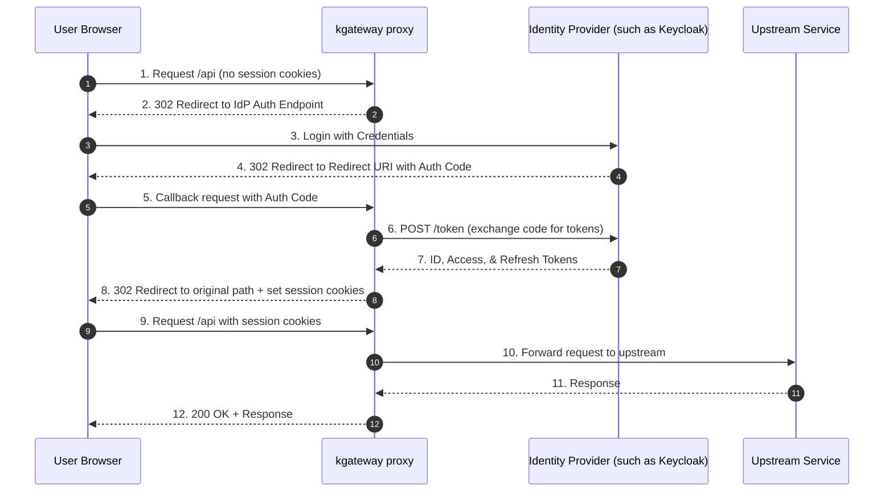

Secure your services by delegating authentication to an external Identity Provider (IdP) using OpenID Connect (OIDC) or OAuth 2.0.

## About OIDC

OpenID Connect (OIDC) is an identity layer built on top of the OAuth 2.0 protocol. In OAuth 2.0 flows, authentication is performed by an external identity provider (IdP). For successful authentications, the IdP returns an access token that represents the user identity. However, the protocol does not define the contents and structure of the access token. This ambiguity reduces the portability of OAuth 2.0 implementations.

OIDC addresses this by requiring IdPs to return a well-defined **ID token** that follows the JSON Web Token (JWT) standard. This standardization allows you to:

- Switch between different IdPs with minimal changes
- Support multiple IdPs at the same time
- Apply consistent security measures (like RBAC) based on token contents

## Downstream authentication

When you configure OAuth2 authentication in kgateway, the gateway acts as the OAuth2 client between your users and an external Identity Provider (IdP). Instead of applications communicating directly with the IdP, the gateway manages the authentication flow, token exchange, and session management before forwarding authenticated requests to your backend services.

In a downstream authentication pattern, clients authenticate to the gateway rather than directly to the backend service. The gateway:

- Redirects unauthenticated users to the configured Identity Provider (IdP)
- Completes the OAuth2 or OIDC authorization flow
- Exchanges authorization codes for tokens
- Stores session information
- Forwards authenticated requests to backend services

Because authentication is centralized at the gateway, backend services do not need to implement OAuth2 or OIDC themselves.

## Supported OAuth2 flows

kgateway supports two types of OAuth 2.0 flows:

| Flow | Typical clients | Gateway behavior |
|------|----------------|------------------|
| **Authorization Code Flow** | Browser applications | Redirects user to IdP, exchanges authorization code for tokens, manages session cookies |
| **Access Token Validation** | API clients, CLI tools, mobile apps | Validates bearer token on each request without redirecting the client |

### Authorization code flow

The authorization code flow is commonly used in web applications where end users access your APIs through a browser.

Before a request is forwarded to a protected API, the gateway intercepts and redirects the request to the OIDC provider. The user authenticates through the OIDC provider. If successful, the OIDC provider issues an authorization code. The gateway exchanges this code for an identity (ID) and access token. The gateway stores these tokens in secure, HTTP-only session cookies, and the access token is never exposed to the user's browser.

### Access token validation flow

For programmatic access, you can set up external auth to use access token validation. The user gets the access token from the OIDC provider first. Then, the user provides the access token in requests to your APIs. The gateway validates the token and, if valid, forwards the request to the upstream service.

## OAuth2 backends

OAuth2 provider configuration is defined separately from the gateway policy by using OAuth2 backends. An OAuth2 backend contains provider-specific configuration such as:

- Issuer URI
- Authorization endpoint
- Token endpoint
- Client credentials
- Logout endpoint

Gateway policies reference one or more OAuth2 backends through backendRefs, which separates provider configuration from traffic policy.

This design allows you to:

- Reuse the same provider configuration across multiple routes
- Configure different Identity Providers for different applications
- Migrate between providers with minimal changes
- Support multiple IdPs within the same cluster

## How kgateway handles OAuth2

When you configure OAuth2/OIDC in kgateway, the gateway proxy acts as the OAuth2/OIDC client on behalf of downstream applications. It intercepts incoming requests, handles the handshake with the authorization server, and manages token storage and validation.

## Session cookies

The gateway stores access tokens, ID tokens, and optionally refresh tokens in secure, HTTP-only session cookies. These cookies are managed by the gateway and are not exposed to the user's browser, ensuring that tokens are not accessible to client-side scripts.

## Provider independence

Although this documentation uses providers such as Keycloak and Auth0, any standards-compliant OpenID Connect provider can be configured by supplying the appropriate OAuth2 backend configuration.
