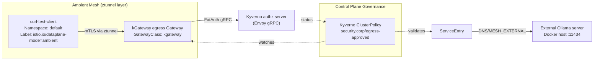

Modern Kubernetes platforms already secure in-cluster (east–west) communication through service meshes like Istio. But the same rigor rarely applies to outbound (egress) traffic — calls leaving the cluster to reach APIs, model endpoints, or third-party services. Without standardized policies, teams often struggle to track which workloads are reaching out to the internet, whether those requests are properly authorized, and how to enforce consistent authentication without adding custom code in every service. This blog reflects my LFX Mentorship journey, where I deep-dived into designing a well governed, observable, and secure egress pathway for Kubernetes workloads.
Modern Kubernetes platforms already secure in-cluster (east–west) communication.

These inconsistencies create both visibility gaps and compliance risks. Platform engineers also need to ensure that failures in external dependencies don’t cascade back into the cluster. The goal of this post is to design a policy-enforced, resilient egress path that is observable, auditable, and governed, using three key technologies working together: **[kgateway](https://kgateway.dev/docs/latest/quickstart/)** (an Envoy-based pluggable gateway), **[Istio Ambient Mesh](https://ambientmesh.io/docs/about/overview/)** (providing secure L4 identity and mTLS), and **[Kyverno](https://kyverno.io/docs/installation/)** (for external authorization and configuration governance).

## The challenge with outgoing traffic

In most clusters, outbound requests leave through arbitrary nodes or NAT gateways, bypassing the control that meshes offer internally. This leads to shadow egress — workloads connecting directly to external endpoints without policy or inspection. Authorization checks are often inconsistent, and operations teams have little visibility into which service made which request.

Even when egress is centralized, resilience policies such as timeouts and retries vary across services, and new external hosts can appear without any governance review. Together, these issues create a fragile perimeter where traffic is secure inside the mesh, but uncontrolled once it leaves the cluster.


## The role of an egress gateway

An egress gateway solves this by acting as a single, managed exit point from the mesh. Every outbound HTTP(S) call passes through it, where you can consistently apply identity-aware routing, authorization policies, retry logic, and observability.

In this post, we’ll show how kgateway, an Envoy-powered gateway built for Gateway API and Ambient Mesh, can serve as that controlled exit point. By combining it with Kyverno’s external authorization (ExtAuth) and Istio Ambient’s secure overlay, we can inspect and govern all outbound traffic without sidecars or additional proxies.


## How the components work together and what does the Blog demonstrate

At the foundation, Istio Ambient Mesh provides L4 security and workload identity via its ztunnel layer. On top of that, kgateway manages egress traffic through L7 routing and resilience features, while Kyverno acts on two planes — as an external authorization service at runtime and as a policy engine for governance during configuration.

Together, they form a layered security and governance model for egress traffic. The Ollama container running outside the cluster serves as our real-world external endpoint — representing a model API or SaaS service — to validate that all outbound requests follow the intended security and control flow.

This guide walks you through how to register an external host using an Istio ServiceEntry, route outbound traffic via a dedicated kgateway egress proxy, and then enforce Kyverno-based authorization at Layer 7.

We will also introduce a Kyverno ClusterPolicy to add governance at the control plane, ensuring all new external ServiceEntries are properly labeled and approved. Finally, we’ll test resilience by pausing the external Ollama service and observing retry and timeout behaviors (503/504) enforced through kgateway’s TrafficPolicy.

## Architecture



## Prequisites
Before setting up the integration between kgateway, Istio Ambient Mesh, and Kyverno, ensure that your local or lab environment includes the following tools and configurations:
* [Docker](https://docs.docker.com/get-docker/)
* [kind (Kubernetes in Docker)](https://kind.sigs.k8s.io/docs/user/quick-start/)
* [kubectl](https://kubernetes.io/docs/tasks/tools/)
* [Helm](https://helm.sh/docs/intro/install/)
* [kgateway](https://kgateway.dev/docs/latest/quickstart/)
* [Kyverno](https://kyverno.io/docs/installation/)


# How Istio Ambient Mesh is different from Service Mesh

Istio Ambient Mesh is a sidecar-less data plane model designed to reduce operational overhead and improve resource efficiency for service-to-service communication. Instead of using per-pod sidecar proxies, Ambient splits its data plane into two layers:

* **Secure Overlay Layer (L4)** — Handled by the lightweight *ztunnel*, providing mTLS, identity, and network telemetry.
* **Waypoint Proxy Layer (L7)** — Handles application-layer policies such as routing, authentication, RBAC, and external authorization.

This separation lets platform teams choose when L7 processing is necessary, reducing cost and computational overhead for workloads that only require transport security.

## kgateway's integration with Ambient Mesh
kgateway integrates to Ambient Mesh for managing our workloads through Layer 4 and Layer 7 network policies. But the thing that sets its apart from other Gateway solutions is that, kgateway is the first project that can be used as a pluggable waypoint for Istio. 
kgateway has been built on same Envoy engine that Istio’s waypoint implementation uses, which has certain features including Istio API Compatability, Shared Observability, Faster Adoption of Security Featrues and Unified Configurational Model with Ambient Mesh.

## Prepare your kgateway environment
Before integrating kagteway with Istio Ambient, ensure we have: 
1. Follow the [Get started guide](https://kgateway.dev/docs/latest/quickstart/) to install kgateway in a kind cluster
2. Follow the [Sample app guide](https://kgateway.dev/docs/latest/install/sample-app/) to create a gateway proxy with an HTTP listener and deploy the httpbin sample app.
3. Set up an ambient mesh in your cluster to secure service-to-service communication with mutual TLS by following the [ambientmesh.io](https://ambientmesh.io/docs/quickstart/) quickstart documentation.
4. Deploy the Ollama Container at port number 11434, binding to 0.0.0.0 so the Kubernetes virtual machine can access it via the host's bridge network.
   ```
   docker run -d -v ollama:/root/.ollama -p 11434:11434 -e OLLAMA_HOST=0.0.0.0 ollama/ollama --name ollama-server
   ```
5. Get the Container IP of ollama container which will be inserted at all the **`address filds` which is 172.17.0.2 in our case.
   ```
   docker inspect -f '{{range .NetworkSettings.Networks}}{{.IPAddress}}{{end}}' <CONTIANER_NAME>
   ```
   Here it will get container's IP as an output:
   ```
   172.17.0.2
   ```
6. Install the Kyverno Envoy authorization plugin that will receive external authorization (ExtAuth) calls from kgateway:
   ```
   helm install kyverno-authz-server --namespace default --create-namespace --wait \
   --version 0.1.0 --repo https://kyverno.github.io/kyverno-envoy-plugin \
   kyverno-authz-server
   ```

While Istio ambient provides Authorization, Authentication and Egress still, there are several scenarios where kgateway can offer a more powerful alternative:

## Securely Egress Traffic with kgateway + Istio Integration

To establish a dedicated, policy-enforced egress path, we must combine three core resources: the **Istio ServiceEntry** (to register the external host), the **kgateway Egress Gateway**, and the **HTTPRoute** (to apply the routing and security logic).

* Our target is an external Ollama container running on the host machine (host.docker.internal) on the default port 11434 and `ServiceEntries` injects the external Ollama endpoint into the Istio service registry for which we'll use static resolution for our local Docker Desktop bridge.
* Define the Gateway resource, leveraging the kgateway GatewayClass to instantiate a dedicated proxy that is explicitly listening for outbound traffic to the Ollama host with an HTTPRoute.

### Why a ServiceEntry is used instead of a `kgateway Backend`?

kgateway also supports defining a **Backend** object (with static endpoints) that the HTTPRoute could reference directly. While that approach works for simple north-south scenarios, it keeps the external host outside of Istio’s service registry.

Using a ServiceEntry delivers two mesh-native advantages:
1. **Unified observability:** By registering the Ollama target with a ServiceEntry, Istio recognizes it as part of the mesh topology. That means ambient telemetry, metrics, and traces automatically include calls to the external service, in addition to the kgateway-specific stats. A kgateway Backend would only emit gateway-layer metrics.
2. **Ambient mesh security:** Because the egress gateway itself participates in Ambient Mesh, Istio can enforce mTLS from the ztunnel layer to the gateway. ServiceEntries are the mechanism Ambient uses to represent external workloads, so mTLS and L4 policy continue to apply even though the destination lives outside the cluster.

In short, a kgateway Backend is great when you only need Gateway API features, but combining a ServiceEntry with kgateway lets you extend Istio’s observability and identity controls all the way to that external dependency.

```yaml
kubectl apply -f - <<EOF
apiVersion: gateway.networking.k8s.io/v1
kind: Gateway
metadata:
  name: egress-kgateway
  namespace: default
spec:
  gatewayClassName: kgateway
  listeners:
    - protocol: HTTP
      port: 8080
      name: http
      allowedRoutes:
        namespaces:
          from: All
---

apiVersion: networking.istio.io/v1beta1
kind: ServiceEntry
metadata:
  name: ollama-external-host
  namespace: default
  labels:
    security.corp/egress-approved: "true"
spec:
  hosts:
  - "host.docker.internal"
  location: MESH_EXTERNAL
  ports:
  - number: 11434
    name: http-ollama
    protocol: HTTP
  resolution: DNS
---

apiVersion: gateway.networking.k8s.io/v1
kind: HTTPRoute
metadata:
  name: ollama-egress-route
  namespace: default 
spec:
  parentRefs:
  - name: egress-kgateway
    sectionName: http
  hostnames:
  - "host.docker.internal"
  rules:
  - backendRefs:
    - name: ollama-external-host
      port: 11434
      kind: ServiceEntry
      group: "networking.istio.io"
EOF
```
### Enroll kgateway and workloads into Ambient Mesh

For the egress gateway to participate in Ambient Mesh and benefit from mTLS and unified observability, we need to enroll the namespace where the gateway is deployed. This ensures traffic from mesh-enabled workloads to the gateway is secured via Ambient's ztunnel layer.

```sh
kubectl label ns default istio.io/dataplane-mode=ambient
```

This label instructs Istio to configure ztunnel sockets on all pods in the `default` namespace, including the kgateway egress proxy pods. Now traffic from mesh-enabled clients (like our test client) to the gateway will be secured with mTLS.

## Managing CEL based RBAC and integrating exAuth with Kyverno into our Request FLow

While Istio Ambient gives us coarse authorization at L4, scenarios like header-based controls, API key validation, or integration with corporate IdPs require richer context. This is where [Kyverno](https://kyverno.io) enters the picture for the rest of the tutorial: it exposes an Envoy-compatible gRPC endpoint so that kgateway can delegate per-request decisions (ExtAuth) right before the traffic leaves the cluster, and later we’ll use the same engine to enforce configuration governance. kgateway’s External Authorization capability allows us to route every Ollama request through this Kyverno service.

kgateway allows us to easily delegate the authorization step for the Ollama API call to an external gRPC service, implementing a Zero Trust defense-in-depth strategy. 
```YAML
kubectl apply -f - <<EOF
apiVersion: gateway.kgateway.dev/v1alpha1   # TrafficPolicy for ExtAuth + Corrected kgateway Resilience
kind: TrafficPolicy
metadata:
  name: ollama-external-auth-policy
  namespace: default
spec:
  targetRefs:
  - group: gateway.networking.k8s.io
    kind: HTTPRoute
    name: ollama-egress-route
  retry:
    attempts: 3
    perTryTimeout: 10s
    statusCodes:
    - 503
    - 504
  timeouts:
   request: 30s
  extAuth:
    extensionRef:
      name: kyverno-authz-server
---
EOF
```

The TrafficPolicy above does more than just hook up ExtAuth:

- **Retries & timeouts** guarantee that kgateway will automatically re-attempt authorization calls if Kyverno is slow or briefly unavailable, instead of immediately failing user traffic.
- **Fail-open vs fail-closed:** The GatewayExtension controls this stance. In regulated environments we typically fail closed (default), but for low-risk demos we can set `failOpen: true` so traffic continues if Kyverno is down, keeping user flows alive while logging the gap.

```YAML
kubectl apply -f - <<EOF

apiVersion: gateway.kgateway.dev/v1alpha1   # GatewayExtension defines the Kyverno server endpoint
kind: GatewayExtension
metadata:
  name: kyverno-authz-server
  namespace: default
spec:
  type: ExtAuth
  extAuth:
    failOpen: false   # keep requests blocked if Kyverno is unavailable
    grpcService:
      backendRef:
        name: kyverno-authz-server
        port: 9081
---
EOF
```

In production you would tune `failOpen` per criticality: customer-facing payment traffic may prefer `false`, whereas internal experimentation clusters might temporarily set it to `true` during policy rollouts.

## Authorization rules for Ollama traffic

With traffic flowing through ExtAuth we now define the actual rules Kyverno must evaluate. For this tutorial we require a positive confirmation header before any prompt reaches the external model. The Envoy AuthorizationPolicy below expresses that business rule using CEL expressions:

```YAML
kubectl apply -f - <<EOF
apiVersion: envoy.kyverno.io/v1alpha1   # Kyverno AuthorizationPolicy: RESTORING SECURITY (Conditional Access)
kind: AuthorizationPolicy
metadata:
  name: demo-policy.example.com
  namespace: default
spec:
  failurePolicy: Fail
  variables:
  - name: force_authorized
    expression: object.attributes.request.http.?headers["x-force-authorized"].orValue("")
  - name: allowed
    expression: variables.force_authorized in ["enabled", "true"]
  authorizations:
  - expression: >
      variables.allowed
        ? envoy.Allowed().Response()
        : envoy.Denied(403).WithBody("Access denied by Kyverno policy").Response()
EOF
```
Here’s what this means operationally:

- **Positive assertion header:** Only requests that carry `x-force-authorized: true` or `enabled` are forwarded to Ollama. This mirrors how enterprises often want application teams to explicitly “tag” the traffic as compliant with business policies.
- **Deterministic deny path:** Anything else triggers a 403 with a human-readable reason so SREs can quickly debug missing headers.
- **Failure policy:** We keep `failurePolicy: Fail` so that malformed requests or Kyverno evaluation errors default to “deny,” ensuring the external model never sees unaudited requests.

# Kyverno Configuration Policy/ Configuration Governance

Runtime enforcement alone is not enough in real enterprises. Platform or security teams usually require an approval workflow before new egress endpoints are allowed. The ClusterPolicy below models that review step: every ServiceEntry must carry the `security.corp/egress-approved: "true"` label, signalling that an administrator verified the destination and its data-sharing risk.

In a corporate process this label might be set only after a Jira ticket is approved or a risk assessment is completed. Without it, developers cannot onboard shadow endpoints, and Kyverno blocks the object at admission time.

```YAML
kubectl apply -f - <<EOF
apiVersion: kyverno.io/v1
kind: ClusterPolicy
metadata:
  name: enforce-serviceentry-egress-label
spec:
  validationFailureAction: Enforce 
  background: false 
  rules:
  - name: require-approved-egress-label
    match:
      any:
      - resources:
          kinds: ["ServiceEntry"]
          names: ["ollama-external-host"]
    validate:
      message: "External ServiceEntries must include the label 'security.corp/egress-approved: true' to ensure policy review."
      pattern:
        metadata:
          labels:
            security.corp/egress-approved: "?*"
EOF
```
# See it in Action/ Testing

### Deploy the test client

To test the security policies applied by kgateway, we use a simple Pod named curl-test-client. Its primary role is to serve as the mesh-enabled client that originates the outbound traffic, allowing us to test Layer 4 security (mTLS) and Layer 7 policies (CEL RBAC/ExtAuth). It is labeled for Ambient Mesh enrollment.

```YAML
kubectl apply -f - <<EOF
apiVersion: apps/v1
kind: Deployment
metadata:
  name: curl-test-client
  namespace: default
  labels:
    app: curl-client
    istio.io/dataplane-mode: ambient
spec:
  replicas: 1
  selector:
    matchLabels:
      app: curl-client
  template:
    metadata:
      labels:
        app: curl-client
        istio.io/dataplane-mode: ambient
    spec:
      containers:
      - name: client
        image: curlimages/curl
        command: ["sleep", "3600"] 
        imagePullPolicy: IfNotPresent
EOF
```

### Verify authorization policies for the Ollama service
We will use the client app that we previously deployed to execute tests against the `host.docker.internal` domain through the kgateway egress gateway.

Authorized Test (With Required Header)
This test should be allowed because the header x-force-authorized: true satisfies the Kyverno Envoy AuthorizationPolicy. The traffic is then proxied by kgateway to the Ollama container.
```sh
kubectl exec -it deploy/curl-test-client -n default -- curl http://egress-kgateway.default:8080/ -v -H "Host: host.docker.internal" -H "x-force-authorized: true"
```

Expected Output:
```sh
< HTTP/1.1 200 OK
...
Ollama is running%
```

If we would not include the true or enabled label with our test command then we will receive an error with 403 Forbidden as:
```
< HTTP/1.1 403 Forbidden
< content-type: text/plain
Access denied by Kyverno policy
```

### Verify retry policies on the Kyverno server

While the TrafficPolicy defines the retry logic (attempts: 3, on 503 or 504), we must prove that the kgateway egress gateway actually executes the retries when an upstream service fails. We will simulate an upstream connection failure by temporarily pausing the external Ollama container.
To test out an error, lets stop our Docker Ollama-server:
```
docker pause ollama-server
echo "Ollama container is paused. Proceeding to send request..."
```
Now Let's try sending our request to ollama-server which is stopped thus unreachable:
```
kubectl exec -it deploy/curl-test-client -n default -- curl http://egress-kgateway.default:8080/ -v -H "Host: host.docker.internal" -H "x-force-authorized: true"
```
Send a request. kgateway will try three times (as configured by attempts: 3 in the TrafficPolicy) before ultimately failing and returning a 503 Service Unavailable or a 504 Gateway Timeout error to the client like:
```
< HTTP/1.1 504 Gateway Timeout
< content-type: text/plain
upstream request timeout
```

Now let's look at the logs from the kgateway egress gateway pod. We look for the final access log entry, which must contain the URX and UF flags to prove the retries occurred.

```sh
KGW_POD=$(kubectl get pods -n default -l gateway.networking.k8s.io/gateway-name=egress-kgateway -o jsonpath='{.items[0].metadata.name}')   # Get the pod name for the egress-kgateway

kubectl logs $KGW_POD -n default | grep 'POST /api/generate' | tail -n 1   # View the last request log entry
```
You should see an output similar to the following:
```
{
  "response_flags": "URX,UF",
  "upstream_transport_failure_reason": "delayed connect error: Connection refused",
  "attempt_count": 2
}
```
# Blog's Technical Conclusion
While Istio Ambient Mesh simplifies service-to-service security by removing sidecars and introducing a layered data plane model, this guide extended its capabilities to demonstrate how kgateway strengthens that foundation with fine-grained policy control, external authorization, and governance enforcement. This paves the way for platform teams to confidently manage both north-south and east-west traffic using a single control model — all while keeping the lightweight operational benefits that Ambient Mesh was designed for.
Through this Blog we addressed one of the most overlooked challenges in service mesh deployments on **How can we extend mesh-level security beyond internal workloads while ensuring Outbound traffic follows the same policy rigor, auditability, and compliance as in-cluster communication.**

# Demo

[Demo](https://youtu.be/5PegECeu0v0)




# My LFX Mentorship Experience
It's always great to contribute to a project and gain skills, experience, expertise and knowledge while working on certain different features of that project, but one of the most important part of contributing to an open source or being a part of an amazing project like kgateway is building up a strong confidence towards the future of the project and building up a commitement for the future to keep contributing as much value back to the project, to keep project's growth gain a consistent or exponential growth sustainably over the interval.

This is only possible with project's strong aim to solve problems in the most required format and with a strong community which is committed to keep the things **Up and Running**, inspired in a direction to solve issues that really messes around with the minds and tasks of the Developers but still remains ignored amid its complexity. 

For a Mentee, his Mentors are the faces of the entire project's community, on which they are working! Thus, it would'nt have been possible without the help of my Mentors - **Nina Polshakova** who kept helping me in the journey of this entire mentorship with every PR added & weekly targets, while contributing constantly to the latest Release v2.1 of kgateway with its first and biggest integration with agentgateway, and **Lin Sun** who helped me and the presiding the entire open source community while managing projects like agentgateway and kagent while working on kgateway's latest release v2.1!

Community at **Kgateway** have been constantly focussing to solve issues which revolves around integration, observability, Security, AI collaboration and Governance implementing the Kubernetes Gateway API with a control plane that scales from lightweight microgateway deployments between services, to massively parallel centralized gateways handling billions of API calls. Community have been markign a huge impact by managing projects that can really impact the Workload orchestration and management through projects like:
- **kgateway** to focus on control plane while integrating with Envoy-based data plane for secure API management of ingress, egress and service mesh.
- **agentgateway** to provide an AI-first enterprise data plane for connectivity across agents, MCP tools, LLMs and interferences written in Rust.

## Community Interaction & Participation
It's always a good idea to go through the project and interract with the community before applying, but many menntees get too excited here and staright away apply for the mentorship which might highlight add some lack of interest in the project in Future.

For me, **the value that the project have been adding to the entire landscape matters the most**. kgateway attracted my attention with its contributions, which made me to go through the documentation and even make a [YouTube Video](https://www.youtube.com/watch?v=RWQbUvVBUTI), explaining about Architecture of kgateway's Control Plane & Data Plane components, and Project's Deployment Patterns, before the mentorship was even announced!

For collaborating with the community Members, I tied attending Community Meetings and even organized a [Podcast](https://www.youtube.com/watch?v=raWq9Q0Pmws) with my Mentor **Lin Sun** on my [YouTube channel](https://www.youtube.com/@AryanParashar_) on the ocassion of kagteway getting accepted as a CNCF Sandbox Project, where I tried understanding about the kgateway community's future goals, its capabilities which sets it apart from other gateway projects and get to know about the experiences of the kgateway's community members who have have been leading and contributing to the entire Kubernetes Project!

These community collaborations and experiences attracted my attention to feel that working closely and contributing to this Project can really increase my experience and then LFX Mentorship came up as the best opportunity for me to get myself involved deeply within the Project and it's capabilities!

## Contributions to be Made during Entire Mentorship
Working on a Mentorship Project can be really exciting that has been bound to the aim of a mentorship, but it should also be kept in our mind that we are contributing in an Open Source Project and our mentorship aim is a part of it which includes:
1. **Deeply Understand our Project**: Go through the Documentation.
2. **Finding Bugs**: Run through the entire Documentation and run codes in your own playground to build experience.
3. **Fixing Bugs**: Open Issues, Merge PRs to solve bugs and improve End user experience.
4. **Improve Documentation & Add Blogs**: To make the Learning Curve less Steeper and easier to understand.
5. **Reflect your Technical Experience**: prove your technical expertise through actual code contributions.
6. **Participation in Community**: Participate in Community's slack channel, Community Meetings to understand the future goals, Present requirements and problems that users are experiencing and maintain Regularly sync progress with mentors

### My Contributions made during Mentoship
During this mentorship, I had the opportunity to work across several areas of the kgateway ecosystem, contributing through hands-on development, documentation improvements, and technical deep dives including: 
1. Documnetation for ServiceEntries management with kgateway and Istio.
2. Fixing Bugs in **exAuth** Policies of kgateway.
3. Opening Issues related to Docuemntation improvements like **Traffic Management with gRPC services, GAMMA Integration, exAuth, etc**.
4. Contributed to kgateway's latest version **v2.1** Release Blog.
5. Building Security integration of kgateway with Istio and Kyverno for its exAuth and CEL based Authz testing policies.
6. Running Demo for Security integration of kgateway with Istio & Kyverno.
7. Contributing to **Argo Rollouts** integration to kgateway, while using **agentgateway** as its gatewayClass.
8. Advocating for kgateway project through a demo video on my Youtube channel with its agentgaetway integration in version v2.1 and MCP walkthrough.

## Mentorship Conclusion
My LFX Mentorship with the kgateway community has been much more than completing weekly tasks or shipping a handful of PRs — it has fundamentally shaped how I think about open-source collaboration, real-world infrastructure design, and the responsibility that comes with contributing to a CNCF ecosystem project. This journey helped me understand the true depth of modern API gateways, the evolving role of Ambient Mesh, and how governance, observability, security, and automation must work together to create reliable platforms.

Most importantly, this mentorship strengthened my confidence as an engineer. Through constant guidance from my mentors, code reviews, architecture discussions, community meetings, and hands-on problem solving, I learned how to approach complex challenges with clarity, break problems into solvable pieces, and design solutions that serve both developers and platform teams. I also gained an appreciation for the culture of open source — where ideas are welcomed, collaboration is encouraged, and every contribution, big or small, moves the project forward.

The experience I gained around Gateway API, Envoy, kgateway, agentgateway, Argo Rollouts and Istio Ambient Mesh will continue to influence my career for years to come. But beyond the technical depth, the mentorship taught me the value of community, communication, and consistency.
This mentorship has been one of the most meaningful steps in my cloud-native journey. Working closely with the kgateway community gave me the opportunity to contribute to real features, solve practical problems, and understand how modern API gateways are evolving around security, governance, and interoperability. From improving documentation and debugging exAuth policies to helping with the v2.1 release, building security demos, and integrating Argo Rollouts with agentgateway. I am deeply grateful to my mentors, the kgateway community, and the CNCF for trusting me with this opportunity and for helping me grow as an open-source contributor.

This is not the end — just the beginning. I will be continuing my regular contributions, sharing what I’ve learned with the community, and helping the **kgateway** Project evolve as it grows. The journey has been inspiring, and I’m really excited to keep building, collaborating, and contributing to the future of **kgateway, aganetgateway** and all cloud-native technologies.
