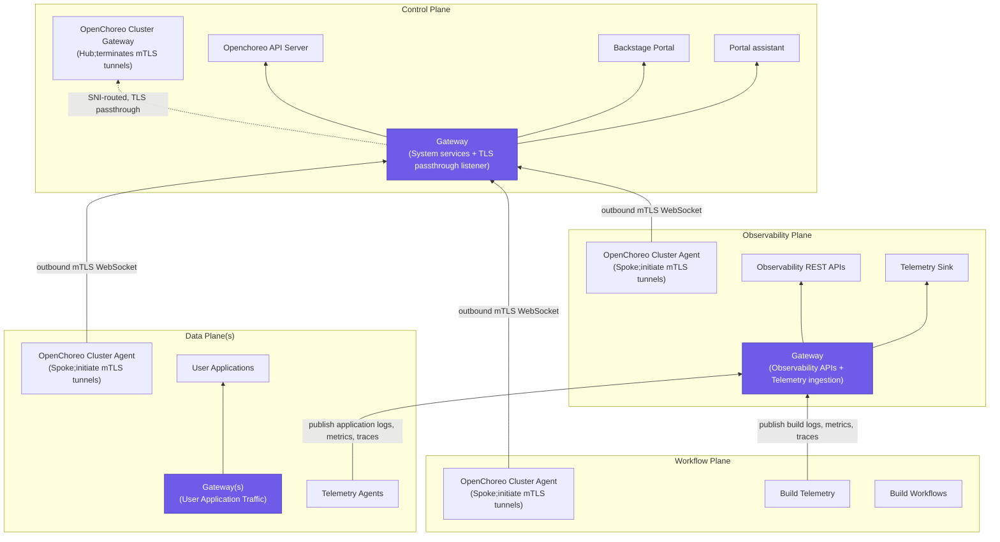
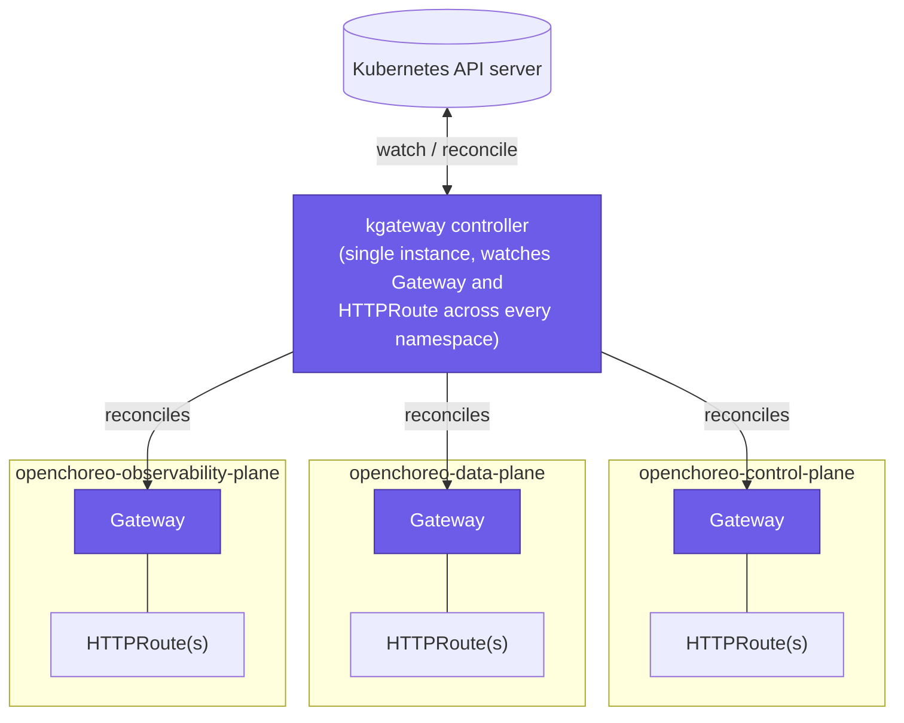
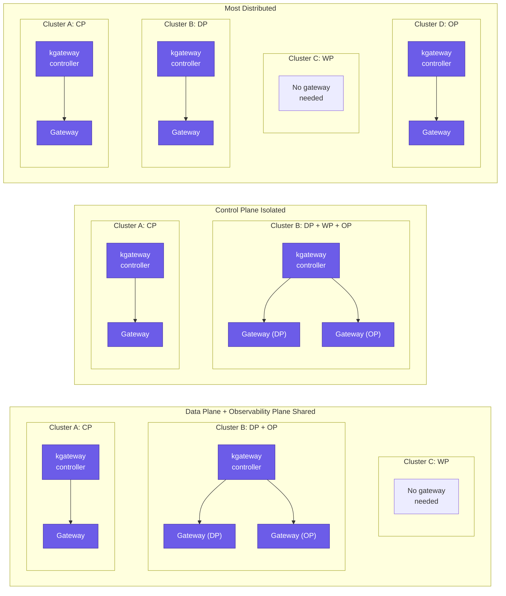
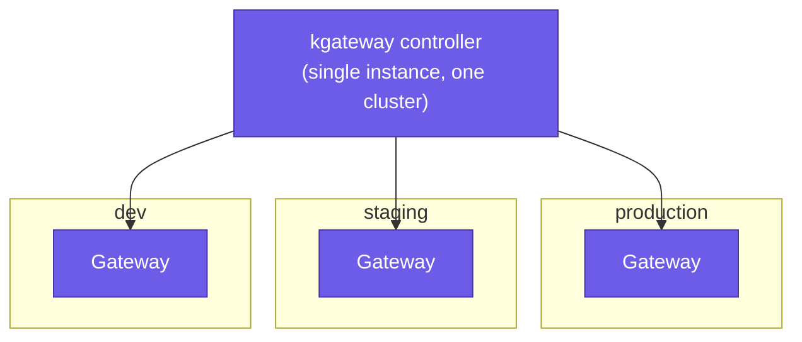
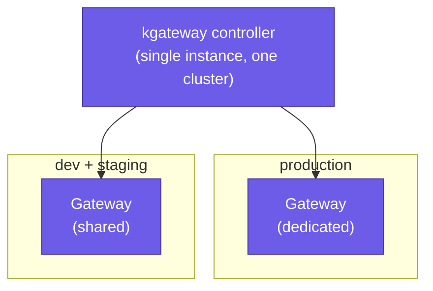
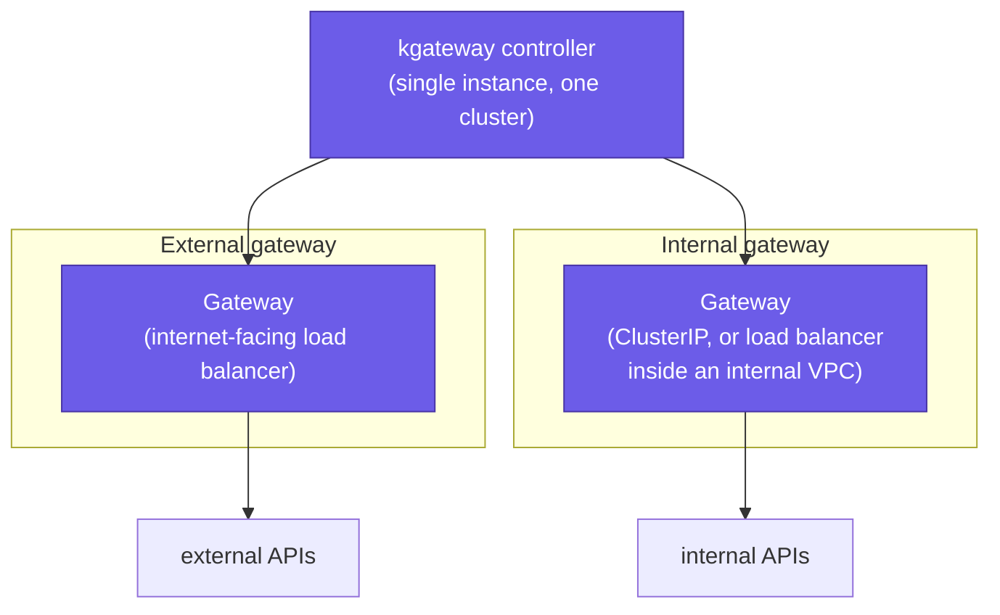
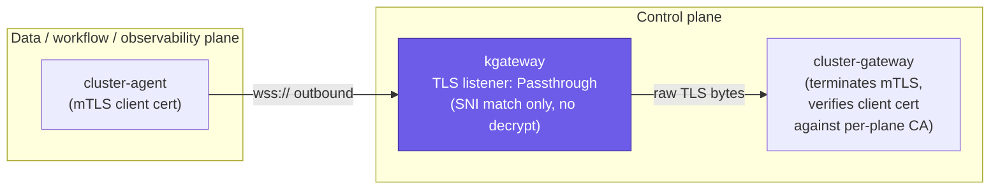

## What is OpenChoreo and the problem it solves

Kubernetes is an infrastructure API, deliberately designed to be highly flexible for the people operating infrastructure. That same flexibility is exactly what makes it too complex for developers who just want to deploy an application. There's no built-in concept of an application, an environment, a promotion, or an owner. Someone has to build that layer, and most organizations end up building it by accident. For example, a Helm chart per team, a CI template that gets copied and mutated, an ingress convention that lives in one engineer's head.

[OpenChoreo](https://openchoreo.dev/) takes a different approach and makes that layer a product instead of an ongoing integration project. It's a complete, modular, open-source, ready-to-use internal developer platform for Kubernetes, and a CNCF Sandbox project. It defines high-level platform and developer abstractions to hide the infrastructure complexity from the developer, orchestrating Kubernetes and other CNCF and open-source projects underneath. Together, these bring development and architecture guardrails, a Backstage-powered developer portal, application CI/CD, GitOps, and observability into a single, cohesive platform.

## OpenChoreo multi-plane architecture and the gateway layer

OpenChoreo is divided into four **planes**, split apart by separation of concern and by the architectural flexibility that split makes possible. There's a **control plane** that reconciles desired state, one or more **data planes** where workloads run, an optional **workflow plane** for builds, and an optional **observability plane** for logs, metrics, and traces. Each plane can be its own Kubernetes cluster, or several of them can share one, and the control plane never has direct Kubernetes API access to any of them. A hub-and-spoke architecture handles the connectivity between the control plane and the other planes instead, which is explained later in this article.

Every one of those planes needs a way to get traffic in. Because every plane can be its own cluster, "the gateway" isn't a single thing in OpenChoreo. Each plane that needs one runs its own gateway, and each one carries a distinctly different responsibility:

- **Control plane**: The gateway here exposes OpenChoreo system services. These include the OpenChoreo REST API and MCP server, the Backstage-based developer portal, and the AI portal assistant.  
- **Data plane**: This is the gateway application developers actually care about. User applications deployed to OpenChoreo get exposed through it. A data plane can also have multiple environment-level gateways, each dedicated to a specific environment.  
- **Observability plane**: This gateway also exposes system services, not user traffic. It fronts the observability plane's own REST APIs, serving logs, metrics, and traces.  
- **Workflow plane**: Has no gateway at all. It executes builds and other automation, has no inbound traffic to serve, and only ever needs to reach *out*. That's covered by the hub-and-spoke architecture explained later in this article.

&nbsp;


***Figure 1:** Every plane's cluster-agent dials outbound to the control plane gateway, which passes the mTLS tunnel straight through to the cluster-gateway by SNI, undecrypted. Data and workflow planes also publish their telemetry outbound to the observability plane gateway.*

OpenChoreo has built its gateway architecture on top of the [Kubernetes Gateway API](https://gateway-api.sigs.k8s.io/) and follows a modular gateway architecture, where any Kubernetes Gateway API implementation can be plugged into OpenChoreo, including kgateway, Traefik, Envoy Gateway, Istio, Cilium Gateway, Nginx Gateway Fabric, and others.

For the default gateway, we've chosen **kgateway**, since it's the most mature and feature-rich Kubernetes Gateway API implementation available, and it caters to our advanced use cases.

## Use of kgateway in OpenChoreo

### Single gateway controller with multiple gateways for OpenChoreo single cluster deployments

In a single cluster OpenChoreo deployments, the common case for evaluation and for right-sized production deployments, one kgateway controller ends up reconciling separate `Gateway` objects for the control plane, the data plane, and the observability plane simultaneously, each living in its own namespace with its own listener configuration, TLS configuration, and hostnames. One controller, several independently configured gateways, with no coordination required between them beyond both existing in the same cluster.

&nbsp;


***Figure 2:** One kgateway controller, watching every namespace, reconciles a separate `Gateway` and its `HTTPRoute`s per plane's namespace.*

### Multiple gateway controllers for OpenChoreo multi cluster deployments

For organizations that need stricter isolation, whether for security and compliance reasons, high availability, or to support a hybrid architecture, OpenChoreo planes can be deployed across multiple Kubernetes clusters instead of sharing one. The most distributed setup is four dedicated clusters, one per plane. There are other variations too. The control plane can run in its own cluster while the data, workflow, and observability planes share a second one. Or the control plane can run alone, the data and observability planes can share a cluster, and the workflow plane can run in a cluster of its own. In every one of those layouts, each cluster gets its own kgateway controller, and that single controller is used across whichever planes happen to be deployed in that cluster.

&nbsp;



***Figure 3:** In every one of these layouts, each cluster gets its own kgateway controller, and that single controller is used across whichever planes happen to be deployed in that cluster. The workflow plane never needs one of its own, since it has no inbound traffic to serve.*

### Environment level gateways in a Dataplane

Multiple environments sharing a single data plane can also have a flexible gateway architecture. By default, all the applications in all the environments share the same physical gateway. For isolation, high availability, and scalability, per-environment gateways can be provisioned and configured instead.

Consider three environments, dev, staging, and production, sharing the same Kubernetes cluster. One option is to give each environment its own dedicated gateway, three separate gateways for three environments. Another option is to serve all the lower environments through a single shared gateway, and give production a separate, dedicated gateway of its own.

&nbsp;



***Figure 4:** Three environments, three dedicated gateways, one kgateway controller.*

&nbsp;


***Figure 5:** Lower environments share one gateway; production gets a dedicated one.*

### External and internal gateways in a Dataplane

OpenChoreo supports external and internal gateways through the gateway architecture itself, using the Kubernetes Gateway API. The Gateway API `Gateway` resource has an `infrastructure` field, and kgateway uses it to configure vendor- and implementation-specific infrastructure, such as the load balancer type, the subnet a load balancer gets provisioned into, and the Kubernetes Service type. For an external gateway, that translates to an internet-facing load balancer. For an internal gateway, it translates to a load balancer placed inside a VPC, or simply a `ClusterIP` Service. The same single-controller, multiple-gateway pattern used everywhere else in OpenChoreo applies here too. One kgateway controller reconciles both the external and the internal `Gateway`.

&nbsp;



***Figure 6:** One kgateway controller, two gateways per data plane, split by visibility rather than by plane or environment. External consumers reach the external gateway; internal consumers reach the internal gateway, which never needs a public IP at all.*

### TLS passthrough support at the gateway for the hub-and-spoke mTLS channels

So far, we've discussed the critical data path where the gateway serves external and internal clients with either system APIs or user-deployed application APIs. The platform layer also has to propagate control signals between the planes which is just as critical as the data path.

In this multi-plane architecture, cluster-agents running in data planes, observability planes, and workflow planes connect to the cluster-gateway in the control plane. This connectivity happens over a mTLS WebSocket channel, and the control plane kgateway instance performs a TLS passthrough to facilitate it. With `mode: Passthrough`, kgateway never decrypts this traffic. It reads the SNI field in the TLS ClientHello, matches it against the `TLSRoute` hostname, and forwards the raw encrypted bytes straight to cluster-gateway. This is one of the most critical control-signal flows for the whole platform functionality.

&nbsp;


***Figure 7:** The cluster-agent dials outbound over a WebSocket. The control plane's kgateway listener runs in `Passthrough` mode, so it matches on the SNI field alone and forwards the raw encrypted bytes without ever decrypting them. The cluster-gateway behind it terminates the mTLS session and verifies the client certificate against that plane's CA.*

### TrafficPolicy, and how OpenChoreo Traits encapsulate it

kgateway is a feature-rich gateway that provides a lot of vendor-specific features on top of the Kubernetes Gateway API, such as security, rate limiting, and request/response transformation. These vendor-specific features are exposed through the kgateway `TrafficPolicy` resource.

This nicely complements OpenChoreo **Traits**. A Trait can be attached to an OpenChoreo component, and through it, developers get to use kgateway functionality via developer abstractions that platform engineers define, without ever needing to know kgateway, or the Kubernetes Gateway API, exists underneath. With a Trait, a platform engineer can create, delete, or patch any Kubernetes object. That means a platform engineer can template a kgateway `TrafficPolicy` inside a Trait, and expose just a handful of parameters for developers to configure.

The following is an example where a `TrafficPolicy` with rate limits is implemented as a Trait and exposed to developers as high-level rate limit parameters.

```
apiVersion: openchoreo.dev/v1alpha1
kind: ClusterTrait
metadata:
  name: request-rate-limit
spec:
  parametersSchema:
    ocSchema:
      requestsPerUnit: { type: integer, default: 100 }
      unit: { type: string, default: Minute }
  creates:
    - targetPlane: DataPlane
      template:
        apiVersion: gateway.kgateway.dev/v1alpha1
        kind: TrafficPolicy
        metadata:
          name: ${oc_generate_name(metadata.componentName, "rate-limit")}
        spec:
          targetRefs:
            - group: gateway.networking.k8s.io
              kind: HTTPRoute
              name: ${oc_generate_name(metadata.componentName, endpoint.key)}
          rateLimit:
            local:
              tokenBucket:
                maxTokens: ${parameters.requestsPerUnit}
                tokensPerFill: ${parameters.requestsPerUnit}
                fillInterval: ${parameters.unit}
```

A developer attaches it the same way they'd attach any other trait:

```
apiVersion: openchoreo.dev/v1alpha1
kind: Component
metadata:
  name: checkout-service
spec:
  traits:
    - kind: ClusterTrait
      name: request-rate-limit
      parameters:
        requestsPerUnit: 200
```

### A few more kgateway features OpenChoreo uses

Beyond routing, hub-and-spoke connectivity, and TrafficPolicy-driven policies, OpenChoreo relies on a handful of other kgateway features directly.

**WebSocket support:** A `HTTPListenerPolicy` turns on WebSocket upgrades at the `Gateway` level, and OpenChoreo enables it on both the control plane and the data plane gateways. On the data plane, this lets user components run WebSocket services. On the control plane, several system services need WebSocket connections too. That includes the hub-and-spoke mTLS channel itself, since the cluster-agent to cluster-gateway connection is a WebSocket connection.

**Disabled request timeouts and a long stream idle timeout for MCP:** OpenChoreo treats AI agents as first-class citizens. It runs an MCP server in the control plane and another in the observability plane, used by the OpenChoreo SRE Agent, FinOps Agent, and Portal Assistant Agent. A static `TrafficPolicy` targets the `HTTPRoute` in front of these services and replaces the gateway's default request timeout with a long `streamIdle`, so MCP responses and server-sent-event streams aren't cut off mid-flight.

**Session persistence for sticky sessions:** OpenChoreo lets developers and platform engineers exec into a running pod for troubleshooting, facilitated through the OpenChoreo control plane. Both the `occ` CLI and the Backstage Portal support this today. An exec session is sticky by nature, every request in that session has to land on the same backend pod, which is exactly what session persistence of kgateway is for.

## Wrapping up

Looking at all the use cases above, it's evident that kgateway is a critical piece of software in the OpenChoreo platform layer. The use cases range from serving user applications, to serving system services, to handling all the cross-plane communication over mTLS channels.

The stability, feature-richness, and flexibility of kgateway have been genuinely impressive to build on, and that's worth appreciating outright. A real shout-out is owed to the kgateway maintainers for that. We're looking forward to adopting even more of its features in OpenChoreo going forward.