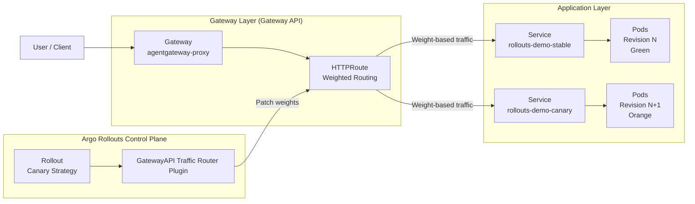

Modern applications rarely fail because of bad code alone instead they also fail becasue changes are released too abruptly. Even well tested features can behave unexpectedly once they interact with real users, real traffic patterns, and real production data. A traditional **Kubernetes Deployment** does provide rolling updates, but it treats all updates the same way and offers very limited control over how traffic is shifted and when users are exposed to new behavior.

Argo Rollouts fills this gap by enabling progressive delivery. Instead of pushing a new version to everyone at once, it allows teams to gradually introduce changes, observe real-time behavior, and make informed decisions before proceeding further.

# The challenge without Progressive Delivery

Modern applications rarely fail because of bad code alone; more often, they fail because changes are released too abruptly. Even well-tested features can behave unpredictably once they encounter real users, real traffic patterns, and real production data. A traditional Kubernetes Deployment does provide rolling updates, but it treats all updates uniformly and offers very limited control over how traffic is shifted and when users are exposed to new behavior.

These limitations become even more pronounced in AI-driven systems, especially those built around agents and agent-to-agent communication protocols such as MCP or A2A. In such architectures, a single change does not affect just one service—it can alter reasoning chains, tool invocation paths, response quality, latency characteristics, and even cost profiles across multiple interacting agents. A rolling update that blindly replaces pods can unintentionally amplify errors, propagate degraded behavior across agents, or disrupt coordination between models and tools.

Argo Rollouts fills this gap by enabling progressive delivery. Instead of pushing a new version to everyone at once, it allows teams to introduce changes gradually, observe real-time behavior, and make promotion decisions based on actual production signals. When combined with gateway-level traffic control, this approach becomes especially powerful for agent-based and AI workloads: traffic can be carefully shaped, experiments can be run safely, and new agent behaviors or models can be validated incrementally without destabilizing the entire system.

In this way, Argo Rollouts transforms deployments from a risky, one-way operation into a controlled, observable evolution, which is essential not only for traditional microservices, but even more so for modern AI systems where correctness, latency, cost, and coordination all matter simultaneously.

Without progressive delivery, we can run into real challenges:

* **Increased blast radius:** If a new version has a critical bug, it can affect the entire user base and services before anyone notices.
* **No incremental validation:** Traffic is not routed in controlled phases, so you miss early feedback from a small set of users that could prevent larger outages.
* **Higher latency and downtime risk:** If a version fails halfway, rollbacks are manual and often reactive rather than automated.
* **No easy A/B experimentation:** Comparing versions side-by-side in production without full cutover is extremely difficult with native deployments alone.
* **Limited metric-driven control:** Traditional updates can’t easily integrate with metrics to decide rollout progress or rollback automatically.

Here's where Progressive delivery performs the controlled, staged approach to releasing changes to solve these challenges by letting you shift traffic gradually, validate metrics in real time, and make automated decisions based on health signals.

## Why Traffic Routing at the Gateway Layer Matters

Even with a tool like Argo Rollouts, traffic routing plays a central role in making deployments truly progressive and observable. A deployment strategy that can’t actually control how traffic is distributed won’t deliver the safety you need.

This is where API gateways and the Kubernetes Gateway API step in:

* Gateway level routing defines where traffic goes to enable weighted traffic splits, path or header-based routing and advanced routing logic.
* Real-time traffic shaping allows tools like Argo Rollouts to incrementally shift user requests between versions based on configured weights.
* Gateway APIs decouple traffic policy from application code so teams can evolve traffic routing independently of deployments.
* They provide a platform native way to express advanced routing (such as canary percentages, mirror traffic, or selective routing) that integrates cleanly with rollout strategies.

By placing progressive delivery at the heart of your deployment lifecycle and pairing it with gateway-level traffic control, we can unlock:

* **Zero-downtime releases** because traffic is only shifted when versions are proven healthy through proper testing and feedback mechanisms.
* **Lower latencies and better performance stability** because we have monitored real user behavior before full release.
* **Greater operational confidence** as metrics and traffic patterns drive rollout decisions, not just automated scripts.
* **Turns deployment into a controlled experiment** with measurable outcomes and minimum risk.

In other words, progressive delivery doesn’t just make deployments smoother, when backed by powerful traffic routing at the gateway layer, but it even turns deployment into a controlled experiment with measurable outcomes and minimum risk.

# How kgateway can work as an API Gateway with agentgateway to handle Rollouts perfectly

At a high level, agentgateway and kGateway are modern, Kubernetes-native gateway implementations built around the Kubernetes Gateway API. Instead of treating traffic management as a side concern, they position the gateway as a first-class, programmable entry point for the cluster.

Unlike traditional ingress controllers, which primarily focus on basic north-south traffic routing, API gateways like **kgateway** can manage **agentgateway** as an enterprise driven data-plane to combine with **ArgoRollouts**, to help address the exact problems teams face without progressive delivery:

1. **Reduced Blast Radius**

Instead of exposing all users to a new version immediately, traffic can be shifted gradually at the gateway layer. If something goes wrong, we can isolate the failures by pausing rollouts or reversing them before it impacts a large user base.

2. **Zero-Downtime Deployments**

Because traffic routing is handled externally by gateways, applications do not need to be restarted or reconfigured mid-deployment. This minimizes connection drops and ensures smooth user experience during transitions.

3. **Lower Latency Risk**

New versions that introduce performance regressions can be detected early by observing real traffic behavior. Traffic weights can be adjusted dynamically to protect users from degraded performance.

4. **Better Observability and Cloud Sustainability**

Gateway acting as a pass-through element for the traffic, making latency, error rate and traffic volumes easy to be observed. 

Progressive delivery avoids unnecessary resource spikes caused by mass rollouts and rollbacks. By introducing changes gradually and only scaling when needed, teams reduce wasted compute, lower energy usage, and operate more sustainably in cloud environments.

## Prerequisites

Before setting up the integration between kgateway, agentgateway and Argo, we need to ensure that our local or lab environment includes the following tools and configurations: 

* [Docker](https://docs.docker.com/get-docker/)
* [kind (Kubernetes in Docker)](https://kind.sigs.k8s.io/docs/user/quick-start/)
* [kubectl](https://kubernetes.io/docs/tasks/tools/)
* [Helm](https://helm.sh/docs/intro/install/)
* [kgateway](https://kgateway.dev/docs/latest/quickstart/)
* [agentgateway](https://kgateway.dev/docs/agentgateway/latest/quickstart/)
* [Argo](https://argoproj.github.io/argo-rollouts//)

# How kgateway & agentgateway works together as an API Gateway to handle AI workloads

Modern AI applications — especially those built around autonomous agents, LLMs, and multiprotocol interactions — place very different demands on API gateways than traditional microservices. Traditional gateways and reverse proxies were designed for short-lived HTTP requests, not the long-lived, stateful, multi-directional communication patterns seen in AI agent ecosystems such as MCP (Model Context Protocol) and A2A (agent-to-agent). agentgateway was introduced to address this gap: it implements a purpose-built Layer-7 data plane that understands agentic communication semantics, supports persistent sessions, bidirectional messages, and offers enterprise-grade security, observability, and protocol negotiation for AI workloads. This makes it far more effective than legacy solutions when bridging interactions between agents, tools, and models at scale.

kgateway builds on this foundation by providing a unified, Kubernetes-native control plane for API traffic based on the Kubernetes Gateway API. It integrates both traditional Envoy-based routing capabilities and the agentgateway data plane, enabling a single API gateway stack that can route, secure, and observe traffic for every type of workload from REST/gRPC microservices to complex AI agent interactions. The recent release of kgateway release(v2.1) marks the first major step in fully integrating agentgateway workflows directly within the Gateway API ecosystem, enabling scalable, dynamic provisioning of AI-forward gateway resources using native Kubernetes CRDs.

## agentgateway's integration to kgateway with latest v2.1 Release

kgateway's v2.1 release marks a major milestone because it’s the first version to integrate the open source project agentgateway! Agentgateway is a highly available, highly scalable data plane that provides AI connectivity for LLMs, MCP tools, AI agents, and inference workloads. As part of this evolution, we’re beginning the deprecation of the Envoy-based AI Gateway and the Envoy-based Inference Extension, since all related functionality is now implemented natively through agentgateway. You can still continue to use Envoy-based Gateways for API Gateway use cases.

When these technologies are combined with progressive delivery tools like Argo Rollouts, the benefits multiply. Argo Rollouts provides safe, controlled traffic shifts between versions, but it relies on an intelligent traffic layer to enforce those decisions at runtime. kgateway with agentgateway gives Argo Rollouts exactly that: a high-performance API gateway that can steer traffic not just between versioned services, but across complex AI agent topologies, LLM providers, and long-lived session protocols without breaking connectivity or context. This alignment enables safer canary deployments of AI-centric changes, smoother rollouts across multi-agent systems, and granular control over traffic behavior at scale, turning deployment safety, agent interoperability, and AI workload routing into a declarative, observable platform capability.
## Architecture


# Prepare your gateway environment: 

1. Follow the [Get started with agentgaetway in Kubernetes](https://kgateway.dev/docs/agentgateway/latest/quickstart/) guide to install and deploy CRDs for kgateway control plane and agentgateway data plane, in a kind cluster.

2. Set up [Argo Rollouts](https://argoproj.github.io/argo-rollouts/) in 'argo-rollouts' namespace for our agentgateway integration, where all the argo rollout features like 'canary' deployment and 'blue-green' Deployments will be put in action.

## Setting-up Kubernetes resources for Rollouts

It will include setting-up and defining Gateways, ConfigMaps, ClusterRoles, CLusterRoleBinding, Services and HTTPRoute to configure rules and traffic routes for our Argo Rollouts.

1. Create a Gateway and a ConfigMap, that uses the agentgateway GatewayClass. The following example sets up a Gateway that uses the default agentgateway proxy template.

```yaml
kubectl apply -f- <<EOF
apiVersion: gateway.networking.k8s.io/v1
kind: Gateway
metadata:
  name: agentgateway-proxy
  namespace: kgateway-system
spec:
  gatewayClassName: agentgateway
  listeners: 
  - protocol: HTTP
    port: 80
    name: http
    allowedRoutes:
      namespaces:
        from: All
---
apiVersion: v1
kind: ConfigMap
metadata:
    name: argo-rollouts-config
    namespace: argo-rollouts
data:
  trafficRouterPlugins: |-
    - name: "argoproj-labs/gatewayAPI"
      location: "https://github.com/argoproj-labs/rollouts-plugin-trafficrouter-gatewayapi/releases/download/v0.3.0/gateway-api-plugin-linux-amd64"
EOF
```

2. Restart the Argo Rollouts for the plug-in to take effect.

```bash
kubectl rollout restart deployment -n argo-rollouts argo-rollouts
```

3. Create a [ClusterRole](https://kubernetes.io/docs/reference/access-authn-authz/rbac/#role-and-clusterrole) to allow the Argo Rollouts pod to manage HTTPRoute resources, which will act as a cluster-wide resource to define rules & permissions for performing CRUD resources to a single namespace within Kubernetes cluster.

```yaml
kubectl apply -f- <<EOF
apiVersion: rbac.authorization.k8s.io/v1
kind: ClusterRole
metadata:
    name: gateway-controller-role
    namespace: argo-rollouts
rules:
  - apiGroups:
      - gateway.networking.k8s.io
    resources:
      - httproutes
    verbs:
      - gets
      - patch
      - update
EOF
```
4. Create a [ClusterRoleBinding](https://kubernetes.io/docs/reference/access-authn-authz/rbac/#rolebinding-and-clusterrolebinding) to give permissions to Argo Rollouts service-account from the cluster role. It allows subjects to perform specific actions across all namespcaes within the cluster, based on permissions defined in ClusterRole.

```yaml
kubectl apply -f- <<EOF
apiVersion: rbac.authorization.k8s.io/v1
kind: ClusterRoleBinding
metadata:
  name: gateway-admin
roleRef:
  apiGroup: rbac.authorization.k8s.io
  kind: ClusterRole
  name: gateway-controller-role
subjects:
  - namespace: argo-rollouts
    kind: ServiceAccount
    name: argo-rollouts
EOF
```

## Setting up Argo Rollouts

1. Now, we'll try setting up endpoint resources for our Argo Rollouts with Gateway APIs to deliver an updated version of rollouts-demo application from before. To do this we'll setup Kubernetes services and routes to define how traffic interacts with our gateway resources.

```yaml
kubectl apply -f- <<EOF
apiVersion: v1
kind: Service
metadata:
  name: rollouts-demo-canary
spec:
  ports:
  - port: 80
    targetPort: http
    protocol: TCP
    name: http
  selector:
    app: rollouts-demo
---
apiVersion: v1
kind: Service
metadata:
  name: rollouts-demo-stable
spec:
  ports:
  - port: 80
    targetPort: http
    protocol: TCP
    name: http
  selector:
    app: rollouts-demo
---
kind: HTTPRoute
apiVersion: gateway.networking.k8s.io/v1beta1
metadata:
  name: argo-rollouts-http-route
spec:
  parentRefs:
    - group: gateway.networking.k8s.io
      kind: Gateway
      name: agentgateway-proxy
      namespace: kgateway-system
  rules:
  - backendRefs:
    - name: rollouts-demo-stable
      kind: Service
      port: 80
    - name: rollouts-demo-canary
      kind: Service
      port: 80
    matches:
    - path:
        type: PathPrefix
        value: /
EOF
```
Here, we have defined two services in the form of `demo-stable` and `demo-canary` rollouts, which will handle traffic in a pattern defined by us through HTTPRoute, responsible for handling both the services at port 80.

2. To verify creation of our HTTPRoute:
```bash
kubectl describe httproute argo-rollouts-http-route
```

We'll get an output as:
```yaml
Status:
  Parents:
    Conditions:
      Last Transition Time:  2025-12-22T11:06:53Z
      Message:
      Observed Generation:   1
      Reason:                Accepted
      Status:                True
      Type:                  Accepted
      Last Transition Time:  2025-12-22T11:06:53Z
      Message:
      Observed Generation:   1
      Reason:                ResolvedRefs
      Status:                True
      Type:                  ResolvedRefs
    Controller Name:         kgateway.dev/agentgateway
    Parent Ref:
      Group:      gateway.networking.k8s.io
      Kind:       Gateway
      Name:       agentgateway-proxy
      Namespace:  kgateway-system
```

3. Next, we need to create an Argo Rollouts Rollout resource. This resource will specify the version of the application, enabling us to perform managed rollouts, where we'll be deploying 3 replicas to allow us to visualize the rollout process.

```yaml
kubectl apply -f - <<EOF
apiVersion: argoproj.io/v1alpha1
kind: Rollout
metadata:
  name: rollouts-demo
  namespace: default
spec:
  replicas: 3
  revisionHistoryLimit: 2
  selector:
    matchLabels:
      app: rollouts-demo
  template:
    metadata:
      labels:
        app: rollouts-demo
    spec:
      containers:
      - name: rollouts-demo
        image: argoproj/rollouts-demo:green
        ports:
        - containerPort: 8080
          name: http
  strategy:
    canary:
      stableService: rollouts-demo-stable
      canaryService: rollouts-demo-canary
      trafficRouting:
        plugins:
          argoproj-labs/gatewayAPI:
            httpRoute: argo-rollouts-http-route
            namespace: default
      steps:
      - setWeight: 30
      - pause: {}
      - setWeight: 60
      - pause: {}
      - setWeight: 100
      - pause: {}
EOF
```

### Testing out Stable Rollouts to improve Blue-Green Deployments

Kubernetes blue-green deployment is a software release strategy that minimizes downtime and risk by running two identical production environments, "blue" (current version) and "green" (new version), and switching traffic between them seamlessly.

Till now we have deployed and configured various kubernetes resources in order to rollout our stable and canary deployments. Now, let's try rolling out our first revision as `revision-1` which will be represented by a **green** color, then later we'll rollout our `canary` deployment as our `revision-2` which will be represented by a **orange** color, while checking the heatlh and state of our rollouts.

1. To have a look at our stable Kubernetes service of our Rollout has been updated: 

```bash
kubectl get svc rollouts-demo-stable -oyaml | yq
```
To get hash-number of the rollout-demo as an output under selection.
```yaml
    selector:
    app: rollouts-demo
    rollouts-pod-template-hash: cbdc6cd8b
```

2. We can even use `kubectl argo` plugin to view the rollout status: 

```yaml
kubectl argo rollouts get rollout rollouts-demo
```
**Output:**
We should see the status of our rollout, with only 1 revisions as:
```yaml
Name:            rollouts-demo
Namespace:       default
Status:          ✔ Healthy
Strategy:        Canary
  Step:          6/6
  SetWeight:     100
  ActualWeight:  100
Images:          argoproj/rollouts-demo:green (stable)
Replicas:
  Desired:       3
  Current:       3
  Updated:       3
  Ready:         3
  Available:     3

NAME                                      KIND        STATUS     AGE    INFO
⟳ rollouts-demo                           Rollout     ✔ Healthy  4m46s
└──# revision:1
   └──⧉ rollouts-demo-cbdc6cd8b           ReplicaSet  ✔ Healthy  4m45s  stable
      ├──□ rollouts-demo-cbdc6cd8b-cqhzp  Pod         ✔ Running  4m45s  ready:1/1
      ├──□ rollouts-demo-cbdc6cd8b-jz7hn  Pod         ✔ Running  4m45s  ready:1/1
      └──□ rollouts-demo-cbdc6cd8b-qrnrr  Pod         ✔ Running  4m45s  ready:1/1
```

3. Test the rollout works by sending a curl request through the gateway for our **loadbalancers**:

```bash
export GW_NAMESPACE=default
export GW_ADDRESS=$(kubectl get svc agentgateway-proxy -n kgateway-system \
  -o jsonpath='{.status.loadBalancer.ingress[0].ip}')
for i in {1..100}; do
  curl "$GW_ADDRESS:80/color"
  echo
done
```

While for **local testing with port-forwarding**: 
```bash
kubectl port-forward -n kgateway-system svc/agentgateway-proxy 8080:80
```
**Then in a seperate terminal:** 
```bash
export GW_ADDRESS=localhost
export GW_PORT=8080

for i in {1..100}; do
  curl "http://$GW_ADDRESS:$GW_PORT/color"
  echo
done
```

**Output:**

We should see a series of "green" only responses:
```
"green"
"green"
"green"
"green"
"green"
"green"
"green"
"green"
"green"
"green"
```
#### Visualization

Now in order to get a well-visualized deployment status of our `revision-1`, we can either use **argo dashboards** or either can simply test on our local browser and view localhost:8080 where the gateway has been hosted. 

```bash
http://localhost:8080/
```

**Output:**


## Canary Deployment

A canary deployment is a progressive release strategy where a new version of an application is introduced to a small subset of users first, while the majority of traffic continues to be served by the existing stable version. Instead of replacing all instances at once, traffic is shifted incrementally, allowing teams to validate changes under real production conditions before committing to a full rollout.

Modern systems are complex, distributed, and highly dynamic. Even with extensive testing, it is impossible to fully predict how a change will behave once exposed to real traffic patterns, user behavior, and production data. Canary deployments address this uncertainty by turning releases into controlled experiments rather than irreversible events.

1. Here in this example, we'll gradually rollout a new revision with updated rollout been shown with **orange** color in replacement to prior **green** colored rollout.

```bash
kubectl argo rollouts set image rollouts-demo \
  rollouts-demo=argoproj/rollouts-demo:orange \
  -n default
```

2. Now to verify if we have rolled out our latest canary rollout:
```bash
kubectl argo rollouts get rollout rollouts-demo
```
Output:
```bash
Name:            rollouts-demo
Namespace:       default
Status:          ॥ Paused
Message:         CanaryPauseStep
Strategy:        Canary
  Step:          1/6
  SetWeight:     30
  ActualWeight:  30
Images:          argoproj/rollouts-demo:green (stable)
                 argoproj/rollouts-demo:orange (canary)
Replicas:
  Desired:       3
  Current:       4
  Updated:       1
  Ready:         4
  Available:     4

NAME                                       KIND        STATUS     AGE  INFO
⟳ rollouts-demo                            Rollout     ॥ Paused   19m
├──# revision:2
│  └──⧉ rollouts-demo-69d5b7c4c9           ReplicaSet  ✔ Healthy  48s  canary
│     └──□ rollouts-demo-69d5b7c4c9-dkjzt  Pod         ✔ Running  48s  ready:1/1
└──# revision:1
   └──⧉ rollouts-demo-cbdc6cd8b            ReplicaSet  ✔ Healthy  19m  stable
      ├──□ rollouts-demo-cbdc6cd8b-cqhzp   Pod         ✔ Running  19m  ready:1/1
      ├──□ rollouts-demo-cbdc6cd8b-jz7hn   Pod         ✔ Running  19m  ready:1/1
      └──□ rollouts-demo-cbdc6cd8b-qrnrr   Pod         ✔ Running  19m  ready:1/1
```

3. Test the rollout works by sending a curl request through the gateway for our **loadbalancers**:

```bash
export GW_NAMESPACE=default
export GW_ADDRESS=$(kubectl get svc agentgateway-proxy -n kgateway-system \
  -o jsonpath='{.status.loadBalancer.ingress[0].ip}')
for i in {1..100}; do
  curl "$GW_ADDRESS:80/color"
  echo
done
```
Expected Ouput might vary but will now include random orange rollouts to get released as well:
```
"green"
"green"
"green"
"orange"
"green"
"orange"
"green"
"green"
"orange"
"orange"
```

#### Visualization

Now in order to get a well-visualized deployment status of our `revision-2`, we can either use **argo dashboards** or either can simply test on our local browser and view localhost:8080 where the gateway has been hosted.

```bash
http://localhost:8080/
```

**Output:**


# Key Takeaways

Progressive delivery shifts deployments from risky, one-time events into controlled, observable processes. By combining Argo Rollouts with Gateway API–based traffic routing, teams gain fine-grained control over how new versions are exposed to real users. Instead of relying solely on rolling updates, traffic can be incrementally shifted, monitored, and adjusted based on live signals. When paired with a Kubernetes-native API gateway such as kgateway and agentgateway, this approach becomes especially effective for modern workloads, including AI and agent-based systems, where correctness, latency, cost, and coordination must all be validated gradually rather than assumed upfront. Thus, Key Takeaways from this setup are:
* Argo Rollouts enables safe, incremental releases through canary and blue-green strategies that go beyond native Kubernetes deployments.
* Gateway-level traffic control is the enforcement point that makes progressive delivery reliable, observable, and reversible.
* This model is particularly valuable for AI and agent-driven workloads, where small changes can have system-wide effects across models, agents, and protocols.

## Where This Fits in Production

In real-world environments, this pattern fits naturally into platform teams managing shared gateways and deployment standards across multiple services. Argo Rollouts defines *when* traffic should move, while the Gateway API defines *how* traffic moves. Together, they enable a clear separation of concerns between application teams and platform teams, while still allowing safe experimentation and rapid iteration.
