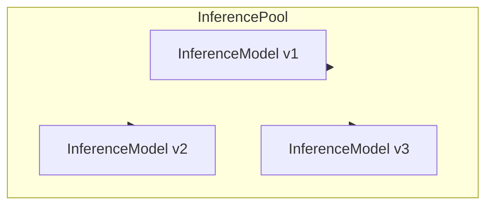
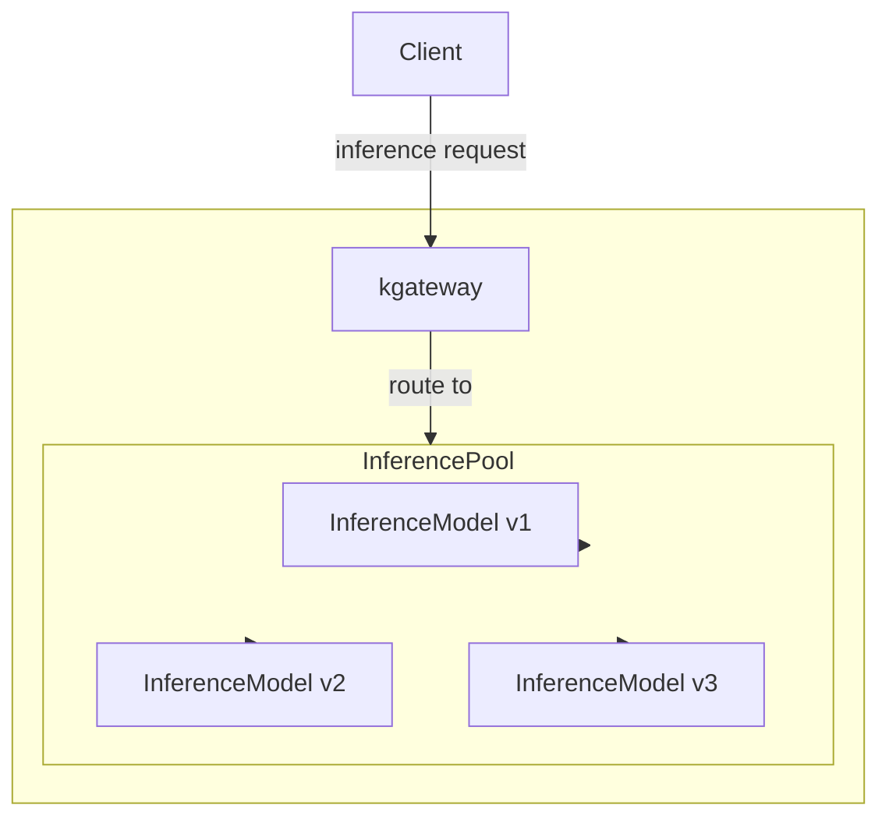

Use kgateway with the Kubernetes Gateway API Inference Extension project. This project extends the Gateway API so that you can route to AI inference workloads such as local Large Language Models (LLMs) that run in your Kubernetes environment.

For more information, see the following resources.


  
  


## About Inference Extension {#about}

The Inference Extension project extends the Gateway API with two key resources, an InferencePool and an InferenceModel, as shown in the following diagram.

The InferencePool groups together InferenceModels of LLM workloads into a routable backend resource that the Gateway API can route inference requests to. An InferenceModel represents not just a single LLM model, but a specific configuration including information such as as the version and criticality. The InferencePool uses this information to ensure fair consumption of compute resources across competing LLM workloads and share routing decisions to the Gateway API.

### Kgateway with Inference Extension {#kgateway}

Kgateway integrates with the Inference Extension as a supported Gateway API provider. This way, a kgateway-created Gateway can route requests to InferencePools, as shown in the following diagram.

The Client sends an inference request to get a response from a local LLM workload. The Gateway receives the request and routes to the InferencePool as a backend. Then, the InferencePool selects a specific InferenceModel to route the request to, based on criteria such as the least-loaded model or highest criticality. The Gateway can then return the response to the Client.

## Setup steps {#setup}

Refer to the **Kgateway** tabs in the **Getting started** guide in the Inference Extension docs.


  

