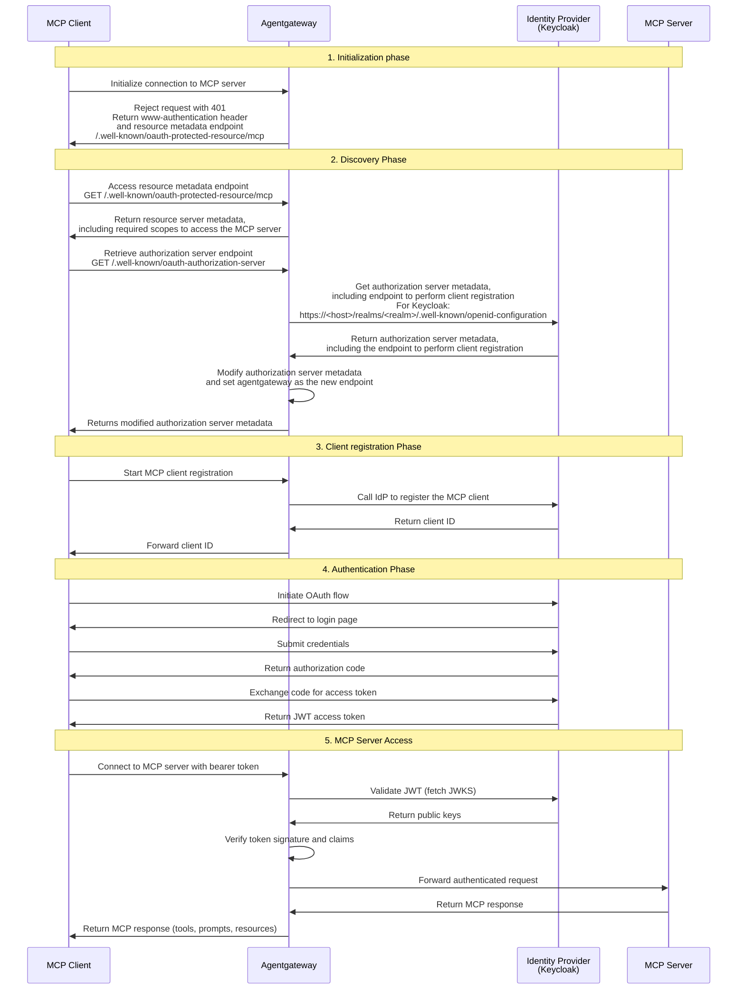

MCP authentication ensures that only authorized MCP clients can access MCP servers and the tools that they expose. Without authentication, any MCP client can connect to your MCP servers and execute arbitrary tool calls, potentially accessing sensitive data or performing unauthorized actions.

To secure your MCP server, you configure it with an authorization server. Typically, the authorization server is an identity provider (IdP), such as Keycloak, that you already use in your environment. 

For MCP clients, such as the MCP inspector tool, Visual Studio Code, or Claude Code to successfully authenticate with the authorization server and obtain the tokens to access the MCP server, the authorization server must comply to the [MCP OAuth 2.0 specification](https://modelcontextprotocol.io/specification/2025-11-25/basic/authorization).

The MCP OAuth specification extends the standard OAuth 2.0 Authorization Code Flow with MCP-specific resource metadata and discovery endpoints so that clients can dynamically register with the authorization server, obtain their client ID, and continue with the OAuth flow to receive the access token. The MCP client then uses this token to gain access to the tools that are exposed on the MCP server. 

## Challenges

Most IdPs do not comply to the MCP OAuth specification and therefore do not expose the resource and authorization server metadata in a format that an MCP client can understand. Because of that, clients cannot dynamically register with the IdP to obtain their client ID. Instead, they must manually register with each IdP that they want to use. In cases where MCP clients, IdPs, and MCP servers are not in the same environment or are owned by different teams and organizations, pre-registration of clients can become unfeasible. 

## Agentgateway to fill in the gaps

Instead of pre-registering MCP clients, you can use agentgateway to register MCP clients dynamically with your IdP. The agentgateway proxy implements the MCP OAuth 2.0 specification, and can therefore facilitate the client registration process on behalf of the MCP client by translating the MCP OAuth information into configuration that the IdP understands. 

The MCP OAuth flow that is facilitated by the agentgateway proxy includes the following phases: 
1. **Initialization**: In the initialization phase, the MCP client tries to connect to a protected MCP server. This connection fails with a 401 HTTP response.
2. **Discovery**: The MCP client discovers the OAuth authorization server that protects the MCP server and required scopes to access the MCP server by using agentgateway.
3. **Client registration**: The agentgateway proxy registers the client with the IdP and returns the client ID. 
4. **Authentication**: The MCP client is redirected to the IdP for login. After successful login, the client receives a JWT access token.
5. **MCP server access**: The client uses the JWT token to access the MCP server and its tools. 

Review the following diagram to learn about the steps that are involved in each phase: 

## Setup

Try out MCP auth with Keycloak and a sample MCP server. Start with [setting up Keycloak](). 
