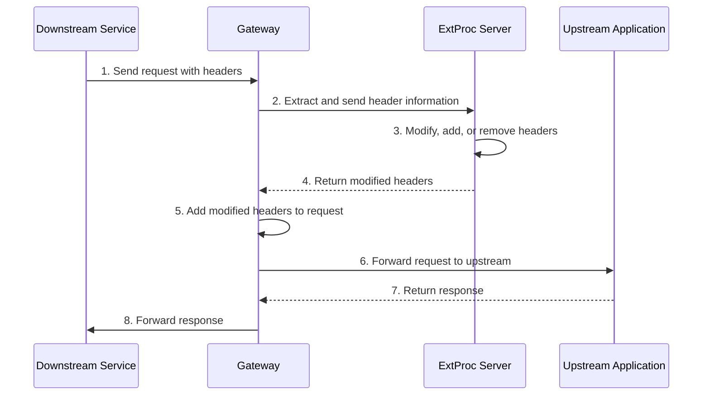

Modify aspects of an HTTP request or response with an external processing server. 

## About external processing

With the external processing, you can implement an external gRPC processing server that can read and modify all aspects of an HTTP request or response, and add that server to the agentgateway proxy processing chain. The external service can manipulate headers, body, and trailers of a request or response before it is forwarded to an upstream or downstream service. The request or response can also be terminated at any given time.

With this approach, you have the flexibility to apply your requirements to all types of apps, without the need to run WebAssembly or other custom scripts.

### How it works

The following diagram shows how request header manipulation works when an external processing server is used.



### ExtProc server considerations

The ExtProc server is a gRPC interface that must be able to respond to events in the lifecycle of an HTTP request. When ExtProc is enabled and a request or response is received on the gateway proxy, the proxy communicates with the ExtProc server by using bidirectional gRPC streams.

To implement your own ExtProc server, make sure that you follow [Envoy's technical specification for an external processor](https://www.envoyproxy.io/docs/envoy/latest/api-v3/extensions/filters/http/ext_proc/v3/ext_proc.proto#extensions-filters-http-ext-proc-v3-externalprocessor). This guide uses a sample ExtProc server that you can use to try out the ExtProc functionality.

## Before you begin

1. [Set up an agentgateway proxy](). 
2. [Install the httpbin sample app]().

## Set up an ExtProc server

Use a sample ExtProc server implementation to try out the ExtProc functionality in .

1. Set up the ExtProc server. This example uses a prebuilt ExtProc server that manipulates request and response headers based on instructions that are sent in an instructions header.
   ```yaml
   kubectl apply -n  -f- <<EOF
   apiVersion: apps/v1
   kind: Deployment
   metadata:
     name: ext-proc-grpc
   spec:
     selector:
       matchLabels:
         app.kubernetes.io/name: ext-proc-grpc
     replicas: 1
     template:
       metadata:
         labels:
           app.kubernetes.io/name: ext-proc-grpc
       spec:
         containers:
           - name: ext-proc-grpc
             # Source code for this image is in test/e2e/features/agentgateway/extproc/example
             image: gcr.io/solo-test-236622/ext-proc-example-basic-sink:0.0.7
             imagePullPolicy: IfNotPresent
             ports:
               - containerPort: 18080
   ---
   apiVersion: v1
   kind: Service
   metadata:
     name: ext-proc-grpc
     labels:
       app: ext-proc-grpc
   spec:
     ports:
     - port: 4444
       targetPort: 18080
       protocol: TCP
       appProtocol: kubernetes.io/h2c
     selector:
       app.kubernetes.io/name: ext-proc-grpc
   EOF
   ```
   
   The `instructions` header must be provided as a JSON string in the following format:
   ```json
   {
     "addHeaders": {
       "header1": "value1",
       "header2": "value2"
     },
     {
     "removeHeaders": [ "header3", "header4" ],
     }
   }
   ```

2. Verify that the ExtProc server is up and running.
   ```sh
   kubectl get pods -n  | grep ext-proc-grpc
   ```
<!--
3. Continue with configuring ExtProc for a [route](#route) or [gateway](#gateway).
-->

## Set up ExtProc

You can enable ExtProc for a particular route in an HTTPRoute resource. 
   
1. Create an  that enables external processing for the agentgateway-proxy.
   ```yaml
   kubectl apply -f- <<EOF
   apiVersion: 
   kind: 
   metadata:
     name: extproc
     namespace: 
   spec:
     targetRefs:
     - group: gateway.networking.k8s.io
       kind: Gateway
       name: agentgateway-proxy
     traffic: 
       extProc:
         backendRef: 
           name: ext-proc-grpc
           namespace: 
           port: 4444
   EOF
   ```
   
2. Send a request to the httpbin app along the `/headers` path and provide your instructions in the `instruction` header. This example instructs the ExtProc server to add the `extproc: true` header. Verify that you get back a 200 HTTP response and that your response includes the `extproc: true` header. 

   

   {}
   ```sh
   curl -vi http://$INGRESS_GW_ADDRESS:8080/headers -H "host: www.example.com" -H 'instructions: {"addHeaders":{"extproc":"true"}}' 
   ```
   {}

   {}
   ```sh
   curl -vi http://localhost:8080/headers -H "host: www.example.com" -H 'instructions: {"addHeaders":{"extproc":"true"}}' 
   ```
   {}

   

   Example output:

   ```console {hl_lines=[10,11]}
   < HTTP/1.1 200 OK
   HTTP/1.1 200 OK
   ...
   < 
   {
     "headers": {
       "Accept": [
         "*/*"
       ],
       "Extproc": [
         "true"
       ],
       "Host": [
         "www.example.com"
       ],
       "Instructions": [
         "{\"addHeaders\":{\"extproc\":\"true\"}}"
       ],
       "User-Agent": [
         "curl/8.7.1"
       ]
     }
   }
   ...
   ```

## Cleanup



```sh
kubectl delete  extproc -n 
kubectl delete deployment ext-proc-grpc -n 
kubectl delete service ext-proc-grpc -n 
```


