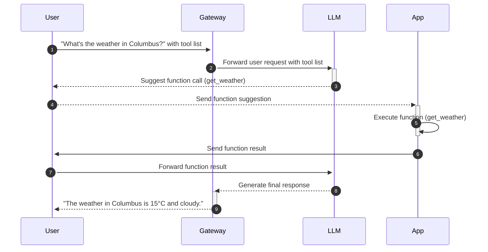



## About function calling {#about}

Large Language Models (LLMs) are limited by static training data. This limitation can make seemingly simple questions difficult to answer. For example, consider the following question:

> What's the weather today?

The LLM has to know several pieces of real-time information that it was not trained on:

* The user's location
* The current date
* The weather forecast for that date and location

Function calling is a way for you as a developer to extend the capabilities of the LLM with your own external APIs, apps, and data. First, you create _tools_ that extend the capabilities of the LLM with a function, such as `get_weather`. These functions can include _parameters_, or inputs, that are needed to execute the function. For example, the `get_weather` function needs the date and location to get the current weather forecast. The _name_ and _description_ of the tool function and parameters help the LLM decide when to call the tool.

Next, when forwarding user requests to the LLM, you can include the set of tools that the LLM can leverage to answer the user. Based on the user's question, the LLM can respond directly or suggest a tool to call to help answer the question. To get the required parameters for the tool call, the LLM might ask the end user or call other functions like `get_location` or `get_date`, which in turn might pull that information based on system settings on the end user's device.

### Function calling sequence diagram {#diagram}

Consider the following sequence diagram that shows how function calling works.



1. The User asks about the weather today. The request includes a list of tools that the LLM can use to answer the question.
2. The Gateway routes the request with the tool list to the LLM.
3. Based on the conversation, the LLM suggests to call the `get_weather` function and includes the required parameters to use that function. The LLM might get these parameters by using the chat history, asking the end user to provide them, or by suggesting other functions to call before calling the `get_weather` function. The Gateway returns this suggestion to the User.
4. The User invokes the `get_weather` function by sending a request to the App. The request includes the required parameters to execute the function.
5. The App executes the `get_weather` function with the required parameters to get the current weather in the location, such as Columbus, OH.
6. The App returns the function result to the User.
7. The User returns the function result to the LLM.
8. The LLM uses the real-time function result from the App in a natural language response and returns this response to the Gateway.
9. The Gateway then forwards the natural language response to the User.

### Behavior with other AI features {#about-behavior}

Keep in mind the following behaviors when using function calling with other AI Gateway features. For more details about these features, see the [API docs](/docs/reference/api/#aitrafficpolicy).

* Streaming responses: You can stream responses that call functions.
* Semantic caching: Function calls are not cached.
* Prompt guards: Prompt guards do not apply to function calls.

### AI provider differences {#about-providers}

Each AI provider has a different way of handling function calling. For example, OpenAI might expect an array of `functions`, while Anthropic expects individual `tools`. Or, the response formats might differ. The capabilities of function calling also differ across providers, with some providing more support for particular cloud providers, others focusing on response time optimization, or others offering more fine-grained control over the response structure. For more information, consult your AI provider's documentation.

* [Anthropic](https://docs.anthropic.com/en/docs/build-with-claude/tool-use/overview)
* [Azure OpenAI](https://learn.microsoft.com/en-us/azure/ai-services/openai/how-to/function-calling)
* [Gemini](https://ai.google.dev/gemini-api/docs/function-calling)
* [Mistral AI](https://docs.mistral.ai/capabilities/function_calling/)
* [OpenAI](https://platform.openai.com/docs/guides/function-calling)
* [Vertex AI](https://cloud.google.com/vertex-ai/docs/reference/rest/v1beta1/FunctionDeclaration?hl=en)

## Before you begin

1. [Set up AI Gateway](../setup/).

2. [Authenticate to the LLM](../auth/).

3. 

## Example of function calling {#function-call}

Send a function call to an LLM through AI Gateway. In the following steps, you use an example `get_weather` function with an OpenAI LLM. 


Keep in mind that for a real use case, you must develop your own app that is capable of sending requests to the LLM and executing a tool, such as to retrieve the latest weather information for a given location.


1. Send a request through the AI Gateway to the OpenAI LLM. In your request, include an example `get_weather` function call. Note that you can include other tools and functions that the app has access to. This way, your LLM can decide on the tool and the function that best answers the user's question. For more examples of creating a function, consult your [AI provider's documentation](#about-providers). The following example demonstrates a response that you might configure your app to send through the AI Gateway to the LLM.

   

   {}
   ```sh
   curl "$INGRESS_GW_ADDRESS:8080/openai" -H content-type:application/json  -d '{
     "model": "gpt-3.5-turbo",
     "messages": [
       {
         "role": "user",
         "content": "How is the current weather in Columbus?"
       }
     ],
     "parallel_tool_calls": false,
     "tools": [
       {
         "type": "function",
         "function": {
           "name": "get_weather",
           "description": "Get the current weather",
           "parameters": {
             "type": "object",
             "properties": {
               "location": {
                   "type": "string",
                   "description": "The city and country, eg. San Francisco, USA"
               },
               "format": { "type": "string", "enum": ["celsius", "fahrenheit", "rankine"] }
             },
             "required": ["location", "format"]
           }
         }
       }
     ],
     "stream": false
   }'
   ```
   {}

   {}
   ```sh
   curl "localhost:8080/openai" -H content-type:application/json  -d '{
     "model": "gpt-3.5-turbo",
     "messages": [
       {
         "role": "user",
         "content": "How is the current weather in Columbus?"
       }
     ],
     "parallel_tool_calls": false,
     "tools": [
       {
         "type": "function",
         "function": {
           "name": "get_weather",
           "description": "Get the current weather",
           "parameters": {
             "type": "object",
             "properties": {
               "location": {
                   "type": "string",
                   "description": "The city and country, eg. San Francisco, USA"
               },
               "format": { "type": "string", "enum": ["celsius", "fahrenheit", "rankine"] }
             },
             "required": ["location", "format"]
           }
         }
       }
     ],
     "stream": false
   }'
   ```
   

   
   
   | Field | Description |
   |-------|-------------|
   | `$INGRESS_GW_ADDRESS:8080/openai` | The address of the AI Gateway that you set up before you began, along with the path to your AI provider, such as `openai`. |
   | `model` | The model to use for the function call, such as `gpt-3.5-turbo`. |
   | `messages` | The messages to send to the model. The example shows a user message asking about the weather in Columbus. |
   | `parallel_tool_calls` | Whether to call multiple tools at the same time. |
   | `tools` | The tools to use for the function call. |
   | `function` | The information about the function to call. |
   | `name` | The name of the function. Often, this name matches the function in your app. Try to be as descriptive as possible so that the LLM can figure out what the function does.
   | `description` | Provide more context about the function that helps the LLM decide when to use this particular function as opposed to other functions. |
   | `parameters` | Include the required parameters that your app needs to execute the function. The example sets up two required parameters: `location` and `format`. |
   | `stream` | Whether to stream the response. If you set this to `true`, the response is streamed token-by-token to the client, which can speed up the response time. The example is set to `false`, which is better for functions that are part of a batch or have strict formatting response requirements.|
   
2. Review the response from the LLM. If the LLM decides to call a tool, the response includes the information that your app needs to execute the function.
   
   ```json
   {
     "id": "chatcmpl-B7nLgGVMnDpc13CZ8tCBNZ8SPmcV9",
     "object": "chat.completion",
     "created": 1741197692,
     "model": "gpt-3.5-turbo-0125",
     "choices": [
       {
         "index": 0,
         "message": {
           "role": "assistant",
           "content": null,
           "tool_calls": [
             {
               "id": "call_iMGPsr4Xx1u0G5sOzFsTCbQU",
               "type": "function",
               "function": {
                 "name": "get_weather",
                 "arguments": "{\"format\":\"celsius\",\"location\":\"Columbus, OH\"}"
               }
             }
           ],
           "refusal": null
         },
         "logprobs": null,
         "finish_reason": "tool_calls"
       }
     ],
   }
   ```
   
   | Field | Description |
   |-------|-------------|
   | `content` | This field is `null` because the model did not return a conversation message. Instead, the model suggests a tool call. |
   | `tool_calls` | The details of the function to call. Notice that the response includes an ID for the tool call, `call_iMGPsr4Xx1u0G5sOzFsTCbQU`. Also, the required parameters are part of the arguments. |
   | `finish_reason` | The `tool_calls` field indicates that the response is not final, but rather a function call that needs further handling. |

3. Set up your app to receive the function call from the LLM and execute the function. For example, assume that your weather app returns the following result:

    ```json
    {
      "temperature": 15,
      "condition": "cloudy"
    }
    ```

4. From the app, return the result of the function call to the LLM through the AI Gateway. Make sure that the app includes the `tool_call_id` for each tool call.
   
   * The following example sends another curl through AI Gateway to the LLM to simulate a response that your app might send. Unlike the first request, this request does not suggest a tool call. Instead, you provide the results from executing the suggested function as part of the message, along with the assistant role that called the tool. 

   

   {}
   ```sh
   curl "$INGRESS_GW_ADDRESS:8080/openai" -H "Content-Type: application/json" -d '{
     "model": "gpt-3.5-turbo",
     "messages": [
       {
         "role": "user",
         "content": "How is the current weather in Columbus?"
       },
       {
         "role": "assistant",
         "content": null,
         "tool_calls": [
           {
             "id": "call_iMGPsr4Xx1u0G5sOzFsTCbQU",
             "type": "function",
             "function": {
               "name": "get_weather",
               "arguments": "{\"format\":\"celsius\",\"location\":\"Columbus, OH\"}"
             }
           }
         ]
       },
       {
         "role": "tool",
         "tool_call_id": "call_iMGPsr4Xx1u0G5sOzFsTCbQU",
         "name": "get_weather",
         "content": "{ \"temperature\": 15, \"condition\": \"Cloudy\" }"
       }
     ]
   }'
   ```
   {}

   {}
   ```sh
   curl "localhost:8080/openai" -H "Content-Type: application/json" -d '{
     "model": "gpt-3.5-turbo",
     "messages": [
       {
         "role": "user",
         "content": "How is the current weather in Columbus?"
       },
       {
         "role": "assistant",
         "content": null,
         "tool_calls": [
           {
             "id": "call_iMGPsr4Xx1u0G5sOzFsTCbQU",
             "type": "function",
             "function": {
               "name": "get_weather",
               "arguments": "{\"format\":\"celsius\",\"location\":\"Columbus, OH\"}"
             }
           }
         ]
       },
       {
         "role": "tool",
         "tool_call_id": "call_iMGPsr4Xx1u0G5sOzFsTCbQU",
         "name": "get_weather",
         "content": "{ \"temperature\": 15, \"condition\": \"Cloudy\" }"
       }
     ]
   }'
   ```
   

   

5. Review the response from the LLM.
   
   ```json
   {
     "id": "chatcmpl-B7opYdxULQAF0xN6SK6jCIZft75xG",
     "object": "chat.completion",
     "created": 1741203388,
     "model": "gpt-3.5-turbo-0125",
     "choices": [
       {
         "index": 0,
         "message": {
           "role": "assistant",
           "content": "The current weather in Columbus is 15°C and cloudy.",
           "refusal": null
         },
         "logprobs": null,
         "finish_reason": "stop"
       }
     ],
   }
   ```

   | Field | Description |
   |-------|-------------|
   | `choices.message.content` | The response includes the content that answers the user's initial query about the weather.  |
   | `choices.finish_reason` | The `stop` finish reason indicates that the response is complete. |

## Next

Explore other AI Gateway features.

* [Fail over traffic](../failover/) across models from the same LLM provider.
* Set up [prompt guards](../prompt-guards/) to block unwanted requests and mask sensitive data.
* [Enrich your prompts](../prompt-enrichment/) with system prompts to improve LLM outputs.
