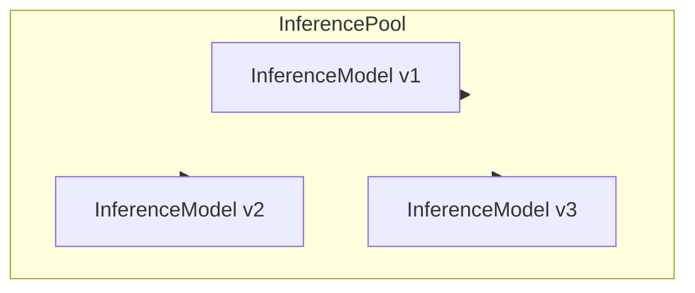
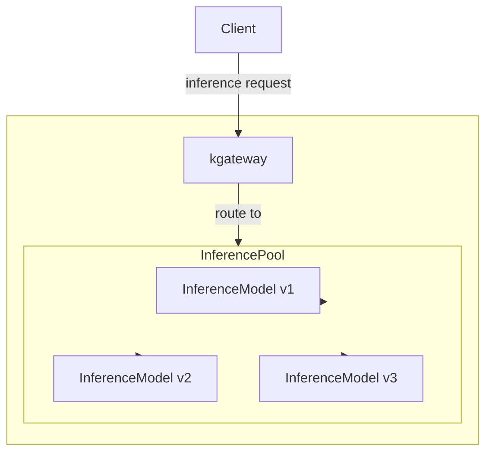

Use  with the Kubernetes Gateway API [Inference Extension project](https://gateway-api-inference-extension.sigs.k8s.io/). This project extends the Gateway API so that you can route to AI inference workloads such as local Large Language Models (LLMs) that run in your Kubernetes environment.

## About Inference Extension {#about}

## Kgateway with Inference Extension {#kgateway}

## Setup steps {#setup}

Refer to the **Getting started** guide in the Inference Extension docs.


  
