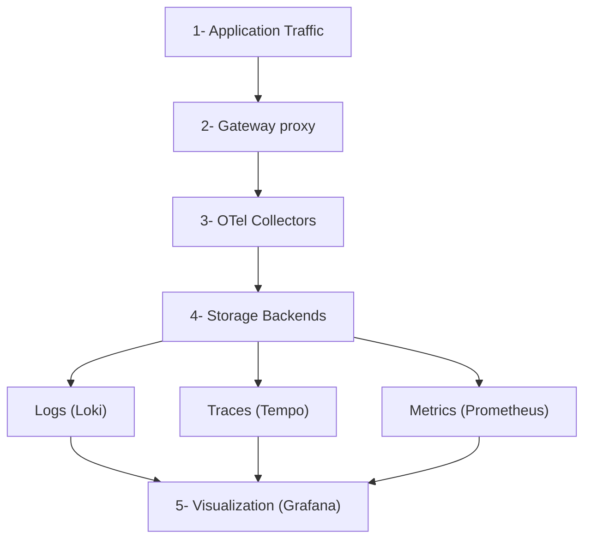

Deploy an open source observability stack based on OpenTelemetry (OTel) that includes the following components:

- **Logs**: Centralized log collection and storage with Grafana [Loki](https://github.com/grafana/loki).
- **Traces**: Distributed tracing with Grafana [Tempo](https://github.com/grafana/tempo).
- **Metrics**: Time-series metrics collection with [Prometheus](https://github.com/prometheus/prometheus).
- **Collection**: Unified telemetry collection with [OpenTelemetry Collector](https://github.com/open-telemetry/opentelemetry-collector).
- **Visualization**: Comprehensive dashboards with [Grafana](https://github.com/grafana/grafana).

## About

Observability tools are essential to gain insight into the health and performance of your gateway proxies. [OpenTelemetry](https://opentelemetry.io/) (OTel) is a flexible, open source framework that provides a set of APIs, libraries, and instrumentation to help capture and export observability data. However, you can follow a similar process as this guide to use the tools that you prefer.

### Observability data types {#data-types}

Observability is built on three core pillars as described in the following table. By combining these three data types, you get a complete picture of your system's health and performance.

| Pillar | Description |
| -- | -- |
| Logs | Discrete events that happen at a specific time with detailed context. |
| Metrics | Numerical measurements aggregated over time intervals. |
| Traces | Records of requests as they flow through distributed systems. |

### Architecture

Review the following diagram to understand the architecture of the observability stack.

The gateway proxy acts as the primary telemetry generator, while the OTel Collectors serve as the central routing hub for all observability data.


Architecture data flow:
1. **Application Traffic**: Applications send requests to the gateway proxy.
2. **Gateway Processing**: The gateway proxy processes requests and generates telemetry data in the form of logs, traces, and metrics.
3. **Telemetry Collection**: The OTel Collectors receive telemetry data from the gateway proxy.
4. **Data Storage**: The OTel Collectors route data to the appropriate storage backends:
   - **Logs** go to Loki for log aggregation and storage.
   - **Traces** go to Tempo for distributed tracing storage.
   - **Metrics** go to Prometheus for time-series metrics storage.
5. **Visualization**: Grafana queries the storage backends as data sources to create unified dashboards.

### More considerations {#more-considerations}

**Push model**: This guide sets up the OTel collectors to push metrics to the storage backends (`push` model), vs. setting up the backends such as Prometheus to scrape metrics from the collector pod (`pull` model). The `push` model is used because it shows the ease and consistency of using OTel for demonstration purposes. It also supports Native Histograms out of the box, which the `pull` model does not due to [a known OTel issue with the Prometheus exporter](https://github.com/open-telemetry/opentelemetry-collector-contrib/issues/33703).

**Debug exporter**: The example pipelines in all three OTel collectors set up the `debug` exporter. This exporter is useful for testing and validation purposes. However, for production scenarios, remove this exporter to avoid performance impacts.

**Prometheus exporter**: If you prefer the `pull` model to the `push` model, you can use `prometheusexporter`'s `promexporter` port with Prometheus to scrape metrics from the collector pod, such as configured in the example later. Also, if you use the `pull` model, make sure to configure Prometheus to handle Native Histograms and scrape the metrics directly as for this model OTel's `prometheusexporter` is not yet supported, per the [known issue](https://github.com/open-telemetry/opentelemetry-collector-contrib/issues/33703) previously mentioned.

## Before you begin



## Step 1: Install Grafana Loki and Tempo {#grafana}

Grafana is a suite of open source tools that help you analyze, visualize, and monitor data in your cluster. For the OTel stack, you install the following Grafana components:

* **Loki**: A log aggregation system that indexes metadata about your logs as a set of labels, not the actual log contents. This way, Loki is more cost-efficient and performant than traditional log aggregation systems.
  
  Loki works best when you use structured logging in your applications, such as JSON format.
  
* **Tempo**: A distributed tracing system that stores trace data in object storage (like Amazon S3) and integrates seamlessly with Grafana for visualization. Distributed tracing helps you see how requests move through a microservices environment, which helps you identify performance bottlenecks, debug issues, and otherwise monitor your system's health to ensure SLA compliance.

Steps to install:

1. Deploy Grafana Loki to your cluster.

   ```yaml
   helm upgrade --install loki loki \
   --repo https://grafana.github.io/helm-charts \
   --version  \
   --namespace telemetry \
   --create-namespace \
   --values - <<EOF
   loki:
     commonConfig:
       replication_factor: 1
     schemaConfig:
       configs:
         - from: 2024-04-01
           store: tsdb
           object_store: s3
           schema: v13
           index:
             prefix: loki_index_
             period: 24h
     auth_enabled: false
   singleBinary:
     replicas: 1
   minio:
     enabled: true
   gateway:
     enabled: false
   test:
     enabled: false
   monitoring:
     selfMonitoring:
       enabled: false
       grafanaAgent:
         installOperator: false
   lokiCanary:
     enabled: false
   limits_config:
     allow_structured_metadata: true
   memberlist:
     service:
       publishNotReadyAddresses: true
   deploymentMode: SingleBinary
   backend:
     replicas: 0
   read:
     replicas: 0
   write:
     replicas: 0
   ingester:
     replicas: 0
   querier:
     replicas: 0
   queryFrontend:
     replicas: 0
   queryScheduler:
     replicas: 0
   distributor:
     replicas: 0
   compactor:
     replicas: 0
   indexGateway:
     replicas: 0
   bloomCompactor:
     replicas: 0
   bloomGateway:
     replicas: 0
   EOF
   ```

2. Deploy Grafana Tempo to your cluster.

   ```yaml
   helm upgrade --install tempo tempo \
   --repo https://grafana.github.io/helm-charts \
   --version  \
   --namespace telemetry \
   --create-namespace \
   --values - <<EOF
   persistence:
     enabled: false
   tempo:
     receivers:
       otlp:
         protocols:
           grpc:
             endpoint: 0.0.0.0:4317
   EOF
   ```

3. Verify that the Grafana pods are running. 
   
   ```sh
   kubectl get pods -n telemetry -l 'app.kubernetes.io/name in (loki,tempo)'
   ```
   
   Example output: 
   ```console
   NAME                   READY   STATUS    RESTARTS   AGE
   loki-0                 2/2     Running   0          3m45s
   loki-chunks-cache-0    2/2     Running   0          3m45s
   loki-results-cache-0   2/2     Running   0          3m45s
   tempo-0                1/1     Running   0          2m10s
   ```

## Step 2: Install the OTel Collector {#otel-collector}

The OpenTelemetry collector acts as a centralized agent that scrapes metrics from the  control plane and data plane gateway proxies. Then, the OTel collector exposes these metrics in Prometheus format so that other tools in your observability stack, such as Grafana, can in turn scrape the OTel collector and visualize the data.

By using an OTel collector to aggregate metrics, you avoid having to configure each application individually to send their metrics to each backend observability tool. This setup simplifies your setup, lets you more easily change backends, improves reliability and debuggability, and lets you optimize preprocessing activities such as filtering, transforming, or enriching the metrics before scraping.

You can deploy three separate OTel collectors that are optimized for the three different types of telemetry data: metrics, logs, and traces. This way, you can scale and optimize each collector based on your telemetry needs.


The example pipelines in all three OTel collectors set up the `debug` exporter. This exporter is useful for testing and validation purposes. However, for production scenarios, remove this exporter to avoid performance impacts.


1. Deploy the metrics collector to handle numerical measurements and time-series data. Note that you can also use the `promexporter` endpoint with Prometheus to scrape metrics from the collector pod, if you prefer the `pull` model to the `push` model.

   ```yaml
   helm upgrade --install opentelemetry-collector-metrics opentelemetry-collector \
   --repo https://open-telemetry.github.io/opentelemetry-helm-charts \
   --version  \
   --set mode=deployment \
   --set image.repository="otel/opentelemetry-collector-contrib" \
   --set command.name="otelcol-contrib" \
   --namespace=telemetry \
   --create-namespace \
   -f -<<EOF
   clusterRole:
     create: true
     rules:
     - apiGroups:
       - ''
       resources:
       - 'pods'
       - 'nodes'
       verbs:
       - 'get'
       - 'list'
       - 'watch'
   ports:
     promexporter:
       enabled: true
       containerPort: 9099
       servicePort: 9099
       protocol: TCP
   
   command:
     extraArgs:
       - "--feature-gates=receiver.prometheusreceiver.EnableNativeHistograms"
   
   config:
     receivers:
       prometheus/kgateway-dataplane:
         config:
           global:
             scrape_protocols: [ PrometheusProto, OpenMetricsText1.0.0, OpenMetricsText0.0.1, PrometheusText0.0.4 ]
           scrape_configs:
           # Scrape the kgateway proxy pods
           - job_name: kgateway-gateways
             honor_labels: true
             kubernetes_sd_configs:
             - role: pod
             relabel_configs:
               - action: keep
                 regex: kube-gateway
                 source_labels:
                 - __meta_kubernetes_pod_label_kgateway
               - source_labels: [__meta_kubernetes_pod_annotation_prometheus_io_scrape]
                 action: keep
                 regex: true
               - source_labels: [__meta_kubernetes_pod_annotation_prometheus_io_path]
                 action: replace
                 target_label: __metrics_path__
                 regex: (.+)
               - action: replace
                 source_labels:
                 - __meta_kubernetes_pod_ip
                 - __meta_kubernetes_pod_annotation_prometheus_io_port
                 separator: ':'
                 target_label: __address__
               - action: labelmap
                 regex: __meta_kubernetes_pod_label_(.+)
               - source_labels: [__meta_kubernetes_namespace]
                 action: replace
                 target_label: kube_namespace
               - source_labels: [__meta_kubernetes_pod_name]
                 action: replace
                 target_label: pod
       prometheus/kgateway-controlplane:
         config:
           global:
             scrape_protocols: [ PrometheusProto, OpenMetricsText1.0.0, OpenMetricsText0.0.1, PrometheusText0.0.4 ]
           scrape_configs:
           # Scrape the kgateway controlplane pods
           - job_name: kgateway-controlplane
             honor_labels: true
             kubernetes_sd_configs:
             - role: pod
             relabel_configs:
               - action: keep
                 regex: kgateway
                 source_labels:
                 - __meta_kubernetes_pod_label_kgateway
               - source_labels: [__meta_kubernetes_pod_annotation_prometheus_io_scrape]
                 action: keep
                 regex: true
               - source_labels: [__meta_kubernetes_pod_annotation_prometheus_io_path]
                 action: replace
                 target_label: __metrics_path__
                 regex: (.+)
               - action: replace
                 source_labels:
                 - __meta_kubernetes_pod_ip
                 - __meta_kubernetes_pod_annotation_prometheus_io_port
                 separator: ':'
                 target_label: __address__
               - action: labelmap
                 regex: __meta_kubernetes_pod_label_(.+)
               - source_labels: [__meta_kubernetes_namespace]
                 action: replace
                 target_label: kube_namespace
               - source_labels: [__meta_kubernetes_pod_name]
                 action: replace
                 target_label: pod
     exporters:
       prometheus:
         endpoint: 0.0.0.0:9099
       prometheusremotewrite/kube-prometheus-stack:
         endpoint: http://kube-prometheus-stack-prometheus.telemetry.svc:9090/api/v1/write
       debug:
         verbosity: detailed
     service:
       pipelines:
         metrics:
           receivers: [prometheus/kgateway-dataplane, prometheus/kgateway-controlplane]
           processors: [batch]
           exporters: [debug, prometheusremotewrite/kube-prometheus-stack]
   EOF
   ```

2. Deploy the logs collector to process and forward application logs.

   ```yaml
   helm upgrade --install opentelemetry-collector-logs opentelemetry-collector \
   --repo https://open-telemetry.github.io/opentelemetry-helm-charts \
   --version  \
   --set mode=deployment \
   --set image.repository="otel/opentelemetry-collector-contrib" \
   --set command.name="otelcol-contrib" \
   --namespace=telemetry \
   --create-namespace \
   -f -<<EOF
   config:
     receivers:
       otlp:
         protocols:
           grpc:
             endpoint: 0.0.0.0:4317
           http:
             endpoint: 0.0.0.0:4318
     exporters:
       otlphttp/loki:
         endpoint: http://loki.telemetry.svc.cluster.local:3100/otlp
         tls:
           insecure: true
       debug:
         verbosity: detailed
     service:
       pipelines:
         logs:
           receivers: [otlp]
           processors: [batch]
           exporters: [debug, otlphttp/loki]
   EOF
   ```

3. Deploy the traces collector to handle distributed tracing data.

   ```yaml
   helm upgrade --install opentelemetry-collector-traces opentelemetry-collector \
   --repo https://open-telemetry.github.io/opentelemetry-helm-charts \
   --version  \
   --set mode=deployment \
   --set image.repository="otel/opentelemetry-collector-contrib" \
   --set command.name="otelcol-contrib" \
   --namespace=telemetry \
   --create-namespace \
   -f -<<EOF
   config:
     receivers:
       otlp:
         protocols:
           grpc:
             endpoint: 0.0.0.0:4317
           http:
             endpoint: 0.0.0.0:4318
     exporters:
       otlp/tempo:
         endpoint: http://tempo.telemetry.svc.cluster.local:4317
         tls:
           insecure: true
       debug:
         verbosity: detailed
     service:
       pipelines:
         traces:
           receivers: [otlp]
           processors: [batch]
           exporters: [debug, otlp/tempo]
   EOF
   ```

4. Verify that the OpenTelemetry collector pods are running. 
   
   ```sh
   kubectl get pods -n telemetry -l app.kubernetes.io/name=opentelemetry-collector
   ```
   
   Example output: 
   ```console
   NAME                                               READY   STATUS    RESTARTS   AGE
   opentelemetry-collector-logs-676777487b-wbtkj      1/1     Running   0          56s
   opentelemetry-collector-metrics-6cdbc47594-mfrzs   1/1     Running   0          69s
   opentelemetry-collector-traces-7696858cf9-tjllx    1/1     Running   0          51s
   ```

## Step 3: Set up Prometheus {#prometheus}

Prometheus is a monitoring system and time-series database that collects metrics from configured targets at given intervals. It's the de facto standard for metrics collection in cloud-native environments. You can use the PromQL query language to set up flexible queries and alerts based on the metrics.

1. Deploy Prometheus in your cluster.

   ```yaml
   helm upgrade --install kube-prometheus-stack kube-prometheus-stack \
   --repo https://prometheus-community.github.io/helm-charts \
   --version  \
   --namespace telemetry \
   --create-namespace \
   --values - <<EOF
   alertmanager:
     enabled: false
   prometheus:
     prometheusSpec:
       ruleSelectorNilUsesHelmValues: false
       serviceMonitorSelectorNilUsesHelmValues: false
       podMonitorSelectorNilUsesHelmValues: false
       enableFeatures:
         - native-histograms
       enableRemoteWriteReceiver: true
   grafana:
     enabled: true
     defaultDashboardsEnabled: true
     datasources:
      datasources.yaml:
        apiVersion: 1
        datasources:
         - name: Prometheus
           type: prometheus
           uid: prometheus
           access: proxy
           orgId: 1
           url: http://kube-prometheus-stack-prometheus.telemetry:9090
           basicAuth: false
           editable: true
           jsonData:
             httpMethod: GET
             exemplarTraceIdDestinations:
             - name: trace_id
               datasourceUid: tempo
         - name: Tempo
           type: tempo
           access: browser
           basicAuth: false
           orgId: 1
           uid: tempo
           url: http://tempo.telemetry.svc.cluster.local:3100
           isDefault: false
           editable: true
         - orgId: 1
           name: Loki
           type: loki
           typeName: Loki
           access: browser
           url: http://loki.telemetry.svc.cluster.local:3100
           basicAuth: false
           isDefault: false
           editable: true
   EOF
   ```

2. Verify that the Prometheus stack's components are up and running. 

   ```sh
   kubectl get pods -n telemetry -l app.kubernetes.io/instance=kube-prometheus-stack
   ```

   Example output: 
   ```console
   NAME                                                        READY   STATUS    RESTARTS   AGE
   kube-prometheus-stack-grafana-b546d7755-ks7sn               3/3     Running   0          72s
   kube-prometheus-stack-kube-state-metrics-684f8c7558-xhn2p   1/1     Running   0          72s
   kube-prometheus-stack-operator-6dc9c666c5-pwzkb             1/1     Running   0          72s
   kube-prometheus-stack-prometheus-node-exporter-z7csm        1/1     Running   0          72s
   ```

## Step 4: Configure telemetry policies {#policies}

Now that you have the telemetry stack set up, you can configure the telemetry policies to collect logging and tracing data for your gateway environment. The HTTPListenerPolicy lets you configure how to collect, process, and route logs and traces for your Gateway or ListenerSet resources. Note that metrics are collected automatically.

1. Create an HTTPListenerPolicy to collect and store logs in Loki. The policy applies to the `http` Gateway that serves traffic to the `httpbin` app that you set up before you began.

   ```yaml
   kubectl apply -f- <<EOF
   apiVersion: gateway.kgateway.dev/v1alpha1
   kind: HTTPListenerPolicy
   metadata:
     name: logging-policy
     namespace: 
   spec:
     targetRefs:
     - group: gateway.networking.k8s.io
       kind: Gateway
       name: http
     accessLog:
     - openTelemetry:
         grpcService:
           backendRef:
             name: opentelemetry-collector-logs
             namespace: telemetry
             port: 4317
           logName: "http-gateway-access-logs"
         body: >-
           "%REQ(:METHOD)% %REQ(X-ENVOY-ORIGINAL-PATH?:PATH)% %RESPONSE_CODE% "%REQ(:AUTHORITY)%" "%UPSTREAM_CLUSTER%"'
   EOF
   ```

2. Create a Kubernetes ReferenceGrant so that the HTTPListenerPolicy can apply to the OTel logs collector service.

   ```yaml
   kubectl apply -f- <<EOF
   apiVersion: gateway.networking.k8s.io/v1beta1
   kind: ReferenceGrant
   metadata:
     name: allow-otel-collector-logs-access
     namespace: telemetry
   spec:
     from:
     - group: gateway.kgateway.dev
       kind: HTTPListenerPolicy
       namespace: 
     to:
     - group: ""
       kind: Service
       name: opentelemetry-collector-logs
   EOF
   ```

3. Create another HTTPListenerPolicy to collect and store traces in Tempo.

   ```yaml
   kubectl apply -f- <<EOF
   apiVersion: gateway.kgateway.dev/v1alpha1
   kind: HTTPListenerPolicy
   metadata:
     name: tracing-policy
     namespace: 
   spec:
     targetRefs:
     - group: gateway.networking.k8s.io
       kind: Gateway
       name: http
     tracing:
       provider:
         openTelemetry:
           serviceName: http
           grpcService:
             backendRef:
               name: opentelemetry-collector-traces
               namespace: telemetry
               port: 4317
       spawnUpstreamSpan: true
   EOF
   ```

4. Create a Kubernetes ReferenceGrant so that the HTTPListenerPolicy can apply to the OTel traces collector service.

   ```yaml
   kubectl apply -f- <<EOF
   apiVersion: gateway.networking.k8s.io/v1beta1
   kind: ReferenceGrant
   metadata:
     name: allow-otel-collector-traces-access
     namespace: telemetry
   spec:
     from:
     - group: gateway.kgateway.dev
       kind: HTTPListenerPolicy
       namespace: 
     to:
     - group: ""
       kind: Service
       name: opentelemetry-collector-traces
   EOF
   ```

## Step 5: Verify your setup {#verify}

To verify that your setup is working, generate sample traffic and review the logs and Grafana dashboard.
   
1. Generate traffic for the httpbin app. 

   
   {}
   ```sh
   for i in {1..5}; do curl -v http://$INGRESS_GW_ADDRESS:8080/status/418 -H "host: www.example.com:8080"; done
   ```
   {}
   {}
   ```sh
   for i in {1..5}; do curl -v localhost:8080/status/418 -H "host: www.example.com:8080"; done
   ```
   {}
   

   Example output:

   ```
   < HTTP/1.1 418 Unknown
   I'm a teapot!
   ...
   ```

2. Check that logs are being collected.

   ```sh
   kubectl -n telemetry logs deploy/opentelemetry-collector-logs | grep '/status/418' | wc -l
   ```

   Example output: The count matches the number of requests that you sent, such as `5`.

   ```

       5
   ```

3. Check that traces are being collected.

   ```sh
   kubectl -n telemetry logs deploy/opentelemetry-collector-traces | grep 'http.status_code: Str(418)' | wc -l
   ```

   Example output: The count traces the number of services that were involved in responding to the request, such as `10`.

   ```

      10
   ```
   
## Step 6: Explore Grafana dashboards




## Cleanup



1. Remove the configmap for the Envoy gateway proxy dashboard and delete the `envoy.json` file.
   ```sh
   kubectl delete cm envoy-dashboard -n telemetry
   rm envoy.json
   kubectl delete cm -dashboard -n telemetry
   rm .json
   ```

2. Delete the HTTPListenerPolicy policies that collect logs and traces.

   ```sh
   kubectl delete httplistenerpolicy logging-policy -n 
   kubectl delete httplistenerpolicy tracing-policy -n 
   ```

3. Uninstall the Grafana Loki and Tempo components. 
   ```sh
   helm uninstall loki -n telemetry
   helm uninstall tempo -n telemetry
   ```

4. Uninstall the OpenTelemetry collectors. 
   ```sh
   helm uninstall opentelemetry-collector-metrics -n telemetry
   helm uninstall opentelemetry-collector-logs -n telemetry
   helm uninstall opentelemetry-collector-traces -n telemetry
   ```

5. Uninstall the Prometheus stack. 
   ```sh
   helm uninstall kube-prometheus-stack -n telemetry
   ```

6. Remove the `telemetry` namespace. 
   ```sh
   kubectl delete namespace telemetry
   ```
