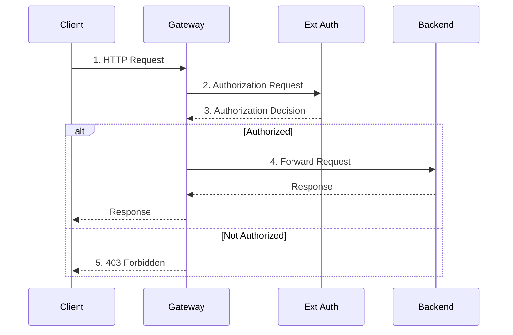

Bring your own external authorization service to protect requests that go through your Gateway.





## About external auth {#about}

 lets you integrate your own external authorization service to your Gateway, based on the [Envoy external authorization filter](https://www.envoyproxy.io/docs/envoy/latest/intro/arch_overview/security/ext_authz_filter). Then, this external authorization service makes authorization decisions for requests that go through the Gateway, as shown in the following diagram.



1. The Client sends a request to the Gateway.
2. The Gateway forwards the request to the Ext Auth service.
3. The Ext Auth service makes a decision as to whether the request is authorized, based on headers, parameters, or other credentials.
4. If authorized, the Gateway forwards the request to the Backend app, which then sends back a response to the Client through the Gateway.
5. If not authorized, the Gateway rejects the request and by default returns a 403 Forbidden response to the Client.

## Before you begin 



## Bring your own external authorization service {#byo-ext-auth}

First, deploy your own external authorization service as a backend service that is accessible to kgateway. To do so, you configure a custom GatewayExtension resource that points to your external authorization service via gRPC.


Keep in mind that your external authorization service must conform to the [Envoy external auth proto](https://github.com/envoyproxy/envoy/blob/main/api/envoy/service/auth/v3/external_auth.proto). The external authorization service also configures the conditions for authorizing a request, such as the inclusion of a certain header or other credentials.



Note that in the following example, resources are created in the same namespace to simplify setup. For example, the external auth service and GatewayExtension are in the same `` namespace, and the TrafficPolicy, HTTPRoute, and backing Service for the sample app are in the same `httpbin` namespace. To create the resources in different namespaces, make sure that you set up a [Kubernetes ReferenceGrant](https://gateway-api.sigs.k8s.io/api-types/referencegrant/) from the GatewayExtension to the Services that back the external auth service. For more information and an example, see the [TrafficPolicy not applied](/docs/operations/debug/#trafficpolicy) troubleshooting docs.


1. Deploy your external authorization service. The following example uses the [Istio external authorization service](https://github.com/istio/istio/tree/master/samples/extauthz) for quick testing purposes. This service is configured to allow requests with the `x-ext-authz: allow` header.

   ```yaml
   kubectl apply -f - <<EOF
   apiVersion: apps/v1
   kind: Deployment
   metadata:
     namespace: 
     name: ext-authz
     labels:
       app: ext-authz
   spec:
     replicas: 1
     selector:
       matchLabels:
         app: ext-authz
     template:
       metadata:
         labels:
           app: ext-authz
           app.kubernetes.io/name: ext-authz
       spec:
         containers:
         - image: gcr.io/istio-testing/ext-authz:1.25-dev
           name: ext-authz
           ports:
           - containerPort: 9000
   EOF
   ```

2. Create a Service for the Deployment that  can access.

   ```yaml
   kubectl apply -f - <<EOF
   apiVersion: v1
   kind: Service
   metadata:
     namespace: 
     name: ext-authz
     labels:
       app: ext-authz
   spec:
     ports:
     - port: 4444
       targetPort: 9000
       protocol: TCP
       appProtocol: kubernetes.io/h2c
     selector:
       app: ext-authz
   EOF
   ```

3. Create a GatewayExtension resource that points to your external authorization Service. Note that the GatewayExtension is created in the same namespace as the external auth service. To use a different namespace, make sure that you set up a [Kubernetes ReferenceGrant](https://gateway-api.sigs.k8s.io/api-types/referencegrant/) from the GatewayExtension to the Services that back the external auth service. For more information and an example, see the [TrafficPolicy not applied](/docs/operations/debug/#trafficpolicy) troubleshooting docs.

   ```yaml
   kubectl apply -f - <<EOF
   apiVersion: gateway.kgateway.dev/v1alpha1
   kind: GatewayExtension
   metadata:
     namespace: 
     name: basic-ext-auth
     labels:
       app: ext-authz
   spec:
     type: ExtAuth
     extAuth:
       grpcService:
         backendRef:
           name: ext-authz
           port: 4444   
   EOF
   ```

## Create external auth policy {#create-policy}

You can apply a policy at two levels: the Gateway level or the HTTPRoute level. If you apply the policy at both levels, the request must pass both policies to be authorized.

1. Send a test request to the httpbin sample app.  Verify that you get back a 200 HTTP response code and that no authorization is required.

   
   {}
   ```sh
   curl -i http://$INGRESS_GW_ADDRESS:8080/headers -H "host: www.example.com:8080"
   ```
   {}
   {}
   ```sh
   curl -i localhost:8080/headers -H "host: www.example.com"
   ```
   {}
   

   Example output: 
   
   ```txt
   HTTP/1.1 200 OK
   ...
   ```

2. Create a TrafficPolicy that applies the GatewayExtension with external authorization at the Gateway level. Note that you can also set the `targetRefs` to select an HTTPRoute, which is demonstrated in later steps. Create the TrafficPolicy in the same namespace as the targeted resource.

   ```yaml
   kubectl apply -f - <<EOF
   apiVersion: gateway.kgateway.dev/v1alpha1
   kind: TrafficPolicy
   metadata:
     namespace: 
     name: gateway-ext-auth-policy
     labels:
       app: ext-authz
   spec:
     targetRefs:
     - group: gateway.networking.k8s.io
       kind: Gateway
       name: http
     extAuth:
       extensionRef: 
         name: basic-ext-auth
   EOF
   ```

3. Repeat your request to the httpbin sample app and verify that the request is denied.

   
   {}
   ```sh
   curl -i http://$INGRESS_GW_ADDRESS:8080/headers -H "host: www.example.com:8080"
   ```
   {}
   {}
   ```sh
   curl -i localhost:8080/headers -H "host: www.example.com"
   ```
   {}
   

   Example output: Note the 403 Forbidden response, along with the special `x-ext-authz*` headers that the Istio external authorization service adds to the request to explain the decision.
   
   ```txt
   HTTP/1.1 403 Forbidden
   x-ext-authz-check-result: denied
   x-ext-authz-check-received: source:{address:{socket_address:{address:"127.0.0.1"  port_value:52492}}}  destination:{address:{socket_address:{address:"127.0.0.1"  port_value:8080}}}  request:{time:{seconds:1743195078  nanos:842835000}  http:{id:"6918845494626045094"  method:"GET"  headers:{key:":authority"  value:"www.example.com"}  headers:{key:":method"  value:"GET"}  headers:{key:":path"  value:"/headers"}  headers:{key:":scheme"  value:"http"}  headers:{key:"accept"  value:"*/*"}  headers:{key:"user-agent"  value:"curl/8.7.1"}  headers:{key:"x-envoy-external-address"  value:"127.0.0.1"}  headers:{key:"x-forwarded-for"  value:"10.244.0.7"}  headers:{key:"x-forwarded-proto"  value:"http"}  headers:{key:"x-request-id"  value:"be03e2fd-4513-489e-8933-67b90c59815a"}  path:"/headers"  host:"www.example.com"  scheme:"http"  protocol:"HTTP/1.1"}}  metadata_context:{}  route_metadata_context:{}
   x-ext-authz-additional-header-override: grpc-additional-header-override-value
   content-length: 76
   content-type: text/plain
   date: Fri, 28 Mar 2025 20:51:18 GMT
   server: envoy
   
   denied by ext_authz for not found header `x-ext-authz: allow` in the request
   ```

4. Send another request, this time with the `x-ext-authz: allow` header. The Istio external authorization service is configured to allow requests with this header. Therefore, the request succeeds.

   
   {}
   ```sh
   curl -i http://$INGRESS_GW_ADDRESS:8080/headers -H "host: www.example.com:8080" -H "x-ext-authz: allow"
   ```  
   {}
   {}
   ```sh
   curl -i localhost:8080/headers -H "host: www.example.com" -H "x-ext-authz: allow"
   ```
   {}
   

   Example output: Note that the 200 response with several `X-Ext-Authz*` headers that explain the decision.

   ```txt
   HTTP/1.1 200 OK
   ...
   ```
   ```json {hl_lines=[18,19,21,22,24,25,27,28]}
   {
     "headers": {
       "Accept": [
         "*/*"
       ],
       "Host": [
         "www.example.com"
       ],
       "User-Agent": [
         "curl/8.7.1"
       ],
       "X-Envoy-Expected-Rq-Timeout-Ms": [
         "15000"
       ],
       "X-Envoy-External-Address": [
         "127.0.0.1"
       ],
       "X-Ext-Authz": [
         "allow"
       ],
       "X-Ext-Authz-Additional-Header-Override": [
         "grpc-additional-header-override-value"
       ],
       "X-Ext-Authz-Check-Received": [
         "source:{address:{socket_address:{address:\"127.0.0.1\"  port_value:41472}}}  destination:{address:{socket_address:{address:\"127.0.0.1\"  port_value:8080}}}  request:{time:{seconds:1743195175  nanos:308379000}  http:{id:\"2185898822670104560\"  method:\"GET\"  headers:{key:\":authority\"  value:\"www.example.com\"}  headers:{key:\":method\"  value:\"GET\"}  headers:{key:\":path\"  value:\"/headers\"}  headers:{key:\":scheme\"  value:\"http\"}  headers:{key:\"accept\"  value:\"*/*\"}  headers:{key:\"user-agent\"  value:\"curl/8.7.1\"}  headers:{key:\"x-envoy-external-address\"  value:\"127.0.0.1\"}  headers:{key:\"x-ext-authz\"  value:\"allow\"}  headers:{key:\"x-forwarded-for\"  value:\"10.244.0.7\"}  headers:{key:\"x-forwarded-proto\"  value:\"http\"}  headers:{key:\"x-request-id\"  value:\"8fc7e284-7c09-4080-9500-f8da4495949d\"}  path:\"/headers\"  host:\"www.example.com\"  scheme:\"http\"  protocol:\"HTTP/1.1\"}}  metadata_context:{}  route_metadata_context:{}"
       ],
       "X-Ext-Authz-Check-Result": [
         "allowed"
       ],
       "X-Forwarded-For": [
         "10.244.0.7"
       ],
       "X-Forwarded-Proto": [
         "http"
       ],
       "X-Request-Id": [
         "8fc7e284-7c09-4080-9500-f8da4495949d"
       ]
     }
   }
   ```

5. Create another TrafficPolicy to disable external authorization for a particular HTTPRoute. This way, requests that do not require external authorization, such as health checks, are allowed through while the external authorization service is still in place for requests to other routes on the Gateway.

   ```yaml
   kubectl apply -f - <<EOF
   apiVersion: gateway.kgateway.dev/v1alpha1
   kind: TrafficPolicy
   metadata:
     namespace: httpbin
     name: route-ext-auth-policy
     labels:
       app: ext-authz
   spec:
     targetRefs:
     - group: gateway.networking.k8s.io
       kind: HTTPRoute
       name: httpbin
     extAuth:
       disable: {}
   EOF
   ```

6. Send a request without the `x-ext-authz` header and verify that you get back a 200 OK response. This time, the TrafficPolicy with the disabled external authorization service takes precedence so that the request is allowed through.

   
   {}
   ```sh
   curl -i http://$INGRESS_GW_ADDRESS:8080/headers -H "host: www.example.com:8080"
   ```
   {}
   {}
   ```sh
   curl -i localhost:8080/headers -H "host: www.example.com"
   ```
   {}
   

   Example output: 
   
   ```txt
   HTTP/1.1 200 OK
   ...
   ```

## Cleanup



1. Delete the TrafficPolicies for the Gateway and HTTPRoute.    

   ```sh
   kubectl delete trafficpolicy -A -l app=ext-authz
   ```

2. Delete the sample external authorization service and GatewayExtension resource.

   ```sh
   kubectl delete gatewayextension,deployment,service -n  -l app=ext-authz
   ```
