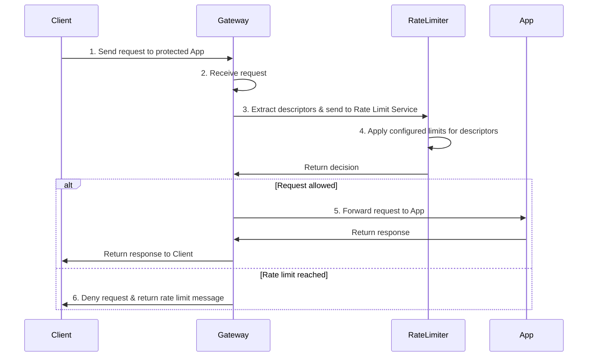

Configure global rate limiting rules across all of your Gateways to protect the backing services in your cluster.





## About {#about}

Global rate limiting in kgateway is powered by [Envoy's rate limiting service protocol](https://www.envoyproxy.io/docs/envoy/latest/configuration/http/http_filters/rate_limit_filter). With global rate limiting, you can apply distributed, consistent rate limits across multiple Gateways. Unlike local rate limiting, which operates per Gateway instance, global rate limiting uses a central service to coordinate rate limits. Therefore, to use global rate limiting, you must bring your own rate limit service that implements the Envoy protocol.

With your own rate limit service in place, you get benefits such as:

- Coordinated rate limiting across multiple Gateways.
- Centralized rate limit management with shared counters.
- Dynamic descriptor-based rate limits that can consider multiple request attributes.
- Consistent user experience, regardless of which Gateway receives the request.

### Request flow

Review the following sequence diagram to understand the request flow with global rate limiting.



1. The Client sends a request to an App that is protected by the Gateway.
2. The Gateway receives the request.
3. The Gateway extracts descriptors and sends them to the Rate Limit Service.
4. The Rate Limit Service applies configured limits for those descriptors and returns a decision to the Gateway.
5. If allowed, the Gateway forwards the request to the App.
6. If the rate limit is reached, the Gateway denies the request and returns a message to the Client.

### Architecture

The global rate limiting feature consists of three components:

1. **TrafficPolicy with rateLimit.global**: Configure your rate limit policy in a kgateway TrafficPolicy. The rate limit policy includes the descriptors to extract from requests for the Gateway to send to the Rate Limit Service.
2. **GatewayExtension**: Connect  with the Rate Limit Service by using a kgateway GatewayExtension.
3. **Rate Limit Service** - An external service that you set up to implement the Envoy Rate Limit protocol. The Rate Limit Service has the actual rate limit values to enforce on requests, based on the descriptors that the TrafficPolicy includes.

### Response headers

When rate limiting is enabled, kgateway adds the following headers to responses. These headers help clients understand their current rate limit status and adapt their behavior accordingly.

| Header | Description | Example |
|--------|-------------|---------|
| x-ratelimit-limit | The rate limit ceiling for the given request | `10, 10;w=60` (10 requests per 60 seconds) |
| x-ratelimit-remaining | The number of requests left for the time window | `5` (5 requests remaining) |
| x-ratelimit-reset | The time in seconds until the rate limit resets | `30` (rate limit resets in 30 seconds) |
| x-envoy-ratelimited | Present when the request is rate limited | `true` |

## Before you begin



## Step 1: Deploy your Rate Limit Service {#byo-rate-limit-service}

You can bring your own rate limit service that implements the Envoy Rate Limit gRPC protocol. 

To get started, you can try out a demo rate limit service from the kgateway project. For more information, see the [GitHub repo](https://github.com/kgateway-dev/kgateway/tree/main/test/kubernetes/e2e/features/rate_limit/testdata).

1. Create the `kgateway-test-extensions` namespace.

   ```sh
   kubectl create namespace kgateway-test-extensions
   ```

2. Deploy the rate limit service.

   ```bash
   kubectl apply -f https://raw.githubusercontent.com/kgateway-dev/kgateway/refs/heads/main/test/kubernetes/e2e/features/rate_limit/global/testdata/rate-limit-server.yaml
   ```

## Step 2: Define the rate limits {#rate-limits}

Define the actual rate limit values (requests per unit time) in your Rate Limit Service. For example, using the [Envoy Rate Limit](https://github.com/envoyproxy/ratelimit) service, you configure the rate limits in its configuration file.

The kgateway example that you deployed in the previous step includes the following rate limit configuration as a Kubernetes ConfigMap.

```sh
kubectl describe configmap ratelimit-config -n kgateway-test-extensions
```



| Field | Description |
|-------|-------------|
| domain | Required. A globally unique identifier to group together a set of rate limit rules. This way, different teams can have their own set of rate limits that don't conflict with each other. Later, you set the domain to use in the kgateway GatewayExtension. If you have different domains for different teams, each team can create their own GatewayExtension that their TrafficPolicies can reference. |
| descriptors | A list of key-value pairs that the Rate Limit Service uses to select which rate limit to use on matching requests. Descriptors are case-sensitive. |
| key | Required. The name for the descriptor to use when matching requests. Later, you use the descriptor key in the kgateway TrafficPolicy to decide which rate limits to apply to requests. The Rate Limit Service expects one of the following values for the descriptor key: `remote_address` for a client IP address (`RemoteAddress` in the TrafficPolicy), `path` for path matching (`Path` in the TrafficPolicy), a key name for header matching (`Header` in the TrafficPolicy), or a custom key name for matching on a generic key-value pair (`Generic` in the TrafficPolicy). |
| value | Optional. Each descriptor can have a value for more specific matching. For example, you might have two descriptor keys that are both for an `X-User-ID` header, but one also has a value of `user1`. This way, you can apply different rate limits to the specific value, such as to further restrict or permit a particular user. Similarly, you can take this approach for remote addresses, paths, and generic key-value pairs such as for `service` plans. |
| rate_limit | Optional. The actual rate limit rule to apply. The example sets different rate limits for each descriptor key. If a descriptor key does not have a rate limit, the TrafficPolicy cannot apply a rate limit to requests, and the requests that match the descriptor are allowed. |
| unit | The unit of time for the rate limit, such as `second`, `minute`, `hour`, or `day`. |
| requests_per_unit | The number of requests to allow per unit of time. |

Example output:

```yaml
Data
====
config.yaml:
----
domain: api-gateway
descriptors:
  - key: remote_address
    rate_limit:
      unit: minute
      requests_per_unit: 1
  - key: path
    value: "/path1"
    rate_limit:
      unit: minute
      requests_per_unit: 1
  - key: path
    value: "/path2"
    rate_limit:
      unit: minute
      requests_per_unit: 2
  - key: X-User-ID
    rate_limit:
      unit: minute
      requests_per_unit: 1
  - key: X-User-ID
    value: user1
    rate_limit:
      unit: minute
      requests_per_unit: 1
  - key: service
    value: premium-api
    rate_limit:
      unit: minute
      requests_per_unit: 2


BinaryData
====
```

## Step 3: Create a GatewayExtension {#gateway-extension}

Create a GatewayExtension resource that points to your Rate Limit Service. 

1. Create a GatewayExtension.

   ```yaml
   kubectl apply -f - <<EOF
   apiVersion: gateway.kgateway.dev/v1alpha1
   kind: GatewayExtension
   metadata:
     namespace: 
     name: global-ratelimit
   spec:
     type: RateLimit
     rateLimit:
       grpcService:
         backendRef:
           name: ratelimit
           namespace: kgateway-test-extensions
           port: 8081
       domain: "api-gateway"
       timeout: "100ms"
       failOpen: false
   EOF
   ```

   {} For more information, see the [API docs](../../../reference/api/#ratelimitprovider).

   | Field | Description | Required |
   |-------|-------------|----------|
   | grpcService | Configuration for connecting to the gRPC rate limit service. | Yes |
   | domain | Domain identity for the rate limit service. If you have different domains for different teams, each team can create their own GatewayExtension that their TrafficPolicies can reference. | Yes |
   | timeout | Timeout for rate limit service calls, such as `100ms`. | No |
   | failOpen | When `true`, requests continue even if the rate limit service is unavailable. | No (defaults to `false`) |

2. Create a Kubernetes ReferenceGrant to allow the GatewayExtension to access the Rate Limit Service. Otherwise, you can create the GatewayExtension and TrafficPolicy in the same namespace as the Rate Limit Service.

   ```yaml
   kubectl apply -f - <<EOF
   apiVersion: gateway.networking.k8s.io/v1beta1
   kind: ReferenceGrant
   metadata:
     name: global-ratelimit
     namespace: kgateway-test-extensions
   spec:
     from:
     - group: gateway.kgateway.dev
       kind: GatewayExtension
       namespace: 
     to:
     - group: ""
       kind: Service
   EOF
   ```

## Step 4: Create a TrafficPolicy {#traffic-policy}

Create a TrafficPolicy resource that applies rate limits to your routes. Note that the TrafficPolicy must be in the same namespace as the GatewayExtension to select it.

The TrafficPolicy configures the descriptors that define the dimensions for rate limiting. Each descriptor consists of one or more entries that help categorize and count requests. The descriptor entries match on the descriptor keys that you defined previously in the Rate Limit Service.

Entries can be of one of the following types: `RemoteAddress`, `Path`, `Header`, or `Generic`. You can combine different entry types so that they are applied together as a rate limit, such as `RemoteAddress` and `Generic` or `Header` and `Path`. The following table describes the different descriptor entry types. For more information, see the [API docs](../../reference/api/#ratelimitpolicy).

| Type | Description | Additional Fields |
|------|-------------|-------------------|
| Header | Extract the descriptor value from a request header. The header name must match a descriptor key in the Rate Limit Service. | `header`: The name of the header to extract. |
| Generic | Use a static key-value pair that you define as the descriptor. | `generic.key`: The descriptor key that matches the descriptor key in the Rate Limit Service.<br>`generic.value`: The static value for more specific matching. |
| Path | Use the request path as the descriptor value. The `Path` entry type is mapped to the `path` descriptor key in the Rate Limit Service. | None |
| RemoteAddress | Use the client's IP address as the descriptor value. The `RemoteAddress` entry type is mapped to the `remote_address` descriptor key in the Rate Limit Service. | None |

Flip through the tabs for different example rate limit policies. Note that the examples apply to the Gateway that you created before you began, but you can also apply a TrafficPolicy to an HTTPRoute or specific route.



{}

Limit requests based on the client's IP address.

```yaml
kubectl apply -f - <<EOF
apiVersion: gateway.kgateway.dev/v1alpha1
kind: TrafficPolicy
metadata:
  name: ip-rate-limit
  namespace: 
spec:
  targetRefs:
  - group: gateway.networking.k8s.io
    kind: Gateway
    name: http
  rateLimit:
    global:
      descriptors:
      - entries:
        - type: RemoteAddress
      extensionRef:
        name: global-ratelimit
EOF
```

{}

{}

Limit requests based on the request path, such as a request with `/path1` or `/path2` in the path as defined in the example Rate Limit Service actions.

```yaml
kubectl apply -f - <<EOF
apiVersion: gateway.kgateway.dev/v1alpha1
kind: TrafficPolicy
metadata:
  name: request-path
  namespace: 
spec:
  targetRefs:
  - group: gateway.networking.k8s.io
    kind: Gateway
    name: http
  rateLimit:
    global:
      descriptors:
      - entries:
        - type: Path
      extensionRef:
        name: global-ratelimit
EOF
```

{}

{}

Limit requests based on a user ID from an `X-User-ID` header.

```yaml
kubectl apply -f - <<EOF
apiVersion: gateway.kgateway.dev/v1alpha1
kind: TrafficPolicy
metadata:
  name: user-rate-limit
  namespace: 
spec:
  targetRefs:
  - group: gateway.networking.k8s.io
    kind: Gateway
    name: http
  rateLimit:
    global:
      descriptors:
      - entries:
        - type: Header
          header: "X-User-ID"
      extensionRef:
        name: global-ratelimit
EOF
```

{}

{}

Apply different limits based on both path and user ID. The following example requires nested descriptors to rate limit requests along the path and header.

```yaml
kubectl apply -f - <<EOF
apiVersion: gateway.kgateway.dev/v1alpha1
kind: TrafficPolicy
metadata:
  name: combined-rate-limit
  namespace: 
spec:
  targetRefs:
  - group: gateway.networking.k8s.io
    kind: Gateway
    name: http
  rateLimit:
    global:
      descriptors:
      - entries:
        - type: Path
        - type: Header
          header: "X-User-ID"
      extensionRef:
        name: global-ratelimit
EOF
```

To rate limit based on `/path1` value for path and `user1` value for header, the matching Rate Limit Service must have nested descriptors as follows:

```yaml
descriptors:
  # Level 1: Path
  - key: path
    value: "/path1"
    descriptors:
      # Level 2: User ID (nested under path)
      - key: X-User-ID
        value: "user1"
        rate_limit:
          unit: minute
          requests_per_unit: 2
```

{}

{}

Combine local and global rate limiting in the same TrafficPolicy such as in the following example. For more information, see [Local rate limiting](../local).

* Local: A rate limit of 5 requests per second is applied to all requests.
* Global: A rate limit of 2 requests per minute is applied to requests with a `service` descriptor key of `premium-api`.

```yaml
kubectl apply -f - <<EOF
apiVersion: gateway.kgateway.dev/v1alpha1
kind: TrafficPolicy
metadata:
  name: local-global-rate-limit
  namespace: 
spec:
  targetRefs:
  - group: gateway.networking.k8s.io
    kind: Gateway
    name: http
  rateLimit:
    local:
      tokenBucket:
        maxTokens: 5
        tokensPerFill: 1
        fillInterval: "1s"
    global:
      descriptors:
      - entries:
        - type: Generic
          generic:
            key: "service"
            value: "premium-api"
      extensionRef:
        name: global-ratelimit
```

{}



## Step 5: Test the rate limits {#test-rate-limits}

Test the rate limits by sending requests to the Gateway. The following steps assume that you created the **client IP address** example TrafficPolicy, which limits requests to 1 request per minute for a particular client IP address.

1. Send a test request to the httpbin sample app. The request succeeds because you did not exceed the rate limit of 1 request per minute.

   
   {}
   ```sh
   curl -i http://$INGRESS_GW_ADDRESS:8080/headers -H "host: www.example.com:8080"
   ```
   {}
   {}
   ```sh
   curl -i localhost:8080/headers -H "host: www.example.com"
   ```
   {}
   

   Example output: 
   
   ```txt
   HTTP/1.1 200 OK
   ...
   ```

2. Repeat the request. The request fails because you exceeded the rate limit of 1 request per minute.

   
   {}
   ```sh
   curl -i http://$INGRESS_GW_ADDRESS:8080/headers -H "host: www.example.com:8080"
   ```
   {}
   {}
   ```sh
   curl -i localhost:8080/headers -H "host: www.example.com"
   ```
   {}
   

   Example output: 
   
   ```txt
   HTTP/1.1 429 Too Many Requests
   ...
   ```

## Cleanup



```sh
kubectl delete -f https://raw.githubusercontent.com/kgateway-dev/kgateway/refs/heads/main/test/kubernetes/e2e/features/rate_limit/testdata/rate-limit-server.yaml
kubectl delete gatewayextension global-ratelimit
kubectl delete trafficpolicy ip-rate-limit user-rate-limit combined-rate-limit local-global-rate-limit
kubectl delete namespace kgateway-test-extensions
```
