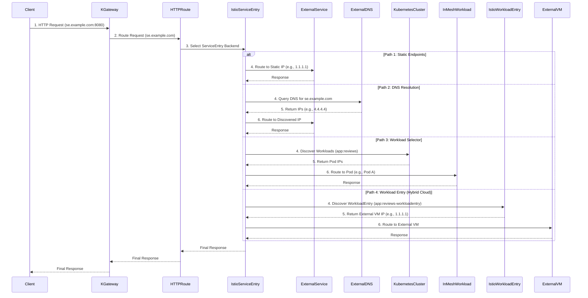

Extend K-Gateway's service mesh to external services using Istio Service Entries for unified traffic management.

# Service Entry with K-Gateway

An **Istio Service Entry** is a Kubernetes custom resource that allows you to integrate and manage external services within your Istio service mesh. For K-Gateway, this is a critical capability as it extends the mesh's robust features – such as traffic management, security, and observability – to services residing outside your Kubernetes cluster. Whether it's a legacy application, a third-party API, or a remote database, Service Entries enable you to treat these external dependencies as first-class citizens of your mesh.

The `ServiceEntry` resource offers flexible mechanisms to define how these external services are discovered and addressed, tailored to different operational needs:


  * **Static Endpoints**: The most straightforward approach, perfect for stable, known external services or local development environments where IPs are fixed.
  * **DNS Resolution**: Ideal for dynamic cloud environments where external service IPs may change. Istio handles dynamic endpoint discovery through DNS lookups.
  * **Workload Selector**: An advanced method to route to specific in-mesh workloads based on Kubernetes labels, useful for granular control over internal service routing.
  * **Workload Entry**: The most powerful option for hybrid-cloud strategies, enabling the integration of non-Kubernetes workloads (like VMs or bare-metal servers) directly into the service mesh.

-----

## The Common Components: K-Gateway and HTTPRoute

Before diving into the specifics of each `ServiceEntry` type, it's important to note the consistent ingress and routing components used across all examples. The `Gateway` and `HTTPRoute` resources define how incoming traffic reaches the mesh's edge and is initially processed.

The `Gateway` resource, `http-gw-for-test`, listens for HTTP traffic on port `8080`. The `HTTPRoute`, `route-to-upstream`, then matches incoming requests for the hostname `se.example.com` and directs them to a backend specified as an Istio `ServiceEntry`. This separation of concerns means the ingress logic remains constant, while the `ServiceEntry` itself dictates the backend's discovery and resolution strategy.

```yaml
kubectl create namespace gwtest
kubectl apply -f - <<EOF
kind: Gateway
apiVersion: gateway.networking.k8s.io/v1
metadata:
  name: http-gw-for-test
  namespace: gwtest
spec:
  gatewayClassName: kgateway
  listeners:
  - protocol: HTTP
    port: 8080
    name: http
    allowedRoutes:
      namespaces:
        from: All
---
apiVersion: gateway.networking.k8s.io/v1beta1
kind: HTTPRoute
metadata:
  name: route-to-upstream
  namespace: gwtest
spec:
  parentRefs:
  - name: http-gw-for-test
  hostnames:
  - "se.example.com"
  rules:
  - backendRefs:
    - name: example-se
      port: 80
      kind: ServiceEntry
      group: networking.istio.io
EOF
```

## Full Code Examples & Use Cases

Building on the common K-Gateway and HTTPRoute configuration, these examples demonstrate how different `ServiceEntry` types are implemented to integrate various external service scenarios.

### 1\. Static Endpoints

This configuration is the most straightforward, designed for external services with fixed, known network addresses. It's an excellent choice for integrating a legacy database, an on-premises application with a stable IP, or for controlled test environments.

The `ServiceEntry` explicitly lists the IP addresses of the external service in the `endpoints` array. With `resolution: STATIC`, Istio directly distributes traffic among these predefined addresses.

```yaml
kubectl apply -f - <<EOF
apiVersion: networking.istio.io/v1
kind: ServiceEntry
metadata:
  name: example-se
  namespace: gwtest
spec:
  hosts:
  - se.example.com
  ports:
  - number: 80
    name: http
    protocol: TCP
  resolution: STATIC
  location: MESH_INTERNAL
  endpoints:
  - address: 1.1.1.1
    locality: r1/z1/sz1
  - address: 2.2.2.2
    locality: r1/z1/sz1
  - address: 3.3.3.3
    locality: r3/z3/sz3
EOF
```
#### Verification Process 
The goal is to simulate a request from inside the mesh and confirm that the Istio sidecar proxy correctly routes it to one of the static endpoints you defined in the ServiceEntry YAML.
```
# Deploy a Test Pod & Verify Hostname Resolution
kubectl run -it test-pod --image=busybox:latest -- /bin/sh
nslookup se.example.com
```
You will see an output as: 
```
Name:      se.example.com
Address 1: 10.14.2.14 # This is the sidecar proxy's IP
```
 **Stimulate a Request & Inspect an Envoy Configuration**
```
# Note: Replace with the actual port your service is listening on
curl -s http://se.example.com/api/info
# (Find a pod running in your namespace, e.g., 'reviews-v1-abcde-fghij')
kubectl get pods
# Then, check its Envoy configuration with the Envoy Pod name
istioctl proxy-config endpoints <POD_NAME> | grep example-se

```
This command will show you a list of the configured endpoints for the example-se Service Entry, which should directly display 1.1.1.1, 2.2.2.2, and 3.3.3.3. This is the most robust way to prove the configuration is correctly loaded.

-----

### 2\. DNS Resolution

For external services hosted in dynamic cloud environments or those whose IP addresses are subject to change, DNS resolution is the recommended approach. This method eliminates the need for manual configuration updates, as Istio dynamically discovers and tracks the service's endpoints.

The key here is `resolution: DNS`. The `ServiceEntry` relies on DNS lookups for the specified `hosts` (`se.example.com` in this case) to determine the service's current IP addresses. The `endpoints` field is intentionally omitted, as discovery is handled automatically.

```yaml
kubectl apply -f - <<EOF
apiVersion: networking.istio.io/v1
kind: ServiceEntry
metadata:
  name: example-se
  namespace: gwtest
spec:
  hosts:
  - se.example.com
  ports:
  - number: 80
    name: http
    protocol: TCP
  resolution: DNS
  location: MESH_INTERNAL
EOF
```
#### Verification Process
DNS Resolution
With DNS resolution, the goal is to confirm that the Service Entry is dynamically resolving the external hostname and routing traffic to the correct external IPs.
```
# Verify DNS Resolution
kubectl run -it test-pod --image=busybox:latest -- /bin/sh
nslookup se.example.com
```
**Expected Output:**
```
Server:         10.96.0.10
Address:        10.96.0.10#53

Non-authoritative answer:
Name:   se.example.com
Address: 8.8.8.8 # An actual external IP
```
**Test Traffic Flow:** Use curl to send a request. A successful response proves that Istio correctly routed traffic to the dynamically discovered endpoint.
```
curl -s http://se.example.com
```
-----

### 3\. Workload Selector

This advanced method provides a flexible way to route to specific in-mesh workloads that might not be exposed via a standard Kubernetes Service. It's particularly useful for fine-grained control or when targeting individual pods directly based on their labels.

The `ServiceEntry` leverages a `workloadSelector` to identify its endpoints. Istio will automatically discover and include any workloads within the mesh that possess the label `app: reviews` as part of this service.

```yaml
kubectl apply -f - <<EOF
apiVersion: networking.istio.io/v1
kind: ServiceEntry
metadata:
  name: example-se
  namespace: gwtest
spec:
  hosts:
  - se.example.com
  ports:
  - number: 80
    name: http
    protocol: TCP
  resolution: STATIC
  location: MESH_INTERNAL
  workloadSelector:
    labels:
      app: reviews
EOF
```
#### Verification Process:
**Get Target Pod IPs and Verify Routinig**
```
# Look for the IP addresses in the 'IP' column.
kubectl get pods -l app=reviews -o wide
kubectl run -it test-pod --image=busybox:latest -- /bin/sh
curl -s http://se.example.com/info
```
**Expected output:**
```
Response from Pod IP: 10.244.0.5
```
-----

### 4\. Workload Entry (Hybrid Cloud)

This is the most powerful and sophisticated configuration, explicitly designed for **hybrid-cloud architectures**. It allows you to seamlessly extend the Istio service mesh to encompass non-Kubernetes workloads, such as virtual machines (VMs) or bare-metal servers, integrating them as first-class mesh participants.

This approach involves two key resources:

  * **`WorkloadEntry`**: Defines the external, non-Kubernetes workload, specifying its network address, locality, and ports. It's assigned labels (e.g., `app: reviews-workloadentry`) for discovery.
  * **`ServiceEntry`**: Utilizes a `workloadSelector` that matches the labels defined in the `WorkloadEntry`. This instructs Istio to automatically discover and use these `WorkloadEntry` instances as its endpoints, effectively bridging your Kubernetes-native mesh with external infrastructure.

```yaml
kubectl apply -f - <<EOF
apiVersion: networking.istio.io/v1
kind: ServiceEntry
metadata:
  name: example-se
  namespace: gwtest
spec:
  hosts:
  - se.example.com
  ports:
  - number: 80
    name: http
    protocol: TCP
  resolution: STATIC
  location: MESH_INTERNAL
  workloadSelector:
    labels:
      app: reviews-workloadentry
---
apiVersion: networking.istio.io/v1
kind: WorkloadEntry
metadata:
  name: reviews-workloadentry-1
  namespace: gwtest
  labels:
    app: reviews-workloadentry
spec:
  address: 1.1.1.1
  locality: r1/z1/sz1
  ports:
    http: 8080
---
apiVersion: networking.istio.io/v1
kind: WorkloadEntry
metadata:
  name: reviews-workloadentry-2
  namespace: gwtest
  labels:
    app: reviews-workloadentry
spec:
  network: external-network
  locality: r2/z2/sz2
  ports:
    http: 8080
EOF
```
#### Verification Process: 
**Verify Envoy Endpoints & Test Traffic Flow**
```
# Get the name of a pod in your mesh
kubectl get pods
# Then, inspect its Envoy configuration
istioctl proxy-config endpoints <POD_NAME> | grep "reviews-workloadentry"
# Test Traffic Flow
kubectl run -it test-pod --image=busybox:latest -- /bin/sh
curl -s http://se.example.com/health
```
A successful response here proves that traffic is flowing correctly from your Kubernetes pod to the external VM.
