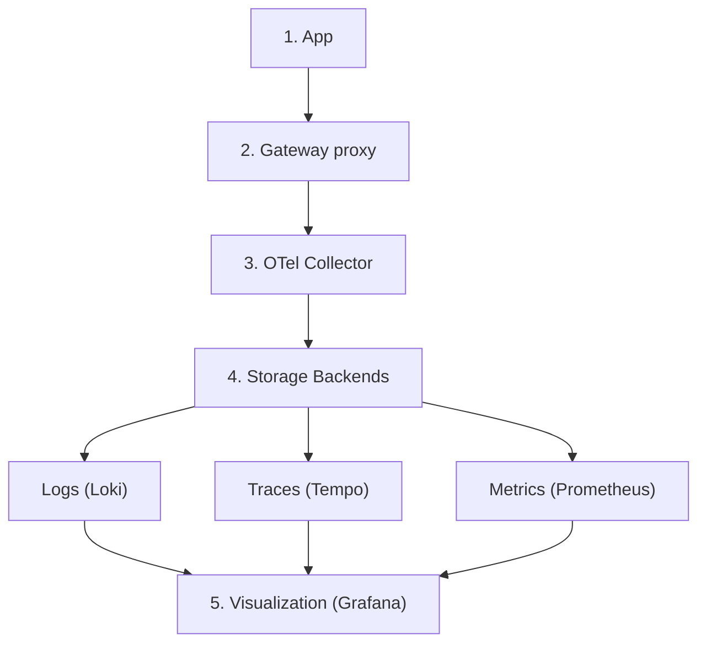

Deploy an open source observability stack based on OpenTelemetry (OTel) that includes the following components:

- **Logs**: Centralized log collection and storage with Grafana Loki.
- **Traces**: Distributed tracing with Grafana Tempo.
- **Metrics**: Time-series metrics collection with Prometheus.
- **Collection**: Unified telemetry collection with OTel Collector.
- **Visualization**: Comprehensive dashboards with Grafana.

For more information about observability, see the [Overview](/docs/observability/) page.

## Architecture

Review the following diagram to understand the architecture of the observability stack.

The gateway proxy acts as the primary telemetry generator, while the OTel Collector serves as the central routing hub for all observability data.

Architecture data flow:
1. **Application Traffic**: Applications send requests to the gateway proxy.
2. **Gateway Processing**: The gateway proxy processes requests and generates telemetry data in the form of logs, traces, and metrics.
3. **Telemetry Collection**: The OTel Collector receives telemetry data from the gateway proxy.
4. **Data Storage**: The OTel Collector routes data to the appropriate storage backends:
   - **Logs** go to Loki for log aggregation and storage.
   - **Traces** go to Tempo for distributed tracing storage.
   - **Metrics** go to Prometheus for time-series metrics storage.
5. **Visualization**: Grafana queries the storage backends as data sources to create unified dashboards.

## Step 1: 